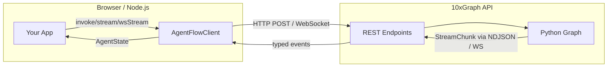

# TypeScript client

> Connect browser and Node.js apps to 10xGraph over REST, streaming, and WebSockets with the typed SDK.

Source: https://10xgraph.com/docs/client
Last updated: 2026-10-08

The `@10xgraph/client` TypeScript SDK is a typed wrapper that connects browser and Node.js apps to a running 10xGraph API. It handles session threading, multiple transport modes, auth headers, file uploads, memory access, and client-side tool execution.

## What you need

Install Node 18 or later and the client package:

```bash
npm install @10xgraph/client
```

For WebSocket support on Node 18-20, also install the `ws` package and pass it to the client config:

```bash
npm install ws
```

```typescript
import { AgentFlowClient } from '@10xgraph/client';
import WebSocket from 'ws';

const client = new AgentFlowClient({
  baseUrl: 'http://localhost:8000',
  webSocketImpl: WebSocket,  // required on Node < 21
  authToken: 'your-token',
});
```

## How it works

Your app calls the client with messages and config. The client connects to the 10xGraph API over your chosen transport, runs the graph, and returns the result with full session state restored from the checkpointer.



## Transport modes

Choose the transport that fits your application's latency, concurrency, and environment:

| Method | Protocol | Granularity | Latency | Bidirectional | Best for |
|---|---|---|---|---|---|
| `invoke()` | HTTP POST | Full response | Highest | No | One-off requests, simple chat |
| `stream()` | HTTP NDJSON body | Token-by-token | Medium | No | Progressive display, token streaming UI |
| `wsStream()` | WebSocket | Token-by-token | Low | Yes | Chat apps, real-time collaboration |
| `realtime()` | WebSocket (binary) | Audio frames | Lowest | Yes | Voice-to-voice conversations |

All modes restore your conversation history from the thread automatically, so you never repeat context.

## Core concepts

**Threads**: Pass a `thread_id` to maintain a conversation across multiple API calls. The checkpointer on the server persists the full agent state, so each new request picks up where the last one stopped.

**Remote tools**: Tool schemas live on the server (in `10xgraph.json`), but implementation runs in your client. This lets you call browser APIs (clipboard, geolocation), keep secrets local, or run integrations the server cannot access.

**Session state**: Every response includes the full `AgentState` (messages, config snapshot, checkpoint). You can inspect thread history, node-level decision logs, and tool results without querying the server again.

## Pages in this section

### Basics

- [Create and configure a client](/docs/client/create-client): Set auth tokens, timeout, proxy headers, and environment-specific URLs
- [Invoke and get results](/docs/client/invoke-agent): Call the agent once and await the final response
- [Stream responses](/docs/client/stream-responses): Consume token-by-token or message-by-message as they arrive
- [Manage threads](/docs/client/manage-threads): List threads, fetch history, update state, delete old conversations

### Features

- [Run client-side tools](/docs/client/remote-tools): Register handlers for tools, auto-execute them during stream
- [Send files and media](/docs/client/files-and-multimodal): Upload images, audio, documents; send them in messages
- [Use the memory API](/docs/client/use-memory-api): Store and search long-term memory (semantic, metadata, facts)
- [Graph utilities](/docs/client/graph-utilities): Inspect schemas, stop runs, fix state, observe execution metadata
- [Realtime audio](/docs/client/realtime-audio): Voice-to-voice with Anthropic's realtime API (passthrough transport)
- [Handle errors](/docs/client/error-handling): Catch and retry transient failures, parse error details

### Frameworks

- [Next.js and React](/docs/client/nextjs-and-react): Route handler proxy (keep tokens server-side), streaming React components, abort patterns

## Frequently asked questions

### What are the transport options?

REST invoke for final results, NDJSON streaming for real-time tokens, WebSocket for low-latency bidirectional communication, and realtime audio for voice-to-voice. Pick based on latency requirements and application type.

### Do I need a WebSocket library in Node?

Node 21+ has native WebSocket support. For Node 18-20, install the `ws` package and pass it as `webSocketImpl` in the client config.

### Can the client run tools locally?

Yes. Register handlers for remote tools declared in the server's 10xgraph.json and the client executes them without the server owning the implementation.
