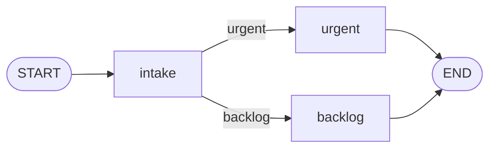

# StateGraph

> How StateGraph models an agent as nodes, edges and shared state, compiling and executing a graph, and handling recursion limits.

Source: https://10xgraph.com/docs/concepts/state-graph
Last updated: 2026-10-08

A `StateGraph` models an agent as a directed graph: nodes (functions, agents or tool dispatchers) connected by edges, all reading and writing one shared state. You define the structure, call `compile()` to validate it, then run it with `invoke()` for a final result or `stream()` for incremental output. A recursion limit stops runaway loops.



## What are the parts of a graph?

| Part | What it is | How you add it |
|---|---|---|
| Node | A function, `Agent` or `ToolNode` that receives state and returns an update | `add_node(name, func)` |
| Static edge | Always go from node A to node B | `add_edge(a, b)` |
| Conditional edge | A function inspects state and picks the next node | `add_conditional_edges(a, fn, path_map)` |
| `START` | Virtual node where a run begins | `add_edge(START, "first")` or `set_entry_point("first")` |
| `END` | Virtual node that finishes the run | `add_edge("last", END)` |
| State | An `AgentState` (or subclass) shared by all nodes | `StateGraph(MyState())` |

`START` and `END` live in `tenxgraph.utils.constants`. Nodes you register may return a `Message`, a list of messages, a plain string (stored as an assistant message), an `AgentState`, a dict or a `Command`.

## How do I build a graph?

This example builds a support ticket triage graph. Each node is a function that receives the shared state and returns an update (either a string, a dict, or a list of messages). The conditional edge routes based on the ticket content.

```python title="triage.py"
from tenxgraph.core import StateGraph
from tenxgraph.core.state import AgentState, Message
from tenxgraph.storage.checkpointer import InMemoryCheckpointer
from tenxgraph.utils.constants import START, END

def intake(state: AgentState, config: dict) -> str:
    """First node: log the intake and prepare for routing."""
    return "Ticket received and queued for triage."

def handle_urgent(state: AgentState, config: dict) -> str:
    """Route path for urgent tickets: page on-call."""
    return "Escalating to on-call engineer. Incident ticket #12345."

def route_to_backlog(state: AgentState, config: dict) -> str:
    """Route path for non-urgent: file in backlog."""
    return "Ticket filed in product backlog for Q4 planning."

def decide_priority(state: AgentState) -> str:
    """Conditional function: returns the node name to visit next."""
    # Extract user message and check urgency indicator
    user_messages = [m for m in state.context if m.role == "user"]
    if not user_messages:
        return "backlog"  # default
    
    text = user_messages[-1].text().lower()
    return "urgent" if "outage" in text or "down" in text else "backlog"

# Build the graph structure
graph = StateGraph()
graph.add_node("intake", intake)
graph.add_node("urgent", handle_urgent)
graph.add_node("backlog", route_to_backlog)

# Set entry point (adds edge from START automatically)
graph.set_entry_point("intake")

# Conditional edge: the function returns a key, path_map maps it to node name
graph.add_conditional_edges(
    "intake",
    decide_priority,
    {"urgent": "urgent", "backlog": "backlog"},
)

# Terminal edges: both outcome paths lead to END
graph.add_edge("urgent", END)
graph.add_edge("backlog", END)

# Compile the graph: validates structure, binds runtime services
app = graph.compile(checkpointer=InMemoryCheckpointer())

# Run the graph
result = app.invoke(
    {"messages": [Message.text_message("AWS region down - checkout failing")]},
    config={"thread_id": "ticket-prod-001"},
)

# Print the final message (last state update)
print("Outcome:", result["messages"][-1].text())
```

**Key points:**

- `set_entry_point("intake")` adds an implicit edge from `START` to "intake", so the graph always begins there.
- The conditional edge's routing function `decide_priority` inspects the state and returns a string key ("urgent" or "backlog"), not a node name. The `path_map` dict maps that key to the actual node name.
- If you omit the `path_map`, the routing function must return the node name directly (e.g., return `"urgent"` instead of returning a key that the map looks up).
- Both "urgent" and "backlog" end with `add_edge(..., END)`, so both paths terminate the graph.

## How does state work?

Every run starts from an `AgentState`. Its main field is `context`, the list of messages, and it uses a reducer (`add_messages`) so new messages are appended rather than replacing the list. `AgentState` also carries `context_summary` and internal `execution_meta` that the runtime uses for steps, interrupts and resume.

Add your own fields by subclassing, then pass an instance to the graph:

```python title="state.py"
from tenxgraph.core.state import AgentState

class TicketState(AgentState):
    customer_tier: str = "free"
```

```python
graph = StateGraph(TicketState())
```

`StateGraph(state=None, ...)` creates a plain `AgentState` when you pass nothing. It also accepts `context_manager`, `publisher`, `id_generator` and `container` (an InjectQ container) for trimming context, emitting events, generating ids and dependency injection.

## What does compile() do?

`compile()` validates the graph structure and returns a `CompiledGraph` object ready for execution. Compilation is where 10xGraph verifies that your graph is sound before you run it, catching structural errors early rather than during execution.

Compilation performs several checks:

- **Entry point validation**: Ensures you have called `set_entry_point()` or added an edge from `START` to a node. If not, raises `GraphError` with code `GRAPH_002`.
- **Node reachability**: Detects orphaned nodes (nodes with no incoming or outgoing edges), which are typically a sign of incomplete routing logic. Raises `GraphError` with code `GRAPH_003`.
- **Edge target validation**: Confirms that every edge points to a node you have actually registered with `add_node()`, otherwise `GRAPH_004`.
- **Interrupt node validation**: If you specified nodes to interrupt before or after, checks that they exist in the graph. Unknown names raise `GraphError` with code `GRAPH_004`, the same code as an edge that targets an unregistered node.
- **Dependency resolution**: Binds checkpointers, stores, publishers, and other runtime services into a dependency container so they are available to nodes during execution.

Once compiled, you can invoke the `CompiledGraph` many times with different inputs and thread ids without recompiling. Compile once at startup.

```python
app = graph.compile(
    checkpointer=checkpointer,       # persist state per thread
    store=store,                     # long-term memory store
    media_store=media_store,         # multimodal content storage
    interrupt_before=["urgent"],     # pause before executing a node
    interrupt_after=["review"],      # pause after executing a node
    callback_manager=callback_manager,  # hooks into execution lifecycle
    shutdown_timeout=30.0,           # grace period for cleanup (seconds)
)
```

If you omit `checkpointer`, 10xGraph uses an `InMemoryCheckpointer` so the graph can always run. It keeps state only in process memory, so nothing survives a restart. See [Checkpointing and threads](/docs/concepts/checkpointing-and-threads) for durable options and [Interrupts](/docs/concepts/interrupts) for `interrupt_before` and `interrupt_after`.

> **Compile-time vs. runtime errors**
>
> Compilation catches structural problems (missing nodes, unreachable paths, bad entry points). It does not validate the correctness of your node functions or their logic. Runtime errors (your node function raises an exception, a tool fails, the LLM is unreachable) surface during execution, not at compile time.

## Understanding recursion limits

Every graph execution has a recursion limit: a maximum number of steps before 10xGraph forces the run to stop. The limit prevents infinite loops caused by faulty routing logic. The default limit is 25 steps per run.

A step is one node execution. An agent node followed by a tool node counts as two steps, and each trip around an agent-tool loop adds two more. Conditional edges themselves do not count as steps; they only determine which node to visit next.

When you invoke a graph, you can override the default limit in the config:

```python
result = app.invoke(
    {"messages": [Message.text_message("Your question")]},
    config={"thread_id": "session-1", "recursion_limit": 100},
)
```

If a run reaches the limit while the graph is still processing (the current node is not `END`), execution stops and raises `GraphRecursionError` with code `RECURSION_001`. The check runs after each node completes, when the step counter has reached the limit, so a run that needs exactly 25 steps also fails at the default. Its `context` holds `max_steps`, `current_step` and `current_node`. When streaming, an `error` chunk is yielded before the exception is raised. See [Errors and limits](/docs/concepts/errors-and-limits).

**When to raise the limit:**

- Your graph has legitimate multi-step workflows that need more than 25 steps (e.g., a research agent that iterates over multiple search queries and summaries).
- You have nested graphs or multi-agent orchestration where one agent calls another, multiplying the step count.

**When the limit is a signal of a bug:**

- A conditional edge always routes back to itself, creating a loop.
- A tool node's routing logic does not properly transition to the next stage.
- A node function returns an update that does not change the state, so the routing function sends it back to the same node.

Fix the routing logic first. Only raise the limit if you have verified that the loop is intentional and necessary.

```python title="loop_guard.py"
from tenxgraph.core.state import AgentState

# A routing function that loops back to "agent" unconditionally will hit the
# recursion limit. Give it an exit condition based on state.
def route(state: AgentState) -> str:
    last = state.context[-1] if state.context else None
    if last is not None and last.role == "assistant" and not last.tools_calls:
        return "final"
    return "agent"
```

> **Monitoring recursion depth**
>
> Stream with `ResponseGranularity.PARTIAL` or `FULL` and read `chunk.state.execution_meta.step` on `state` chunks. If the counter climbs toward the limit, stop consuming and inspect the routing logic.

## Should I use invoke or stream?

Both methods take the same `input_data` and `config`, but differ in how results are returned. Each also has an async variant: `ainvoke` and `astream`.

| | `invoke` | `stream` |
|---|---|---|
| Returns | One dict when the run finishes | A generator of `StreamChunk` objects |
| Use when | A script or background job needs the final answer | A web UI should show tokens and progress as they arrive |
| Server endpoint | `POST /v1/graph/invoke` | `POST /v1/graph/stream` |
| In async code | `await app.ainvoke(...)` | `async for chunk in app.astream(...)` |

`invoke` calls `asyncio.run` internally, so from within an event loop, call `ainvoke` instead to avoid a "running event loop" error.

**Example with stream:** this reuses `app` from the triage example. At the default granularity only `message` and `error` chunks are delivered, so ask for `PARTIAL` to also receive `state` chunks.

```python title="stream_run.py"
from tenxgraph.core.state import Message
from tenxgraph.utils.constants import ResponseGranularity

for chunk in app.stream(
    {"messages": [Message.text_message("Checkout is down for all users")]},
    config={"thread_id": "session-42"},
    response_granularity=ResponseGranularity.PARTIAL,
):
    if chunk.event == "message":
        # Output from a node as it arrives
        print(chunk.message.text())
    elif chunk.event == "state":
        # State after a node has finished
        print("Step:", chunk.state.execution_meta.step)
```

Each `StreamChunk` has:

- `event`: `"message"`, `"state"` (after a node completes), `"updates"` (run status data) or `"error"`.
- `message`: The message if `event == "message"`.
- `state`: The state if `event == "state"`.

`LOW` yields `message` and `error` chunks, `PARTIAL` adds `state`, and `FULL` adds `updates`. See [Streaming](/docs/concepts/streaming) for the full model.

## What goes in the run config?

The config dict passed to `invoke()` and `stream()` controls how the graph execution behaves for that specific run. It is separate from the `response_granularity` argument, which controls what data is returned.

| Key | Meaning |
|---|---|
| `thread_id` | Which conversation to load and save. A random ID is generated with a warning if you omit it. |
| `user_id` | Owner of the thread. Defaults to `anonymous`. Used for access control and logging. |
| `recursion_limit` | Maximum steps before stopping (default 25). See [Understanding recursion limits](#understanding-recursion-limits). |
| `run_id` | Optional unique identifier for this specific run. Used in logging and tracing. If not provided, one is generated. |

**response_granularity** determines what the result or each stream chunk contains:

| Value | What you get |
|---|---|
| `LOW` (default) | Only messages from the state. Smallest payload. |
| `PARTIAL` | Messages, context summary, and execution metadata. |
| `FULL` | The complete state object. Useful for debugging or accessing all custom fields. |

Pass `response_granularity` directly to `invoke()` or `stream()`, not in the config dict:

```python
from tenxgraph.core.state import Message
from tenxgraph.utils.constants import ResponseGranularity

input_data = {"messages": [Message.text_message("Checkout is down")]}
result = app.invoke(
    input_data,
    config={"thread_id": "session-1", "recursion_limit": 50},
    response_granularity=ResponseGranularity.FULL,
)
```

## Related pages

- [Quickstart](https://10xgraph.com/docs/get-started/first-agent): Run a ReactAgent locally and over HTTP.
- [Build a graph](https://10xgraph.com/docs/guides/build-a-graph): Step-by-step graph building and routing.
- [How PgCheckpointer works](https://10xgraph.com/docs/concepts/memory): How checkpointers persist threads.
- [Replay-safe tools](https://10xgraph.com/docs/concepts/replay-safe-tools): Resume a crashed run without repeating tools.

## Frequently asked questions

### What is the difference between StateGraph and ReactAgent?

ReactAgent is a prebuilt that creates a StateGraph for you, with one agent node, one tool node and a conditional edge between them. Build a StateGraph yourself when you need your own nodes, routing or several agents.

### What happens if a graph loops forever?

Each run has a recursion limit (25 steps by default). When exceeded, execution stops with a GraphRecursionError. Increase recursion_limit in the run config or fix the routing logic that causes loops.

### Do I need a checkpointer to use a StateGraph?

No, a graph runs without one. But without a checkpointer, nothing is saved between calls. Every invoke starts fresh from the initial state, and you cannot resume interrupted runs. Pass a checkpointer to compile().
