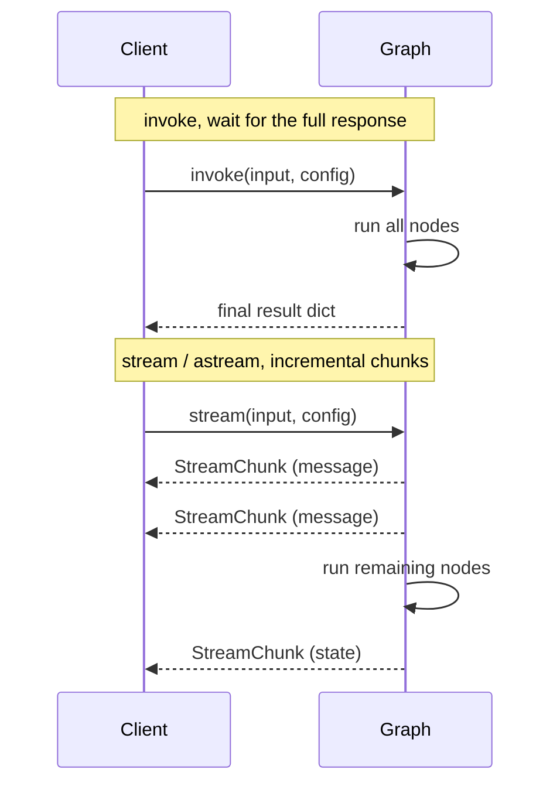

# Streaming

> Why and how to stream agent responses. Python execution modes, StreamChunk, ResponseGranularity, and transport options.

Source: https://10xgraph.com/docs/concepts/streaming
Last updated: 2026-10-08

10xGraph provides three execution modes for agents: **invoke** to wait for the final result, **stream** (sync generator) for incremental chunks in blocking code, and **astream** (async generator) for incremental chunks in async contexts. Streaming is essential for chat and realtime UIs where users expect to see model output appear token by token and tool results arrive as they complete.

---

## Why stream

Invoking a graph end-to-end blocks the caller until every node finishes. For interactive experiences, streaming reveals progress to the user while the graph is still running. The stream emits structured chunks as the model generates text, tools execute in parallel, and nodes complete. Your UI can show tokens as they arrive, tool calls as they're made, and state updates as they occur, rather than waiting for silence.

Streaming also bounds memory and latency on long-running agents: you don't buffer a 50,000-token context in RAM before handing it back.

---

## How it works



Use **invoke** or **ainvoke** when you need the full result before proceeding. Use **stream** or **astream** when the client should see partial responses immediately as they arrive.

---

## StreamChunk model

Every streaming event is a `StreamChunk` Pydantic model with a discriminated event type:

```python
from tenxgraph.core.state.stream_chunks import StreamChunk, StreamEvent

class StreamChunk(BaseModel):
    event: StreamEvent          # "message" | "state" | "error" | "updates"
    message: Message | None     # populated for StreamEvent.MESSAGE
    state: AgentState | None    # populated for StreamEvent.STATE
    data: dict | None           # populated for StreamEvent.ERROR / UPDATES
    thread_id: str | None
    run_id: str | None
    metadata: dict | None
    timestamp: float            # UNIX timestamp
```

The `event` field determines which of the four data fields is populated. Match on it to handle each event type:

| `StreamEvent` | Meaning | Populated field | Use |
|---|---|---|---|
| `MESSAGE` | Model or tool output | `message` | Render text tokens, display tool calls |
| `STATE` | Node completed | `state` | Show execution progress, update context |
| `ERROR` | Execution failed | `data` | Handle errors in the stream |
| `UPDATES` | Custom node emission | `data` | Receive progress, metrics, or custom data from tools |

---

## Response granularity

Both `stream()` and `astream()` accept a `response_granularity` parameter that controls what state is included in each `StreamChunk`. This lets you tune the amount of data streamed: less granularity saves bandwidth and parsing; higher granularity gives the client a complete view of execution state:

```python
from tenxgraph.utils import ResponseGranularity
```

| Value | Includes | Use when |
|---|---|---|
| `LOW` (default) | Latest messages only | You only need the model's output, not internal state |
| `PARTIAL` | Messages, context, context summary | You need context to render memory or summaries alongside output |
| `FULL` | Full state plus all messages | You're rebuilding the complete execution state on the client |

---

## Synchronous streaming

Use `stream()` from blocking code (non-async libraries, CLI scripts):

```python
from tenxgraph.core.state import Message
from tenxgraph.utils import ResponseGranularity
from tenxgraph.core.state.stream_chunks import StreamEvent

for chunk in app.stream(
    {"messages": [Message.text_message("Tell me a short story.")]},
    config={"thread_id": "stream-1", "recursion_limit": 10},
    response_granularity=ResponseGranularity.LOW,
):
    if chunk.event == StreamEvent.MESSAGE and chunk.message is not None:
        print(chunk.message.text(), end="", flush=True)

print()  # trailing newline
```

---

## Asynchronous streaming

Use `astream()` inside async contexts (FastAPI, async tests, async notebooks):

```python
import asyncio
from tenxgraph.core.state import Message
from tenxgraph.utils import ResponseGranularity
from tenxgraph.core.state.stream_chunks import StreamEvent

async def main():
    inp = {"messages": [Message.text_message("Call get_weather for Tokyo.")]}
    config = {"thread_id": "astream-1", "recursion_limit": 10}

    async for chunk in app.astream(inp, config, ResponseGranularity.LOW):
        if chunk.event == StreamEvent.MESSAGE and chunk.message is not None:
            print(chunk.message.text(), end="", flush=True)
        elif chunk.event == StreamEvent.STATE and chunk.state is not None:
            print(f"\n[state received, step={chunk.state.execution_meta.step}]")

asyncio.run(main())
```

### Handling all event types

Use pattern matching to process each chunk type without repeated conditionals:

```python
async for chunk in app.astream(inp, config):
    match chunk.event:
        case StreamEvent.MESSAGE:
            print("message:", chunk.message.text())
        case StreamEvent.STATE:
            print("state step:", chunk.state.execution_meta.step)
        case StreamEvent.ERROR:
            print("error:", chunk.data)
        case StreamEvent.UPDATES:
            print("custom update:", chunk.data)
```

---

## Non-streaming execution

When you don't need incremental results, use `invoke()` or `ainvoke()` to run the graph to completion and return the final state dict:

```python
# Synchronous
result = app.invoke(
    {"messages": [Message.text_message("Hello!")]},
    config={"thread_id": "t1"},
    response_granularity=ResponseGranularity.LOW,
)
messages = result["messages"]   # list of Message

# Asynchronous
result = await app.ainvoke(
    {"messages": [Message.text_message("Hello!")]},
    config={"thread_id": "t1"},
)
```

The returned dict keys depend on `response_granularity`:

| Granularity | Keys returned |
|---|---|
| `LOW` | `messages` |
| `PARTIAL` | `messages`, `context`, `context_summary` |
| `FULL` | `messages`, `state` |

---

## Stopping a stream

Request graceful cancellation of a running stream with `stop()` or `astop()`. The graph checks the stop flag after each node and exits cleanly, returning a final state dict:

```python
# Stop from another coroutine or thread
await app.astop({"thread_id": "stream-1"})
```

The stopped stream does not emit further chunks after the cancellation takes effect.

---

## Transports

Streaming is available over multiple transport layers. Choose based on your deployment and client type:

### REST (NDJSON)

The HTTP `/v1/graph/stream` endpoint streams responses as newline-delimited JSON (NDJSON), one `StreamChunk` per line. Use this when you need a simple HTTP transport that works with any HTTP client (curl, fetch, axios) and no bidirectional connection. Not ideal for high-frequency token streams due to HTTP framing overhead.

See [Invoke and stream over REST](/docs/server/invoke-and-stream) for details and examples.

### WebSocket (turn-based)

The WebSocket `/v1/graph/ws` endpoint streams individual `StreamChunk` frames over a persistent WebSocket connection. Use this for lower-latency bidirectional communication and tighter control over thread state. Suitable for most chat UIs.

See [WebSocket streaming](/docs/server/websockets) for configuration, authentication, and close codes.

### WebSocket (realtime audio)

The WebSocket `/v1/graph/live` endpoint is optimized for realtime (Anthropic Realtime API and similar) agents that need to stream audio frames bidirectionally with minimal latency. This is a specialized transport; use it only if your agent is built for continuous audio I/O.

See [Realtime audio agent](/docs/guides/use-realtime-audio) for integration details.

### AG-UI

The POST `/v1/ag-ui` endpoint implements the AG-UI (agentic UI) protocol for frameworks like CopilotKit. It streams events and tool results in the AG-UI format, handles browser tool execution, and supports human approval interrupts.

This transport is automatically configured when `ag_ui.enabled` is set in your 10xgraph.json.

---

## TypeScript client

From TypeScript, the `AgentFlowClient.stream()` method handles all transport details and returns a unified async iterator of `StreamChunk` objects. No need to parse NDJSON or manage WebSocket frames yourself.

See [Stream responses in TypeScript](/docs/client/stream-responses) for code examples and React integration patterns.

---

## Related concepts

- [State and messages](/docs/concepts/state-and-messages): The data structures carried in `StreamChunk`
- [Agents and tools](/docs/concepts/agents-and-tools): How agents emit messages during execution
- [Serving agents](/docs/concepts/serving-agents): Request lifecycle and the API server execution model
