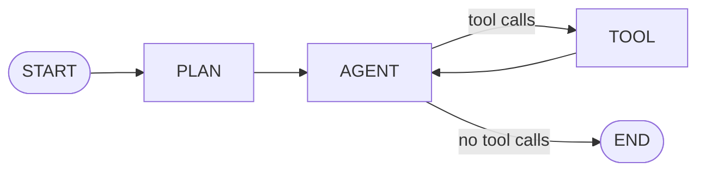

# Build a Coding AI Agent in Python

> Build a plan-first coding agent with read, search, test and diff-proposing tools, so every file change is reviewed by a human before it lands.

Source: https://10xgraph.com/docs/examples/coding-agent
Last updated: 2026-10-08

This example builds a coding agent that plans first, then reads, searches and tests your repository in a loop. It never writes to disk itself: its `write_file` tool returns a unified diff that your code applies after approval. It is a reference architecture you can run locally and harden for your own use.

## What the example shows

The agent follows one rule: plan first, execute second, propose diffs, test always. The graph has three nodes, and the files it touches are limited to your repository root.



| Piece | Role |
|---|---|
| `PLAN` | An `Agent` with no tools. It outlines the steps and changes nothing. |
| `AGENT` | An `Agent` bound to the `TOOL` node. It calls tools until the task is done. |
| `TOOL` | A `ToolNode` holding `read_file`, `write_file`, `search_codebase` and `run_tests`. |
| `apply_change` | A plain function outside the graph. It writes a diff proposal only after you approve it. |

This shape prevents three failure modes: silent misunderstanding (the plan exposes it), destructive writes (nothing is written without review), and wasted loops (tests, not the model's confidence, decide whether a change worked).

## Run it

You need Python 3.12 or newer, the Anthropic extra, and an Anthropic API key in your environment. To use a different provider, change the `model` strings and install the matching extra.

```bash
pip install "10xgraph[anthropic]"
export ANTHROPIC_API_KEY="your-key"   # set in your shell, never commit it
```

Save the two files below in the root of the repository you want the agent to work on. `tools.py` limits all file access to the directory where you run the script, so run it from the repository root.

## Define the tools

The tools give the agent four capabilities: read a file, search the code, run the tests, and propose a change. Each one validates paths against the repository root, caps its output so it cannot flood the context, and returns JSON so errors are visible to the model.

```python title="tools.py"
import json
import subprocess
from difflib import unified_diff
from pathlib import Path

from tenxgraph.utils.decorators import tool

REPO_ROOT = Path.cwd().resolve()
MAX_READ_CHARS = 50_000
MAX_SEARCH_RESULTS = 20
MAX_SEARCHED_FILE_BYTES = 1_000_000
TEST_TIMEOUT_SECONDS = 120

def _inside_repo(path: Path) -> bool:
    """Return True when the resolved path stays inside the repository root."""
    return path.is_relative_to(REPO_ROOT)

@tool(
    name="read_file",
    description="Read a text file relative to the repository root. Output is capped at 50,000 characters.",
    tags=["file", "read"],
)
def read_file(path: str) -> str:
    """Read a file relative to the repository root.

    Args:
        path: File path relative to the repository root.
    """
    target = (REPO_ROOT / path).resolve()
    if not _inside_repo(target):
        return json.dumps({"error": f"{path} is outside the repository root"})
    if not target.is_file():
        return json.dumps({"error": f"{path} is not an existing file"})
    try:
        content = target.read_text(errors="replace")
    except OSError as exc:
        return json.dumps({"error": str(exc)})
    if len(content) > MAX_READ_CHARS:
        return json.dumps(
            {"content": content[:MAX_READ_CHARS], "truncated": True, "total_chars": len(content)}
        )
    return json.dumps({"content": content, "truncated": False})

@tool(
    name="write_file",
    description=(
        "Propose a new version of a file. Returns a unified diff for human review. "
        "Nothing is written to disk by this tool."
    ),
    tags=["file", "write"],
)
def write_file(path: str, content: str, reason: str) -> str:
    """Propose writing a file and return the diff without applying it.

    Args:
        path: File path relative to the repository root.
        content: The complete new contents of the file.
        reason: Why this change is being made.
    """
    target = (REPO_ROOT / path).resolve()
    if not _inside_repo(target):
        return json.dumps({"error": f"{path} is outside the repository root"})
    try:
        old = target.read_text() if target.exists() else ""
    except OSError as exc:
        return json.dumps({"error": str(exc)})
    relative = str(target.relative_to(REPO_ROOT))
    diff = "".join(
        unified_diff(
            old.splitlines(keepends=True),
            content.splitlines(keepends=True),
            fromfile=relative,
            tofile=relative,
        )
    )
    return json.dumps(
        {
            "path": relative,
            "reason": reason,
            "diff": diff,
            "status": "pending_approval",
            "old_lines": len(old.splitlines()),
            "new_lines": len(content.splitlines()),
        }
    )

@tool(
    name="search_codebase",
    description="Case-insensitive search of file names and file contents. Returns paths and line previews.",
    tags=["file", "search"],
)
def search_codebase(query: str, path: str = ".", glob: str = "**/*.py") -> str:
    """Search the codebase for a string in file names and contents.

    Args:
        query: Text to search for.
        path: Directory to search, relative to the repository root.
        glob: File pattern, for example "**/*.py".
    """
    search_root = (REPO_ROOT / path).resolve()
    if not _inside_repo(search_root):
        return json.dumps({"error": "Search path must be inside the repository root"})

    needle = query.lower()
    results: list[dict] = []
    for candidate in search_root.glob(glob):
        if len(results) >= MAX_SEARCH_RESULTS:
            break
        if not candidate.is_file() or candidate.stat().st_size > MAX_SEARCHED_FILE_BYTES:
            continue
        relative = str(candidate.relative_to(REPO_ROOT))
        if needle in candidate.name.lower():
            results.append({"path": relative, "match_type": "filename"})
            continue
        try:
            lines = candidate.read_text(errors="replace").splitlines()
        except OSError:
            continue
        for number, line in enumerate(lines, start=1):
            if needle in line.lower():
                results.append(
                    {
                        "path": relative,
                        "line": number,
                        "preview": line.strip()[:100],
                        "match_type": "content",
                    }
                )
                if len(results) >= MAX_SEARCH_RESULTS:
                    break
    return json.dumps({"results": results})

@tool(
    name="run_tests",
    description="Run the pytest suite, or one test path. Output is capped at the last 4,000 characters.",
    tags=["test", "execution"],
)
def run_tests(test_path: str = "") -> str:
    """Run pytest on the repository or on one test file or directory.

    Args:
        test_path: Optional test file or directory relative to the repository root.
    """
    command = ["python", "-m", "pytest", "-x", "--tb=short", "-v"]
    if test_path:
        target = (REPO_ROOT / test_path).resolve()
        if not _inside_repo(target):
            return json.dumps({"error": f"{test_path} is outside the repository root"})
        command.append(str(target))
    try:
        result = subprocess.run(
            command,
            capture_output=True,
            text=True,
            timeout=TEST_TIMEOUT_SECONDS,
            cwd=REPO_ROOT,
        )
    except subprocess.TimeoutExpired:
        return json.dumps({"error": f"Test run exceeded {TEST_TIMEOUT_SECONDS} seconds"})
    output = (result.stdout + result.stderr)[-4000:]
    return json.dumps(
        {"exit_code": result.returncode, "passed": result.returncode == 0, "output": output}
    )

def apply_change(path: str, content: str) -> None:
    """Write an approved change to disk. Call this yourself, never expose it as a tool."""
    target = (REPO_ROOT / path).resolve()
    if not _inside_repo(target):
        raise ValueError(f"{path} is outside the repository root")
    target.parent.mkdir(parents=True, exist_ok=True)
    target.write_text(content)
```

`apply_change` is deliberately not decorated and not given to the agent. Approval is a decision your application makes, so the write capability stays on your side of the boundary.

## Build the plan-then-execute graph

The graph runs `PLAN` once, then loops between `AGENT` and `TOOL` until the model answers without requesting a tool. The router checks the last message for tool calls instead of searching for words like "done", which is fragile.

```python title="agent.py"
import asyncio

from tenxgraph.core.graph import Agent, StateGraph, ToolNode
from tenxgraph.core.state import AgentState, Message
from tenxgraph.storage.checkpointer import InMemoryCheckpointer
from tenxgraph.utils.constants import END

from tools import read_file, run_tests, search_codebase, write_file

MODEL = "anthropic/claude-sonnet-5"  # change the model string to use another provider

PLANNER_PROMPT = (
    "You are a code planning assistant. Outline the steps you will take to complete "
    "the task. Do not write or execute anything yet. Be concise."
)
EXECUTOR_PROMPT = (
    "You are a code execution assistant. A plan already exists in the conversation; "
    "follow it step by step. Read files before changing them. Use search_codebase to "
    "find related code. Propose every change with write_file and never claim a file "
    "was written, because changes need human approval. Run run_tests after each "
    "proposed change. When the task is complete, reply with a short summary and no tool calls."
)

def route_after_agent(state: AgentState) -> str:
    """Go to TOOL when the last assistant message requested tools, otherwise stop."""
    if state.context:
        last = state.context[-1]
        if last.role == "assistant" and last.tools_calls:
            return "TOOL"
    return END

def build_graph():
    """Build and compile the PLAN -> AGENT <-> TOOL graph."""
    tool_node = ToolNode([read_file, write_file, search_codebase, run_tests])

    graph = StateGraph()
    graph.add_node(
        "PLAN",
        Agent(model=MODEL, system_prompt=[{"role": "system", "content": PLANNER_PROMPT}]),
    )
    graph.add_node(
        "AGENT",
        Agent(
            model=MODEL,
            system_prompt=[{"role": "system", "content": EXECUTOR_PROMPT}],
            tool_node="TOOL",
        ),
    )
    graph.add_node("TOOL", tool_node)

    graph.set_entry_point("PLAN")
    graph.add_edge("PLAN", "AGENT")
    graph.add_conditional_edges("AGENT", route_after_agent, {"TOOL": "TOOL", END: END})
    graph.add_edge("TOOL", "AGENT")

    return graph.compile(checkpointer=InMemoryCheckpointer())

async def main() -> None:
    app = build_graph()
    task = "Add a greet(name) function to lib.py that returns 'Hello, <name>!' and a test for it."
    result = await app.ainvoke(
        {"messages": [Message.text_message(task)]},
        config={"thread_id": "coding-example-1", "recursion_limit": 30},
    )
    for message in result["messages"]:
        print(f"{message.role}: {message.text()[:300]}")

if __name__ == "__main__":
    asyncio.run(main())
```

Run it with `python agent.py`. The output depends on the model, so it varies between runs. Expect a plan message, then assistant and tool messages as the agent reads, proposes and tests, and a final summary. Proposed diffs appear in the `write_file` tool messages.

## Approve and apply a proposed change

The agent only proposes changes, so you read the `pending_approval` results and decide. This helper pairs each approved proposal with the agent's tool call so your code can apply it. Wire it to whatever approval step you use: a terminal prompt, a pull request comment or a review UI.

```python title="approve.py"
import json

from tools import apply_change

def apply_if_approved(proposal_json: str, new_content: str, approved: bool) -> bool:
    """Show a write_file result and apply new_content to disk only when approved."""
    proposal = json.loads(proposal_json)
    if "error" in proposal:
        print("Cannot apply:", proposal["error"])
        return False
    print(proposal["diff"])
    if not approved:
        return False
    apply_change(proposal["path"], new_content)
    return True
```

The tool result carries the diff but not the full file, so keep the `content` argument of the original `write_file` call (available in the assistant message's `tools_calls`) and pass it as `new_content`. For pausing the graph itself while a person decides, see [Add human approval](/docs/guides/add-human-approval) and [Interrupts](/docs/concepts/interrupts).

## Harden it for production

Treat this example as a starting point. A coding agent runs code and reads files on your behalf, so the surrounding environment matters more than the prompts.

- **Sandbox execution.** Never run it on a production host. Use a container, a single-tenant VM or a managed sandbox, with no access to secrets you do not want exposed.
- **Limit resources.** Cap CPU, memory and wall time per test run. The example sets a 120 second timeout, but a container limit is the real guard.
- **Restrict the network.** Disable outbound access unless the task needs it. A prompt injected through a code comment can try to send code elsewhere.
- **Review by risk.** Humans should approve changes to authentication, payments and permissions. For small, non-sensitive diffs you can add an automated reviewer, but keep a person in the loop for the rest.
- **Manage context.** Keep the read and search caps, summarize older turns, or work one file at a time on large repositories. See [Agents and tools](/docs/concepts/agents-and-tools).
- **Bound the loop.** Keep a `recursion_limit` in the config so a confused agent stops instead of looping.

## When not to use this pattern

Skip it when a wrong change is expensive or the task is unclear.

- **Security-critical code.** Do not let an agent change authentication, payment or privilege boundaries without line-by-line human review.
- **Ambiguous tasks.** If the plan keeps changing or the agent needs clarification, rewrite the task first.
- **Live production systems.** Test in a copy or staging environment, never on the running system.
- **Untrusted input.** Task text from untrusted users can carry prompt injection. Validate it, or do not give the agent file and shell access.

## Variants to try next

The same graph shape fits other jobs; change the prompts and the tool set.

- **Code review agent.** Read pull request diffs and tests and comment, using the same tools without `write_file`.
- **Bug-fix agent.** Start from a failing test, run it before and after each change, and stop when it passes.
- **Migration agent.** Apply a mechanical refactor across many files, with a batch review of the diffs.
- **Documentation agent.** Read code and propose docstring or markdown changes.

To make the tools richer, see [Use the tool decorator](/docs/guides/use-tool-decorator). To stream progress to a UI while it works, see [Stream a graph](/docs/guides/stream-graph). For typed final results, see [Structured output](/docs/guides/structured-output).

## Frequently asked questions

### When should I use a coding agent?

Use one for well-defined work such as refactors, bug fixes and small features, and only when you can sandbox execution. Avoid it for security-critical code.

### Why does write_file only propose a diff?

An agent that writes files directly can damage a repository before anyone looks. Returning a diff lets a human approve or redirect each change, and your own code applies only approved ones.

### What model should I use for a coding agent?

Pick a model with a large context window and strong tool calling, because coding tasks fill context quickly. Any model supported by the Agent class works.
