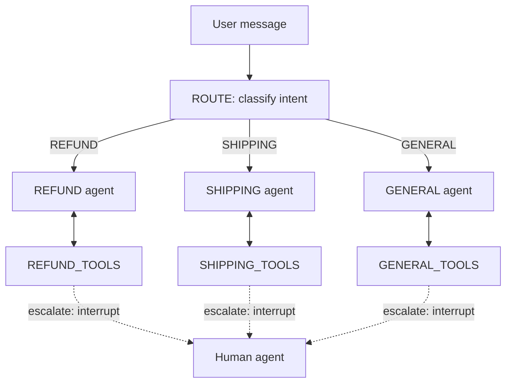

# Build a Customer Support AI Agent in Python

> Reference architecture for a production customer support AI agent in Python. Intent routing, ticket lookup, refund tools, and human handoff with 10xGraph.

Source: https://10xgraph.com/docs/examples/customer-support-agent
Last updated: 2026-07-27

This page shows a customer support agent that routes each message to a refund, shipping or general specialist, lets each specialist call only its own tools, and pauses for a human with `interrupt()`. The code runs as shown once you set provider API keys. The order, payment and shipping clients are mocks you replace.

## Architecture overview

The graph has a small router agent, three specialist agents, and one tool node per specialist. The router picks a lane, the specialist answers or calls tools, and any specialist can pause the graph to hand the case to a person.



This is a workflow with agents inside it: the routing is a fixed step, and the reasoning happens inside each branch.

| Design choice | Why |
|---|---|
| Small model for routing | Classification is cheap, so the expensive model runs only when needed. |
| One tool node per specialist | The refund agent cannot call shipping tools, which removes a class of wrong tool calls. |
| Tool calls as graph nodes | Every tool run is a distinct step with its own record in the thread. |
| Escalation through `interrupt()` | The pause is saved in the checkpoint, so a human can answer minutes or days later. |

## Install and configure

Install the core package with the two provider extras used below, and set the API keys for the providers you use. The router uses Google (`GOOGLE_API_KEY` or `GEMINI_API_KEY`) and the specialists use Anthropic (`ANTHROPIC_API_KEY`). Any other provider works the same way by changing `model` and `provider`.

```bash
pip install "10xgraph[google-genai,anthropic]"
```

## Define the backends and tools

Each specialist gets its own tools, built from plain typed functions with docstrings. The `@tool` decorator marks them and the docstring becomes the description the model sees. The three `Mock` classes stand in for your order database, payment API, shipping provider and help center, so replace them with real clients.

```python title="support_agent.py"
import asyncio

from tenxgraph.core.graph import Agent, StateGraph, ToolNode
from tenxgraph.core.state import AgentState, Message
from tenxgraph.storage.checkpointer import InMemoryCheckpointer
from tenxgraph.utils import END, interrupt, tool

# Placeholder backends. Replace each with your real client.
class MockOrderDB:
    def fetch(self, order_id: str) -> dict:
        return {"id": order_id, "status": "shipped", "total": 49.99, "items": 1}

class MockPayments:
    def refund(self, order_id: str, reason: str, idempotency_key: str) -> str:
        return f"Refund processed for order {order_id} ({reason})"

class MockShipping:
    def get_tracking(self, order_id: str) -> str:
        return f"Order {order_id}: tracking ABC123DEF456, in transit"

    def reship(self, order_id: str) -> str:
        return f"Reship requested for order {order_id}"

class MockDocs:
    def search(self, query: str) -> str:
        return f"Help center articles found for: {query}"

orders_db = MockOrderDB()
payments = MockPayments()
shipping = MockShipping()
docs = MockDocs()

# Refund tools
@tool
def get_order(order_id: str) -> str:
    """Look up an order by ID. Returns its status, item count and total."""
    order = orders_db.fetch(order_id)
    return f"Order {order_id}: {order['status']}, total ${order['total']}, {order['items']} item(s)"

@tool
def issue_refund(order_id: str, reason: str) -> str:
    """Refund an order. Call only after the customer has confirmed."""
    # A stable key makes a retried request safe: the payment API ignores duplicates.
    return payments.refund(order_id, reason=reason, idempotency_key=f"refund-{order_id}")

@tool
def escalate_refund(reason: str) -> str:
    """Hand the case to a human agent when the customer is upset or the case is unusual."""
    # The graph stops here. The tool runs again on resume and interrupt() returns the reply.
    # Keep side effects after this call, because code before it runs twice.
    reply = interrupt({"type": "refund", "reason": reason}, message=f"Refund escalation: {reason}")
    return f"Human agent replied: {reply}"

# Shipping tools
@tool
def get_tracking(order_id: str) -> str:
    """Get tracking information for an order."""
    return shipping.get_tracking(order_id)

@tool
def reship(order_id: str) -> str:
    """Request a reship for a lost or damaged order."""
    return shipping.reship(order_id)

@tool
def escalate_shipping(reason: str) -> str:
    """Hand the case to a human agent."""
    reply = interrupt({"type": "shipping", "reason": reason}, message=f"Shipping escalation: {reason}")
    return f"Human agent replied: {reply}"

# General tools
@tool
def search_docs(query: str) -> str:
    """Search the help center for articles."""
    return docs.search(query)

@tool
def escalate_general(reason: str) -> str:
    """Hand the case to a human agent when the customer is frustrated or needs a person."""
    reply = interrupt({"type": "general", "reason": reason}, message=f"Escalation: {reason}")
    return f"Human agent replied: {reply}"

refund_tools = ToolNode([get_order, issue_refund, escalate_refund])
shipping_tools = ToolNode([get_order, get_tracking, reship, escalate_shipping])
general_tools = ToolNode([search_docs, escalate_general])
```

`interrupt()` takes a payload for whoever resumes the thread, plus an optional `message` and `reason`. It raises a control-flow exception on the first run and returns the resume value on the next. See [interrupts](/docs/concepts/interrupts) for how the pause is stored.

## Create the router and specialist agents

The router is a small model that returns one label, and each specialist is a larger model with a focused prompt and its own tool node. Explicit escalation rules in the prompts are followed more reliably than leaving the decision to the model.

```python title="support_agent.py (continued)"
# Small, fast model for routing. It has no tools and returns a single label.
router = Agent(
    model="gemini-2.5-flash",
    provider="google",
    system_prompt=[{
        "role": "system",
        "content": (
            "Classify the customer's latest request into exactly one of: "
            "REFUND, SHIPPING, GENERAL. Reply with the label only."
        ),
    }],
)

# Larger model for each specialist, each with only its own tools.
refund_agent = Agent(
    model="claude-sonnet-5",
    provider="anthropic",
    system_prompt=[{
        "role": "system",
        "content": (
            "You handle refund requests. Look up the order before refunding and confirm "
            "the details with the customer first. Escalate if the customer is upset, "
            "the amount is over $500, or the case is unusual."
        ),
    }],
    tool_node=refund_tools,
)

shipping_agent = Agent(
    model="claude-sonnet-5",
    provider="anthropic",
    system_prompt=[{
        "role": "system",
        "content": (
            "You handle shipping and tracking questions. Look up the order, share tracking, "
            "and reship only for lost or damaged orders. Escalate complex cases."
        ),
    }],
    tool_node=shipping_tools,
)

general_agent = Agent(
    model="claude-sonnet-5",
    provider="anthropic",
    system_prompt=[{
        "role": "system",
        "content": (
            "You handle general support questions. Search the help center before answering. "
            "Escalate if the customer is frustrated or asks for a person."
        ),
    }],
    tool_node=general_tools,
)
```

## Wire the graph with conditional routing

The graph sends each message through the router, then into one specialist loop that alternates between the agent and its tool node until the agent stops calling tools. Two small functions decide the edges: one reads the router's label, and one checks whether the last assistant message requested tools.

```python title="support_agent.py (continued)"
graph = StateGraph()
graph.add_node("ROUTE", router)
graph.add_node("REFUND", refund_agent)
graph.add_node("SHIPPING", shipping_agent)
graph.add_node("GENERAL", general_agent)
graph.add_node("REFUND_TOOLS", refund_tools)
graph.add_node("SHIPPING_TOOLS", shipping_tools)
graph.add_node("GENERAL_TOOLS", general_tools)

def pick_lane(state: AgentState) -> str:
    """Read the router's label. Anything unexpected falls back to GENERAL."""
    label = state.context[-1].text().strip().upper() if state.context else ""
    return label if label in {"REFUND", "SHIPPING", "GENERAL"} else "GENERAL"

def wants_tools(tools_node: str):
    """Build an edge function: go to tools_node if the agent asked for tools, else end."""
    def route(state: AgentState) -> str:
        last = state.context[-1] if state.context else None
        if last and last.role == "assistant" and last.tools_calls:
            return tools_node
        return END
    return route

graph.set_entry_point("ROUTE")
graph.add_conditional_edges(
    "ROUTE", pick_lane, {"REFUND": "REFUND", "SHIPPING": "SHIPPING", "GENERAL": "GENERAL"}
)
for agent_node, tools_node in [
    ("REFUND", "REFUND_TOOLS"),
    ("SHIPPING", "SHIPPING_TOOLS"),
    ("GENERAL", "GENERAL_TOOLS"),
]:
    graph.add_conditional_edges(agent_node, wants_tools(tools_node), {tools_node: tools_node, END: END})
    graph.add_edge(tools_node, agent_node)  # tool results go back to the same specialist

# Use PgCheckpointer in production so threads survive restarts.
app = graph.compile(checkpointer=InMemoryCheckpointer())
```

The router's label stays in the thread as an assistant message, so each specialist sees it as context. If you want a cleaner history, replace the router agent with a plain function node that returns a label message.

## Run it and resume after an escalation

Send each customer message with the same `thread_id` so the checkpointer keeps the conversation. When a specialist escalates, the run stops at `interrupt()`. Run the same thread with a `resume` value to answer it.

```python title="support_agent.py (continued)"
async def chat(text: str, thread_id: str) -> str:
    """Send one customer message and return the agent's last message."""
    result = await app.ainvoke(
        {"messages": [Message.text_message(text)]},
        config={"thread_id": thread_id, "recursion_limit": 15},
    )
    return result["messages"][-1].text()

async def human_reply(answer: str, thread_id: str) -> str:
    """Resume a paused thread. interrupt() returns `answer` inside the escalation tool."""
    result = await app.ainvoke({"resume": answer}, config={"thread_id": thread_id})
    return result["messages"][-1].text()

async def main() -> None:
    print(await chat("I want a refund for order 1001, it arrived broken.", "customer-123"))
    print(await chat("Where is order 1002?", "customer-456"))

if __name__ == "__main__":
    asyncio.run(main())
```

The replies depend on the models, so your output will differ. To test escalation, ask for a refund while telling the agent you are furious, then call `human_reply("Approved, refund issued.", "customer-123")` on that thread. For streaming, see [stream a graph](/docs/guides/stream-graph), and for the approval flow in detail, see [add human approval](/docs/guides/add-human-approval).

## Production considerations

Four changes matter most before real customers use it.

| Concern | What to do |
|---|---|
| Persistence | Replace `InMemoryCheckpointer` with a durable one and keep one `thread_id` per customer conversation. See [set up checkpointing](/docs/guides/set-up-checkpointing). |
| Cost abuse | Set per-user limits on the API server. See [rate limiting](/docs/server/rate-limiting). |
| Money movement | Keep idempotency keys on every refund, and require the customer to confirm in the prompt before `issue_refund`. |
| Escalation visibility | Record every `interrupt()` payload in a queue or table so your team can review and learn from handoffs. |

## When not to use this

Use this shape for broad support with distinct intent lanes. Choose something else in these cases.

- **Mixed intents in one message.** If customers often ask about a refund, shipping and product advice together, one agent with all tools is simpler than a router.
- **Heavy personalization.** If answers depend on customer history, add a memory layer. See [use the memory store](/docs/guides/use-memory-store).
- **Many specialists.** With dozens of lanes, one classification step becomes a bottleneck. Use a hierarchy, or see [hand off between agents](/docs/guides/handoff-between-agents).
- **Shared tools across lanes.** This example already duplicates `get_order` in two tool nodes. If lanes need the same data constantly, merge them.

## Metrics to track

These figures are starting targets from typical support deployments, not guarantees. Measure your own baseline first.

| Metric | Starting target |
|---|---|
| Deflection rate (resolved without a human) | 30 to 50 percent |
| First-response time (p95) | under 1.5 seconds |
| Escalation rate | 10 to 25 percent |
| CSAT versus a human-only baseline | within 5 percent |
| Cost per resolved ticket | under $0.50 |

## Next steps

- [Set up durable checkpointing](/docs/guides/set-up-checkpointing) so paused threads survive restarts.
- [Add human approval](/docs/guides/add-human-approval) to build the reviewer side of an escalation.
- [Stream responses](/docs/guides/stream-graph) to show progress while the agent works.
- [Use the memory store](/docs/guides/use-memory-store) to personalize replies.
