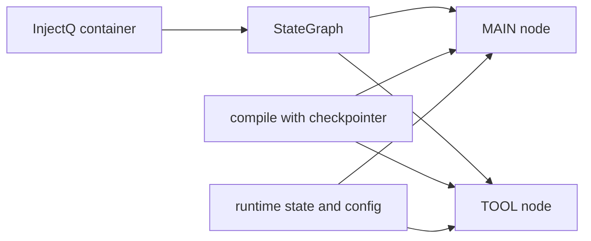
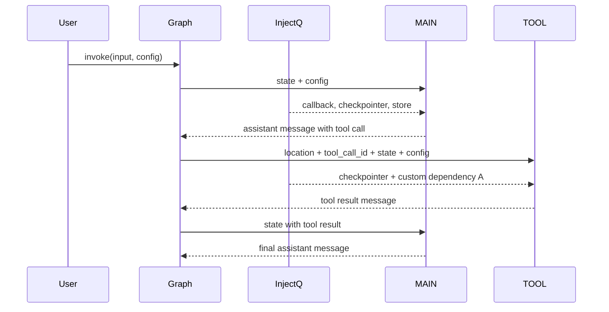

# Dependency Injection

> Use InjectQ with 10xGraph to inject shared services such as checkpointers, stores, callbacks, and app-specific dependencies into graph nodes and tools.

Source: https://10xgraph.com/docs/examples/dependency-injection
Last updated: 2026-10-08

This example builds a small ReAct-style graph where a main node and a tool function both receive shared services through dependency injection. You register a custom class in an InjectQ container, pass the container to `StateGraph`, and declare services with `Inject[...]` defaults. No model call or API key is needed.

## How to run the example

The example lives in `agentflow/examples/react-injection/react_di.py` in the 10xGraph repository. The main node returns scripted messages instead of calling a model, so it runs offline. It imports `python-dotenv` and `injectq`, both of which are dependencies of `10xgraph`.

```bash
# Install 10xGraph (add a provider extra such as google-genai if you extend the example with a real model)
pip install "10xgraph[google-genai]"

# From the root of the cloned repository
cd agentflow
python examples/react-injection/react_di.py
```

If you extend the example with a real Gemini call, set `GEMINI_API_KEY` in your environment first. The unmodified example does not read it.

## What dependency injection gives you here

Dependency injection lets nodes and tools declare the services they need in their signatures, so you do not create or pass those services at every call site. Use it when several nodes share a service, when you want explicit and testable dependencies, or when tools need stateful infrastructure such as a checkpointer.



For the reasoning behind DI and the full list of injectable parameters, see [Dependency injection](/docs/concepts/dependency-injection) and [Use Dependency Injection](/docs/guides/use-dependency-injection).

## Create and populate the container

The example gets the singleton `InjectQ` container and binds an instance of a small custom class. Any value you bind this way can later be requested with `Inject[...]`.

```python title="agentflow/examples/react-injection/react_di.py"
from injectq import Inject, InjectQ

class A:
    """A stand-in for any application service."""

checkpointer = InMemoryCheckpointer()

# Get the shared container and bind an instance of A
container = InjectQ.get_instance()
container.bind_instance(A, A())

# A plain string value can be bound by key and read back later
container["generated_id2"] = "main-response-12345"
```

The container is connected to the graph with `StateGraph(container=container)`, shown in the graph-building section below.

## Inject services into a tool

A tool function mixes runtime parameters with injected services. The graph supplies `location`, `tool_call_id`, `state` and `config`; the container supplies `checkpointer` and `a`. Parameters with an `Inject[...]` default are not part of the schema sent to the model.

```python title="agentflow/examples/react-injection/react_di.py"
def get_weather(
    location: str,
    tool_call_id: str,
    state: AgentState,
    config: dict,
    checkpointer: InMemoryCheckpointer = Inject[InMemoryCheckpointer],
    a: A = Inject[A],
) -> Message:
    """Get the current weather for a specific location."""
    # tool_call_id and state come from the graph runtime
    if tool_call_id:
        print(f"Tool call ID: {tool_call_id}")
    if state and hasattr(state, "context"):
        print(f"Number of messages in context: {len(state.context)}")

    res = f"The weather in {location} is sunny"
    return Message.tool_message(
        content=[
            ToolResultBlock(call_id=tool_call_id, output=res, status="completed")
        ],
    )

tool_node = ToolNode([get_weather])
```

## Inject services into a node

A node declares injected services the same way. The main node asks for the callback manager, the checkpointer and the store, and also reads values straight from the container. The store is typed `BaseStore | None` because no store is configured in this example.

```python title="agentflow/examples/react-injection/react_di.py"
async def main_agent(
    state: AgentState,
    config: dict,
    callback: CallbackManager = Inject[CallbackManager],
    checkpointer: InMemoryCheckpointer = Inject[InMemoryCheckpointer],
    store: BaseStore | None = Inject[BaseStore],
):
    inq = InjectQ.get_instance()
    # try_get returns the default when a key is not bound
    message_id2 = inq.try_get("generated_id2", "final-response-579898")
    print("Generated Message ID 2: ", message_id2)
    print("checkpointer", checkpointer)
    print("state", len(state.context))
    print("config", config)

    if len(state.context) == 1:
        # First pass: reply with a scripted tool call
        return Message(
            message_id="final-response-579898",
            content=[
                TextBlock(text="This is example final response from main agent."),
                ToolCallBlock(
                    id="weather-tool-123",
                    name="get_weather",
                    args={"location": "San Francisco"},
                ),
            ],
            role="assistant",
            tools_calls=[
                {
                    "id": "weather-tool-123",
                    "type": "function",
                    "function": {
                        "name": "get_weather",
                        "arguments": '{"location": "San Francisco"}',
                    },
                }
            ],
        )
    # Second pass: reply with a plain final message
    return Message(
        message_id="main-response-12345",
        content=[TextBlock(text="This is the final response from main agent.")],
        role="assistant",
    )
```

Typical uses for injected node services are audit logging, callback orchestration, long-term storage access and shared business services.

## Route between the nodes

A routing function decides whether the loop calls the tool or ends. It sends the run to `TOOL` when the last message is an assistant message with tool calls, and to `END` otherwise.

```python title="agentflow/examples/react-injection/react_di.py"
def should_use_tools(state: AgentState) -> str:
    """Determine if we should use tools or end the conversation."""
    if not state.context:
        return "TOOL"

    last_message = state.context[-1]

    # Assistant message with tool calls: run the tool
    if last_message.role == "assistant" and last_message.tools_calls:
        return "TOOL"

    # Tool result or anything else: finish
    return END
```

## Build, compile and run the graph

The graph is a standard ReAct loop. Passing `container=container` to `StateGraph` is what makes your bindings available during execution, and compiling with a checkpointer lets nodes and tools request it with `Inject[InMemoryCheckpointer]`.

```python title="agentflow/examples/react-injection/react_di.py"
graph = StateGraph(container=container)
graph.add_node("MAIN", main_agent)
graph.add_node("TOOL", tool_node)

graph.add_conditional_edges("MAIN", should_use_tools, {"TOOL": "TOOL", END: END})
graph.add_edge("TOOL", "MAIN")  # always return to MAIN after a tool runs
graph.set_entry_point("MAIN")

app = graph.compile(checkpointer=checkpointer)

inp = {"messages": [Message.text_message("Please call the get_weather function for New York City")]}
config = {"thread_id": "12345", "recursion_limit": 10}

res = app.invoke(inp, config=config)
for m in res["messages"]:
    print("Message Type: ", m.role)
    print(m)
```

The imports the file needs at the top are:

```python title="agentflow/examples/react-injection/react_di.py"
from injectq import Inject, InjectQ

from tenxgraph.core.graph import StateGraph, ToolNode
from tenxgraph.core.state import AgentState, Message
from tenxgraph.core.state.message_block import TextBlock, ToolCallBlock, ToolResultBlock
from tenxgraph.storage.checkpointer import InMemoryCheckpointer
from tenxgraph.storage.store.base_store import BaseStore
from tenxgraph.utils.callbacks import CallbackManager
from tenxgraph.utils.constants import END
```

## Runtime and injected data flow

The graph hands runtime values to each node, and the container supplies the declared services.



| Value | Source |
|---|---|
| `state`, `config`, `tool_call_id` | 10xGraph runtime |
| `checkpointer`, `callback`, `store` | InjectQ container, populated by the graph |
| `a` | your own `bind_instance` call |

## Check that it worked

A successful run prints four messages in order: the user message, the scripted assistant tool call, the tool result, and the final assistant message. The exact IDs and timestamps differ on every run.

- The main node runs twice. Its printed state length is `1` on the first pass and `3` on the second.
- The tool prints its `tool_call_id` (`weather-tool-123`) and the context length.
- The tool result reads `The weather in San Francisco is sunny`. The location comes from the scripted tool call, not from your "New York City" prompt, because no model is involved.

## Common mistakes

- Creating a container but not passing it to `StateGraph(container=container)`.
- Requesting a key that was never bound with `inq.get(...)`. Use `try_get` for optional values.
- Expecting injected parameters to appear in the tool schema sent to the model. They do not.
- Treating optional services such as `store` as always present. Check for `None`.

## Next steps

- [MCP Client](/docs/examples/mcp-client): Add MCP support to your agent.
- [Use Dependency Injection](/docs/guides/use-dependency-injection): The complete guide to injectable parameters and their sources.

## Frequently asked questions

### Do I need to install InjectQ separately?

No. 10xgraph depends on injectq, so installing 10xgraph brings it in. You import Inject and InjectQ from injectq in your own code.

### Do injected parameters appear in the tool schema the model sees?

No. Parameters whose default is Inject[...] are treated as framework-provided and are left out of the tool schema.

### Does this example call a real model?

No. The main node returns scripted messages, so the example runs offline and needs no API key.
