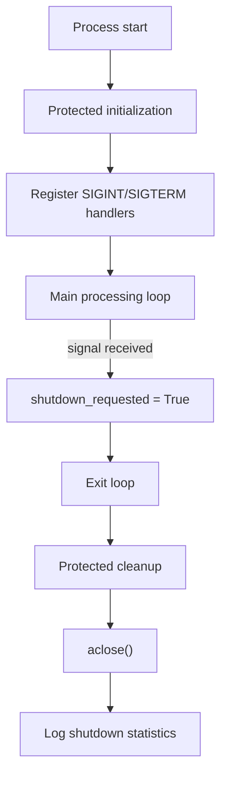

# Graceful Shutdown

> Run a tool-calling 10xGraph agent as a long-running service that handles SIGINT and SIGTERM, protects startup and cleanup, and calls aclose().

Source: https://10xgraph.com/docs/examples/graceful-shutdown
Last updated: 2026-10-08

To shut a 10xGraph service down cleanly, register signal handlers with `GracefulShutdownManager`, stop starting work once `shutdown_requested` is set, and finish by calling `await graph.aclose()`. This example runs a tool-calling agent in a loop and walks through each of those steps, including how to read the shutdown statistics.

## What the example shows

A production-ready asyncio service that:

- handles both `SIGINT` (Ctrl+C) and `SIGTERM` (from container orchestrators)
- keeps initialization and cleanup protected from interruption
- processes work in a loop until shutdown is requested
- closes all graph resources with `aclose()` and logs shutdown statistics
- uses a realistic ReAct agent with tool calling, not a mock

This pattern applies to API worker processes, background job runners, CLI daemons, and containerized services.

## How to run it

Install the required provider extra:

```bash
pip install "10xgraph[google-genai]"
```

Then run the example:

```bash
python examples/graceful_shutdown/graceful_shutdown_example.py
```

The example uses the `google` provider, so set your Google GenAI credentials first, as described in the [Google GenAI example](/docs/examples/google-genai). The source is `agentflow/examples/graceful_shutdown/graceful_shutdown_example.py` in the repository.

The process starts working through a fixed list of queries. Press Ctrl+C while it is running. You should see:

- normal task execution logged to the console
- Ctrl+C triggers graceful shutdown instead of an abrupt crash
- cleanup section executes with signal handlers deferred
- shutdown statistics log (duration, background tasks, checkpointer, publisher, store)
- the application exits cleanly with code 0

## Full example

The complete file, so you can read it in one pass before the walkthrough.

```python title="examples/graceful_shutdown/graceful_shutdown_example.py"
import asyncio
import datetime
import logging
import sys

from tenxgraph.core import Agent, StateGraph, ToolNode
from tenxgraph.core.state import AgentState, Message
from tenxgraph.utils import END
from tenxgraph.utils.shutdown import GracefulShutdownManager

# Configure logging
logging.basicConfig(
    level=logging.INFO, format="%(asctime)s - %(name)s - %(levelname)s - %(message)s"
)
logger = logging.getLogger(__name__)

# Define tools for the agent
def get_current_time(tool_call_id: str | None = None) -> str:
    """Get the current time."""
    return f"Current time is {datetime.datetime.now().strftime('%H:%M:%S')}"

def get_system_status(tool_call_id: str | None = None) -> str:
    """Get the system status."""
    return "System status: All services operational"

def calculate(expression: str, tool_call_id: str | None = None) -> str:
    """Safely evaluate a mathematical expression."""
    try:
        # Only allow basic math operations for safety
        # Note: In production, use a proper math parser instead of eval
        allowed_names = {"__builtins__": {}}
        result = eval(expression, allowed_names, {})  # noqa: S307
        return f"Result: {result}"
    except Exception as e:
        return f"Error calculating: {e}"

# Create tool node with available tools
tool_node = ToolNode([get_current_time, get_system_status, calculate])

# Create the main agent using Agent class
main_agent = Agent(
    model="gemini-2.0-flash-exp",
    provider="google",
    system_prompt=[
        {
            "role": "system",
            "content": """You are a helpful assistant with access to tools.
You can check the time, system status, and perform calculations.
Use tools when appropriate to help answer user questions.""",
        },
    ],
    tools=tool_node,
    trim_context=True,
)

def route_decision(state: AgentState) -> str:
    """Route to tool execution or end based on agent output."""
    if not state.context:
        return "TOOL"

    last_message = state.context[-1]

    # Check if assistant made tool calls
    if (
        hasattr(last_message, "tools_calls")
        and last_message.tools_calls
        and len(last_message.tools_calls) > 0
        and last_message.role == "assistant"
    ):
        return "TOOL"

    # If last message is tool result, go back to agent
    if last_message.role == "tool":
        return "MAIN"

    # Otherwise, we're done
    return END

def build_graph() -> StateGraph:
    """Build a React agent graph with tool calling."""
    graph = StateGraph()
    graph.add_node("MAIN", main_agent)
    graph.add_node("TOOL", tool_node)

    # Conditional routing from main agent
    graph.add_conditional_edges("MAIN", route_decision, {"TOOL": "TOOL", END: END, "MAIN": "MAIN"})

    # Always return to main after tool execution
    graph.add_edge("TOOL", "MAIN")

    graph.set_entry_point("MAIN")
    return graph

async def long_running_service():
    """
    Long-running service that processes tasks until shutdown signal received.

    This demonstrates:
    - Graceful shutdown with signal handling
    - Protected initialization and cleanup
    - Proper resource management
    - Shutdown statistics logging
    - React agent with real tool calling
    """
    # Configuration
    SHUTDOWN_TIMEOUT = 30.0

    # Create shutdown manager
    shutdown_manager = GracefulShutdownManager(shutdown_timeout=SHUTDOWN_TIMEOUT)

    logger.info("Building and compiling graph...")
    graph = build_graph().compile(shutdown_timeout=SHUTDOWN_TIMEOUT)

    # Register signal handlers for SIGTERM and SIGINT
    shutdown_manager.register_signal_handlers()
    logger.info("Signal handlers registered (Ctrl+C to stop)")

    task_count = 0  # Initialize task counter before try block
    try:
        # Protected initialization
        logger.info("Starting initialization (protected from interruption)...")
        with shutdown_manager.protect_section():
            await asyncio.sleep(2)  # Simulate initialization
            logger.info("Initialization complete")

        # Main processing loop
        logger.info("Entering main loop. Press Ctrl+C to shutdown gracefully...")

        # Define sample queries for the agent
        sample_queries = [
            "What time is it?",
            "Can you calculate 15 + 27?",
            "What's the system status?",
            "Calculate 100 * 5 and tell me the time",
        ]

        while not shutdown_manager.shutdown_requested:
            try:
                # Check for shutdown every 1 second
                await asyncio.wait_for(asyncio.sleep(0.1), timeout=1.0)

                # Process a task
                task_count += 1
                query = sample_queries[(task_count - 1) % len(sample_queries)]
                logger.info(f"Processing task #{task_count}: {query}")

                result = await graph.ainvoke(
                    {"messages": [Message.text_message(query, role="user")]},
                    config={"thread_id": f"thread_{task_count}"},
                )

                # Log the final response
                if result.get("messages"):
                    last_msg = result["messages"][-1]
                    if last_msg.role == "assistant":
                        logger.info(f"Agent response: {last_msg.content[:100]}...")

                logger.info(f"Task #{task_count} completed")

                # Simulate some delay between tasks
                await asyncio.sleep(2)

            except TimeoutError:
                # No task available, continue to check shutdown flag
                continue
            except Exception as e:
                logger.exception("Error processing task: %s", e)

    except KeyboardInterrupt:
        logger.info("Received KeyboardInterrupt (Ctrl+C)")
    except Exception as e:
        logger.exception("Fatal error: %s", e)
        sys.exit(1)
    finally:
        # Protected cleanup
        logger.info("Starting cleanup (protected from interruption)...")
        with shutdown_manager.protect_section():
            # Close graph with detailed statistics
            stats = await graph.aclose()

            # Log shutdown statistics
            logger.info("=== Shutdown Statistics ===")
            logger.info(f"Total duration: {stats.get('total_duration', 0):.2f}s")
            logger.info(f"Background tasks: {stats.get('background_tasks', {})}")
            logger.info(f"Checkpointer: {stats.get('checkpointer', {})}")
            logger.info(f"Publisher: {stats.get('publisher', {})}")
            logger.info(f"Store: {stats.get('store', {})}")

            # Unregister signal handlers
            shutdown_manager.unregister_signal_handlers()
            logger.info("Cleanup complete")

        logger.info(f"Processed {task_count} tasks total")
        logger.info("Application shutdown complete")

async def main():
    """Main entry point."""
    logger.info("=== Graceful Shutdown Example ===")
    logger.info("This example demonstrates graceful shutdown with signal handling.")
    logger.info("Press Ctrl+C at any time to trigger graceful shutdown.")
    logger.info("")

    try:
        await long_running_service()
    except KeyboardInterrupt:
        logger.info("Application terminated")
    finally:
        logger.info("Goodbye!")

if __name__ == "__main__":
    try:
        asyncio.run(main())
    except KeyboardInterrupt:
        logger.info("Shutdown complete")
        sys.exit(0)
```

## Code walkthrough

The example is structured in phases: imports and tools, graph building, shutdown coordination, and the main service loop.

### Setting up tools and the agent

The example defines three tools to make the agent work realistically:

```python
def get_current_time(tool_call_id: str | None = None) -> str:
    return f"Current time is {datetime.datetime.now().strftime('%H:%M:%S')}"

def get_system_status(tool_call_id: str | None = None) -> str:
    return "System status: All services operational"

def calculate(expression: str, tool_call_id: str | None = None) -> str:
    try:
        allowed_names = {"__builtins__": {}}
        result = eval(expression, allowed_names, {})
        return f"Result: {result}"
    except Exception as e:
        return f"Error calculating: {e}"
```

The `tool_call_id` parameter is injected by the graph at runtime. The `calculate` tool uses `eval` with empty builtins to keep the example short; use a real math parser in production. The Agent is configured with Google's Gemini model:

```python
main_agent = Agent(
    model="gemini-2.0-flash-exp",
    provider="google",
    system_prompt=[
        {
            "role": "system",
            "content": "You are a helpful assistant with access to tools...",
        }
    ],
    tools=tool_node,
    trim_context=True,
)
```

### Building the graph

The graph routes between the main agent and a tool node:

```python
def build_graph() -> StateGraph:
    graph = StateGraph()
    graph.add_node("MAIN", main_agent)
    graph.add_node("TOOL", tool_node)
    graph.add_conditional_edges("MAIN", route_decision, {"TOOL": "TOOL", END: END, "MAIN": "MAIN"})
    graph.add_edge("TOOL", "MAIN")
    graph.set_entry_point("MAIN")
    return graph
```

The `route_decision` function checks whether the agent made tool calls. If so, the graph goes to the tool node. If the last message is a tool result, it returns to the agent. Otherwise, it ends.

### Creating a shutdown manager and registering signal handlers

The shutdown manager coordinates the graceful shutdown process:

```python
SHUTDOWN_TIMEOUT = 30.0
shutdown_manager = GracefulShutdownManager(shutdown_timeout=SHUTDOWN_TIMEOUT)
graph = build_graph().compile(shutdown_timeout=SHUTDOWN_TIMEOUT)
shutdown_manager.register_signal_handlers()
```

The same timeout is used for both the manager and the compiled graph. When a signal arrives, the manager sets `shutdown_requested = True`, which the main loop checks on each iteration.

### Protecting initialization

Critical initialization is wrapped in `protect_section()`. `protect_section()` returns a `DelayedKeyboardInterrupt` context manager. A SIGINT or SIGTERM that arrives inside it is stored and handled when the block exits:

```python
with shutdown_manager.protect_section():
    await asyncio.sleep(2)
    logger.info("Initialization complete")
```

This ensures that startup code finishes before a shutdown signal can interrupt it.

### Main processing loop

The service loop is simple and responsive:

```python
while not shutdown_manager.shutdown_requested:
    try:
        # Short pause between loop checks; the TimeoutError branch is a safety net
        await asyncio.wait_for(asyncio.sleep(0.1), timeout=1.0)
        task_count += 1
        query = sample_queries[(task_count - 1) % len(sample_queries)]
        logger.info(f"Processing task #{task_count}: {query}")

        result = await graph.ainvoke(
            {"messages": [Message.text_message(query, role="user")]},
            config={"thread_id": f"thread_{task_count}"},
        )

        logger.info(f"Task #{task_count} completed")
        await asyncio.sleep(2)

    except TimeoutError:
        continue
    except Exception as e:
        logger.exception("Error processing task: %s", e)
```

The `while` condition is the only place the flag is read, so a signal that arrives mid-task lets that task finish and then ends the loop. Each iteration runs one task and catches exceptions so one failure does not crash the process. The example sends a different query on each iteration to exercise the agent's tool calling.

### Protected cleanup

When the loop exits or an exception occurs, cleanup runs in a protected section:

```python
with shutdown_manager.protect_section():
    stats = await graph.aclose()

    logger.info("=== Shutdown Statistics ===")
    logger.info(f"Total duration: {stats.get('total_duration', 0):.2f}s")
    logger.info(f"Background tasks: {stats.get('background_tasks', {})}")
    logger.info(f"Checkpointer: {stats.get('checkpointer', {})}")
    logger.info(f"Publisher: {stats.get('publisher', {})}")
    logger.info(f"Store: {stats.get('store', {})}")

    shutdown_manager.unregister_signal_handlers()
```

`aclose()` drains background tasks, closes the checkpointer, publisher and store, and returns a dictionary with the keys `background_tasks`, `checkpointer`, `publisher`, `store` and `total_duration`. A component that is not configured reports `status: skipped`. These are logged so you can verify that the shutdown was clean: no dangling background tasks, no incomplete checkpoints, no publisher errors.

## Architecture diagrams

### Shutdown flow



### Signal handling sequence

```mermaid
sequenceDiagram
    participant OS as OS / container runtime
    participant Manager as GracefulShutdownManager
    participant Loop as Main loop
    participant Graph as Compiled graph

    OS->>Manager: SIGINT or SIGTERM
    Manager->>Manager: shutdown_requested = True
    Loop->>Loop: stop starting new tasks
    Loop->>Graph: exit loop, call aclose()
    Graph-->>Loop: shutdown statistics
```

## Why each piece matters

**`GracefulShutdownManager`** coordinates signal handling and protects critical sections. It decouples signal receipt from cleanup logic and allows you to defer interruption briefly around initialization and teardown.

**`protect_section()`** delays SIGINT and SIGTERM handling inside a context manager and re-delivers the signal on exit. It swaps in process-level signal handlers, so it works from the main thread only. Use it sparingly around code that cannot tolerate partial execution: resource initialization, final cleanup, and transaction commits.

**Checking `shutdown_requested` in the loop** stops the service from starting new work after a shutdown signal arrives. Existing tasks may still be running; the signal handler sets a flag, not a hard interrupt.

**Calling `aclose()` and logging stats** proves that shutdown was healthy. If a checkpointer has unsaved changes or a publisher has unsent messages, those stats will show it. Logging them makes it easy to debug bad shutdowns in production.

## Common mistakes to avoid

- **Relying on `KeyboardInterrupt` alone.** Containers send `SIGTERM`, not `SIGINT`. Both must be handled.
- **Doing cleanup in `finally` without protection.** Cleanup can be interrupted mid-way. Use `protect_section()` around critical teardown.
- **Skipping `aclose()`.** Without it, background tasks, database connections, and message queues may hang. Always call it.
- **Starting new work after shutdown is requested.** Check `shutdown_requested` before accepting new tasks, not inside them.
- **Not logging shutdown statistics.** You won't know whether a shutdown was healthy without inspecting the stats.

## What to try next

- Change `SHUTDOWN_TIMEOUT` and observe how long cleanup is allowed to take. `aclose()` gives the background task manager the full timeout and each of the checkpointer, publisher and store one third.
- Attach a checkpointer or publisher to `compile()` and watch their entries in the statistics change from `skipped`.
- Add your own shutdown callback with `add_shutdown_callback()` to see how to coordinate with external systems.
- Replace the sample queries with work from a real queue.
- Run the example in a container and send it `SIGTERM` from the orchestrator to verify termination works there too.

For the reusable pattern without the agent, see the [graceful shutdown guide](/docs/guides/graceful-shutdown). For background tasks and resource cleanup, see [running background tasks](/docs/guides/run-background-tasks) and the [background tasks reference](/docs/reference/python/background-tasks).

## Frequently asked questions

### Why handle SIGTERM as well as Ctrl+C?

Container orchestrators stop processes with SIGTERM, not SIGINT. GracefulShutdownManager registers handlers for both.

### What does graph.aclose() return?

A dictionary of shutdown statistics with background_tasks, checkpointer, publisher, store and total_duration entries.
