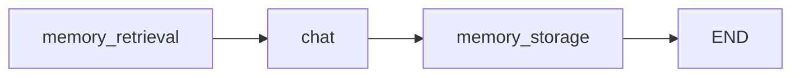

# Memory

> Build a chatbot that remembers user preferences across conversations, using Mem0 and Qdrant for long-term memory inside custom graph nodes.

Source: https://10xgraph.com/docs/examples/memory
Last updated: 2026-10-08

A chatbot that learns user preferences and recalls them in later conversations. A retrieval node searches Mem0 before the agent answers, a storage node saves each exchange afterwards, and the retrieved memories reach the model through the system prompt. This example calls the Mem0 SDK directly from custom nodes.

## Run the example

The source is [`examples/memory/simple_personalized_agent.py`](https://github.com/10xGraph/10xGraph/tree/main/examples/memory) in the core repo. It needs a Gemini key, a Mem0 key and a Qdrant cloud cluster.

Install the packages (the `mem0` extra installs `mem0ai`):

```bash
pip install "10xgraph[google-genai,mem0]" python-dotenv
```

Create a `.env` file next to the script with your own values:

```text
GOOGLE_API_KEY=your_google_api_key
MEM0_API_KEY=your_mem0_api_key
QDRANT_URL=https://your-cluster.qdrant.io
QDRANT_API_KEY=your_qdrant_api_key
```

Then run it:

```bash
python simple_personalized_agent.py
```

## How the graph is shaped

The graph has three nodes in a line: retrieve memories, chat, store the exchange. Retrieval writes a string into the state, the agent's system prompt reads it, and storage runs only after the reply exists.



## Extend the state with user context

The custom state adds two fields: `user_id` scopes every Mem0 call, and `memory_context` holds the text that retrieval builds for the system prompt.

```python title="simple_personalized_agent.py"
import asyncio
import os

from dotenv import load_dotenv
from mem0 import Memory

from tenxgraph.core import Agent, StateGraph
from tenxgraph.core.state import AgentState, Message
from tenxgraph.utils.constants import END

load_dotenv()

class MemoryAgentState(AgentState):
    """State with user ID and memory context for interpolation."""

    user_id: str = ""
    memory_context: str = ""
```

## Configure Mem0 with a Qdrant cloud backend

Mem0 manages embeddings and the vector store. This config points it at your Qdrant cluster and uses Gemini for both the memory-extraction model and the embeddings.

```python title="simple_personalized_agent.py"
config = {
    "vector_store": {
        "provider": "qdrant",
        "config": {
            "collection_name": "simple_agent_memory",
            "url": os.getenv("QDRANT_URL"),
            "api_key": os.getenv("QDRANT_API_KEY"),
            "embedding_model_dims": 768,  # must match the Gemini embedding size
        },
    },
    "llm": {
        "provider": "gemini",
        "config": {"model": "gemini-2.0-flash-exp", "temperature": 0.1},
    },
    "embedder": {"provider": "gemini", "config": {"model": "models/text-embedding-004"}},
}

memory = Memory.from_config(config)
```

The vector size is fixed per collection. If you change the embedding model, use a new `collection_name`.

## Retrieve memories before the agent answers

The retrieval node searches Mem0 with the latest user message and the current `user_id`, keeps the top three hits, and writes them into `memory_context`. Failures are caught so a memory outage does not stop the chat.

```python title="simple_personalized_agent.py"
async def memory_retrieval_node(state: MemoryAgentState) -> MemoryAgentState:
    """Search Mem0 and build the text the system prompt will interpolate."""
    if not state.context:
        return state

    user_message = state.context[-1].text()

    memories = []
    try:
        results = memory.search(query=user_message, user_id=state.user_id, limit=3)
        if "results" in results:
            memories = [m["memory"] for m in results["results"]]
        print(f"Retrieved {len(memories)} memories")
    except Exception as e:
        print(f"Memory retrieval error: {e}")

    if memories:
        state.memory_context = "Relevant memories:\n" + "\n".join(f"- {m}" for m in memories)
    else:
        state.memory_context = ""
    return state
```

## Inject memories through the system prompt

The agent's system prompt contains the placeholder `{memory_context}`. 10xGraph fills state placeholders in the prompt from the current state before each model call, so whatever retrieval wrote appears in the prompt.

```python title="simple_personalized_agent.py"
response_agent = Agent(
    model="gemini-2.0-flash",
    provider="google",
    system_prompt=[
        {
            "role": "system",
            "content": """You are a helpful AI assistant with memory of past conversations.

{memory_context}

Be conversational, helpful, and reference past interactions when relevant.""",
        },
    ],
    trim_context=True,  # keep long conversations within the context window
)
```

## Store each exchange after the reply

The storage node takes the last two messages (the user turn and the agent reply) and adds them to Mem0 under the user's ID. Mem0 extracts the durable facts itself, and the model never decides whether to store.

```python title="simple_personalized_agent.py"
async def memory_storage_node(state: MemoryAgentState) -> MemoryAgentState:
    """Save the latest user/assistant exchange to long-term memory."""
    if len(state.context) < 2:
        return state

    user_message = state.context[-2]
    ai_message = state.context[-1]

    try:
        interaction = [
            {"role": "user", "content": user_message.content},
            {"role": "assistant", "content": ai_message.content},
        ]
        memory.add(messages=interaction, user_id=state.user_id, metadata={"app_id": "simple-agent"})
        print(f"Memory stored for user {state.user_id}")
    except Exception as e:
        print(f"Memory storage error: {e}")
    return state
```

## Wire the nodes into a graph

Entry point, edges and `END` make the three nodes run in order on every turn.

```python title="simple_personalized_agent.py"
graph = StateGraph[MemoryAgentState](MemoryAgentState())

graph.add_node("memory_retrieval", memory_retrieval_node)
graph.add_node("chat", response_agent)
graph.add_node("memory_storage", memory_storage_node)

graph.set_entry_point("memory_retrieval")
graph.add_edge("memory_retrieval", "chat")
graph.add_edge("chat", "memory_storage")
graph.add_edge("memory_storage", END)

app = graph.compile()
```

## Chat across turns and check recall

Pass `user_id` in the run config. The example uses it as both `thread_id` and `user_id`. The last two prompts ask what the agent remembers, which is how you check the memory works.

```python title="simple_personalized_agent.py"
async def main():
    user_id = "test_user"
    conversations = [
        "Hi, I'm John and I love pizza!",
        "What are some good pizza toppings?",
        "What do you remember about my food preferences?",
        "I also enjoy hiking on weekends",
        "What activities do I enjoy based on our conversation?",
    ]

    for message in conversations:
        print(f"User: {message}")
        inp = {"messages": [Message.text_message(message, role="user")]}
        run_config = {"thread_id": user_id, "user_id": user_id}
        result = await app.ainvoke(inp, config=run_config)
        print(f"Agent: {result['messages'][-1].text()}\n")

if __name__ == "__main__":
    asyncio.run(main())
```

The replies are model output and vary between runs. Expect the third answer to mention pizza and the fifth to mention hiking. To prove memory is long-term and not just thread history, run the script again with a new `thread_id` and the same `user_id`: the agent should still recall John.

## What to try next

- Swap Gemini for OpenAI by changing the `llm` and `embedder` providers in the Mem0 config and the agent model, then update `embedding_model_dims`.
- Run `personalized_agent_qdrant.py` in the same folder for a larger state with session tracking and summaries.
- Read [Long-term memory](/docs/concepts/memory-and-store) for how checkpointers (thread memory) differ from stores (long-term memory).
- For memory built into the agent without custom nodes, read [Use a memory store](/docs/guides/use-memory-store).

## Frequently asked questions

### How do I use the built-in memory API instead of calling Mem0 directly?

Pass Agent(memory=MemoryConfig(...)) with a QdrantStore or Mem0Store, and the agent gets memory without custom nodes. See Use a memory store.

### Can memories be stored without the model deciding?

Yes. In this example a graph node writes every exchange to Mem0 after the agent replies, so the model never has to call a memory tool.

### How are memories isolated per user?

The user_id from the run config is copied into the state and passed to every Mem0 search and add call, so each user only sees their own memories.
