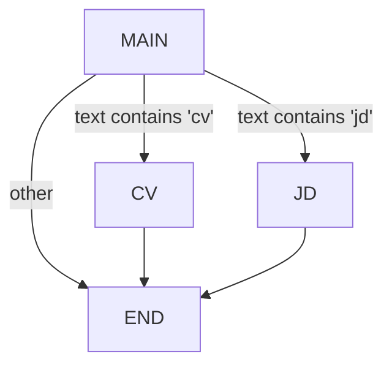

# Multiagent

> Route work between specialist nodes in one 10xGraph graph with a coordinator node and conditional edges, using a deterministic, runnable example.

Source: https://10xgraph.com/docs/examples/multiagent
Last updated: 2026-10-08

This example routes work between specialist nodes in a single graph. A coordinator node produces a message, a routing function reads it, and a conditional edge sends the run to the CV specialist, the JD specialist or the end. Use it for a few clear specialists with simple rules.

## How to run it

The example lives at `agentflow/examples/multiagent/multiagent.py`.

Install the package. The example needs no provider extra because no model is called (`python-dotenv`, which the script imports, is a dependency of 10xGraph):

```bash
pip install 10xgraph
```

Run:

```bash
python agentflow/examples/multiagent/multiagent.py
```

The script prints three runs. The last message of each run is "CV Created Successfully", "JD Created Successfully" and "Thank you for contacting me", in that order.

## Graph shape

The example builds a graph with one coordinator and two specialists:



The `MAIN` node is the coordinator. It generates a message whose text determines which specialist runs next. The routing function checks the message text and directs flow to `CV`, `JD`, or `END`.

## Code walkthrough

**Import the pieces.** The script needs the graph class, the state and message types, and the `END` constant:

```python title="agentflow/examples/multiagent/multiagent.py"
from dotenv import load_dotenv

from tenxgraph.core.graph import StateGraph
from tenxgraph.core.state import AgentState, Message
from tenxgraph.utils.constants import END

load_dotenv()
```

**Define specialized worker nodes.** Each node is a plain function that takes state and an optional config, and returns a message:

```python title="agentflow/examples/multiagent/multiagent.py"
def cv_agent(state: AgentState, config: dict | None = None):
    return Message.text_message("CV Created Successfully", role="assistant")

def jd_agent(state: AgentState, config: dict | None = None):
    return Message.text_message("JD Created Successfully", role="assistant")
```

These are stateless nodes. In a real system, they might call APIs or run sub-graphs.

**Create the coordinator node.** The `main_agent` function examines the `config` dictionary to decide what message to send. This makes the example deterministic and easy to test:

```python title="agentflow/examples/multiagent/multiagent.py"
def main_agent(state: AgentState, config: dict):
    is_end = config.get("trail", 2)
    if is_end == 0:
        return Message.text_message("CV", role="assistant")
    elif is_end == 1:
        return Message.text_message("JD", role="assistant")
    else:
        return Message.text_message("Thank you for contacting me", role="assistant")
```

In a real application, you would replace this logic with an LLM call: `Agent(model="...")` would analyze the input and decide which specialist to route to.

**Write the routing function.** The `should_use_tools` function inspects the last message from the coordinator and returns the name of the next node:

```python title="agentflow/examples/multiagent/multiagent.py"
def should_use_tools(state: AgentState) -> str:
    """Determine if we should use tools or end the conversation."""
    if not state.context or len(state.context) == 0:
        return "TOOL"  # No context, might need tools

    last_message = state.context[-1]
    msg = last_message.text()
    if "cv" in msg.lower():
        return "CV"
    if "jd" in msg.lower():
        return "JD"

    return END
```

The function reads the text of the last message. If it contains "cv" or "jd", it returns that specialist's node name. Otherwise it returns `END` to finish the run. The `"TOOL"` branch only fires when the context is empty; it has no entry in the path map below, so it is a leftover guard you can drop in your own graphs.

**Build and compile the graph.** Wire up the nodes and edges:

```python title="agentflow/examples/multiagent/multiagent.py"
graph = StateGraph()
graph.add_node("MAIN", main_agent)
graph.add_node("CV", cv_agent)
graph.add_node("JD", jd_agent)

# Add conditional edges from MAIN
graph.add_conditional_edges(
    "MAIN",
    should_use_tools,
    {"CV": "CV", "JD": "JD", END: END},
)

# Each specialist finishes the run
graph.add_edge("CV", END)
graph.add_edge("JD", END)
graph.set_entry_point("MAIN")

app = graph.compile()
```

The conditional edges dictionary maps routing function outputs to node names. Each specialist node connects directly to `END`, so there is no loop back to `MAIN`. The `recursion_limit` in the config caps the number of steps as a safety net.

**Run the graph with different configs.** The example invokes the graph three times with different `trail` values:

```python title="agentflow/examples/multiagent/multiagent.py"
config = {"thread_id": "12345", "recursion_limit": 10, "trail": 0}
inp = {"messages": [Message.text_message("HI")]}
res = app.invoke(inp, config=config)
for message in res["messages"]:
    print(message.role, message)
```

Each run produces messages appended to the state. The `trail` config determines which specialist the coordinator routes to:

- `trail = 0` produces "CV" message, routes to CV specialist
- `trail = 1` produces "JD" message, routes to JD specialist
- `trail = 2` produces "Thank you for contacting me", routes to END

## What to try next

**Upgrade the coordinator to use an LLM.** Replace the deterministic `main_agent` with an `Agent` that calls a real model. The agent reads the user input and decides which specialist to invoke.

**Add handoff tools.** Let specialists themselves initiate handoff to other specialists using `create_handoff_tool`. This gives them agency. See the [Handoff example](/docs/examples/handoff).

**Chain multiple specialists.** Route from one specialist to another based on intermediate results, not just the initial coordinator decision.

**Add memory.** Store the thread's state across multiple invocations so that specialists can access conversation history. See the [Memory example](/docs/examples/memory) and the [Checkpointing guide](/docs/guides/set-up-checkpointing).

## Frequently asked questions

### How does a conditional edge pick the next node?

The routing function receives the state and returns a string. The path map passed to add_conditional_edges translates that string into a node name or END.

### Do I need an API key to run this example?

No. The coordinator is deterministic and reads a trail value from the config, so no model is called.
