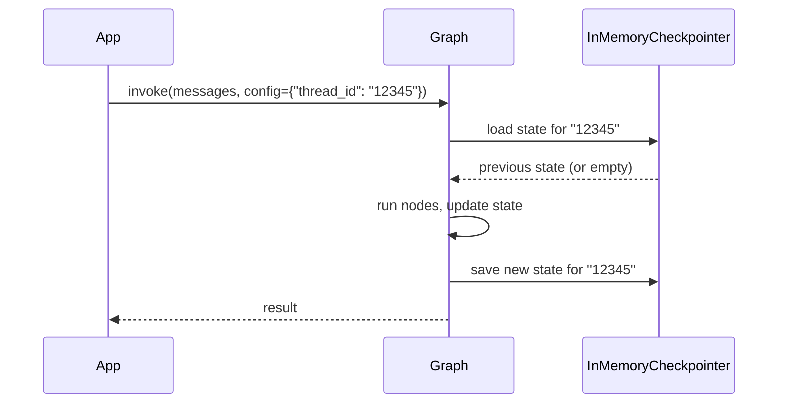

# ReAct Agent

> Walk through a ReAct agent that calls a weather tool, injects tool_call_id and state, and keeps history per thread with a checkpointer.

Source: https://10xgraph.com/docs/examples/react-agent
Last updated: 2026-10-08

This example builds a ReAct (Reason + Act) agent: an `Agent` node reasons, a `ToolNode` runs the tool calls it requests, and a conditional edge loops between them until the model answers. It uses a weather tool, a custom state class and an `InMemoryCheckpointer`, so you see the full loop in one file.

## What the example shows

- A tool (`get_weather`) with a simple retry loop around a stand-in weather function.
- A custom state class that extends `AgentState`.
- Injected tool parameters (`tool_call_id`, `state`) that the model never sees.
- A router function that decides between the tool node and the end of the run.
- An `InMemoryCheckpointer` that stores state per `thread_id`.

## How to run it

The example file is `agentflow/examples/react/react_sync.py` in the repository. It needs a Gemini API key.

Install the core library with Google Gemini support:

```bash
pip install "10xgraph[google-genai]"
```

Set your Gemini API key (`GOOGLE_API_KEY` also works), or put it in a `.env` file, which the script loads with `load_dotenv()`:

```bash
export GEMINI_API_KEY="your-api-key"
```

Run the example:

```bash
python agentflow/examples/react/react_sync.py
```

The script invokes the agent once with thread ID `12345` and prints each message and the token usage.

## Define a custom state and a checkpointer

The state class adds a field to `AgentState`, and the checkpointer saves state per thread.

```python title="react_sync.py (state and checkpointer)"
from tenxgraph.core.state import AgentState
from tenxgraph.storage.checkpointer import InMemoryCheckpointer

class CustomAgentState(AgentState):
    jd_name: str = "CustomAgentState"

checkpointer = InMemoryCheckpointer()
```

`InMemoryCheckpointer` keeps state in process memory, keyed by `thread_id`. Calling `invoke` again with the same `thread_id` loads the previous state. Nothing survives a restart, so for durable storage use `PgCheckpointer` instead.

The diagram shows where the checkpointer sits in a run:



## Write a tool with injected parameters

The tool takes the model-supplied `location` plus two parameters the framework fills in.

```python title="react_sync.py (tool)"
def call_weather_api(location: str) -> str:
    return f"The weather in {location} is sunny"

def get_weather(
    location: str,
    tool_call_id: str | None = None,
    state: CustomAgentState | None = None,
) -> str:
    """Get the current weather for a specific location."""
    # Access injected parameters
    if tool_call_id:
        print(f"Tool call ID: {tool_call_id}")
    if state and hasattr(state, "context"):
        print(f"Number of messages in context: {len(state.context)}")
    
    # Try the weather function up to 3 times
    result = ""
    for i in range(3):
        try:
            result = call_weather_api(location)
            break
        except Exception as e:
            print(f"Attempt {i + 1} failed: {e}")
            if i == 2:
                result = f"Sorry, I couldn't fetch the weather for {location} after multiple attempts."
    
    return result
```

`tool_call_id` and `state` are injected at call time and are not part of the tool schema sent to the model:

| Parameter | Resolved from |
|---|---|
| `tool_call_id: str` | The tool call ID assigned by the LLM |
| `state: AgentState` (or subclass) | The current graph state |

`call_weather_api` always succeeds here, so the retry branch never runs. Replace it with a real API call to see the retry and the fallback message.

## Configure the agent

The `Agent` node wraps the Gemini model, the system prompt and the tool node.

```python title="react_sync.py (agent)"
from tenxgraph.core import Agent, StateGraph, ToolNode

tool_node = ToolNode([get_weather])

agent = Agent(
    model="gemini-2.5-flash",
    provider="google",
    system_prompt=[
        {
            "role": "system",
            "content": """You are a helpful assistant, talking with Human over voice.
Your task is to assist the user in finding information and answering questions.
When you ask for tools, share some filler content to keep the conversation
natural, and then call the tools with the right parameters.""",
        },
        {"role": "user", "content": "Today Date is 2024-06-15"},
    ],
    trim_context=True,
    reasoning_config=True,
    tool_node=tool_node,
)
```

Key parameters:

- `model`: The model name.
- `provider`: Set to `"google"` here. If omitted, it is detected from the model name.
- `system_prompt`: Can be a string or a list of message dicts, as shown here.
- `trim_context=True`: trims the context using the context manager (default `False`).
- `reasoning_config=True`: turns on reasoning for models that support it. It also accepts a dict such as `{"effort": "high"}`.
- `tool_node`: The `ToolNode` that executes tool calls from the LLM.

## Wire the graph with conditional routing

The router sends the run to the tool node or ends it, and the tool node always returns to the agent.

```python title="react_sync.py (graph)"
from tenxgraph.utils.constants import END

def should_use_tools(state: AgentState) -> str:
    """Route: should we call tools next, or end?"""
    if not state.context or len(state.context) == 0:
        return "TOOL"
    
    last_message = state.context[-1]
    
    # If assistant just called tools, execute them
    if (
        hasattr(last_message, "tools_calls")
        and last_message.tools_calls
        and len(last_message.tools_calls) > 0
        and last_message.role == "assistant"
    ):
        return "TOOL"
    
    # If we just got tool results, have the agent respond
    if last_message.role == "tool":
        return "MAIN"
    
    # Otherwise, end the conversation
    return END

graph = StateGraph()
graph.add_node("MAIN", agent)
graph.add_node("TOOL", tool_node)

# From MAIN, conditionally route to TOOL or END
graph.add_conditional_edges(
    "MAIN",
    should_use_tools,
    {"TOOL": "TOOL", END: END},
)

# After tool execution, always go back to MAIN
graph.add_edge("TOOL", "MAIN")
graph.set_entry_point("MAIN")

app = graph.compile(checkpointer=checkpointer)
```

`should_use_tools` implements the ReAct loop:

1. **MAIN** calls the agent (LLM reasons and optionally calls tools).
2. **Conditional edge** checks if the LLM produced tool calls:
   - Yes: go to the **TOOL** node.
   - A tool result is last: go to **MAIN**.
   - Otherwise: go to **END**.
3. The **TOOL** node runs the requested tool calls.
4. **Edge** sends tool results back to **MAIN**, which reasons again.

The loop ends when the model replies without tool calls. `recursion_limit` in the run config caps the number of steps.

## Invoke the agent on a thread

Pass a message and a config with `thread_id` and `recursion_limit`.

```python title="react_sync.py (run)"
from tenxgraph.core.state import Message

inp = {"messages": [Message.text_message("Please call the get_weather function for New York City")]}
config = {"thread_id": "12345", "recursion_limit": 10}

res = app.invoke(inp, config=config)

for msg in res["messages"]:
    print(f"[{msg.role}] {msg}")
```

On the first run:

1. The graph loads the state for thread `"12345"` (empty the first time).
2. The agent receives "Please call the get_weather..." and calls `get_weather("New York City")`.
3. The tool returns "The weather in New York City is sunny".
4. The agent produces a final response.
5. The checkpointer saves the state for the thread.

The script calls `invoke` once. If you call it again in the same process with the same `thread_id`:

1. The checkpointer loads the saved state.
2. A new input message is appended.
3. The agent responds, and the loop repeats.

## Complete runnable source

The full file, with the debug prints from the script:

```python title="agentflow/examples/react/react_sync.py"
from dotenv import load_dotenv

from tenxgraph.core import Agent, StateGraph, ToolNode
from tenxgraph.core.state import AgentState, Message
from tenxgraph.storage.checkpointer import InMemoryCheckpointer
from tenxgraph.utils.constants import END

load_dotenv()

checkpointer = InMemoryCheckpointer()

class CustomAgentState(AgentState):
    jd_name: str = "CustomAgentState"

def call_weather_api(location: str) -> str:
    return f"The weather in {location} is sunny"

def get_weather(
    location: str,
    tool_call_id: str | None = None,
    state: CustomAgentState | None = None,
) -> str:
    """Get the current weather for a specific location."""
    if tool_call_id:
        print(f"Tool call ID: {tool_call_id}")
    if state and hasattr(state, "context"):
        print(f"Number of messages in context: {len(state.context)}")
    
    result = ""
    for i in range(3):
        try:
            result = call_weather_api(location)
            break
        except Exception as e:
            print(f"Attempt {i + 1} failed: {e}")
            if i == 2:
                result = f"Sorry, I couldn't fetch the weather for {location} after multiple attempts."
    
    return result

tool_node = ToolNode([get_weather])

agent = Agent(
    model="gemini-2.5-flash",
    provider="google",
    system_prompt=[
        {
            "role": "system",
            "content": """You are a helpful assistant, talking with Human over voice.
Your task is to assist the user in finding information and answering questions.
When you ask for tools, share some filler content to keep the conversation
natural, and then call the tools with the right parameters.""",
        },
        {"role": "user", "content": "Today Date is 2024-06-15"},
    ],
    trim_context=True,
    reasoning_config=True,
    tool_node=tool_node,
)

def should_use_tools(state: AgentState) -> str:
    """Determine if we should use tools or end the conversation."""
    if not state.context or len(state.context) == 0:
        return "TOOL"
    
    last_message = state.context[-1]
    
    if (
        hasattr(last_message, "tools_calls")
        and last_message.tools_calls
        and len(last_message.tools_calls) > 0
        and last_message.role == "assistant"
    ):
        return "TOOL"
    
    if last_message.role == "tool":
        return "MAIN"
    
    return END

graph = StateGraph()
graph.add_node("MAIN", agent)
graph.add_node("TOOL", tool_node)

graph.add_conditional_edges(
    "MAIN",
    should_use_tools,
    {"TOOL": "TOOL", END: END},
)

graph.add_edge("TOOL", "MAIN")
graph.set_entry_point("MAIN")

app = graph.compile(checkpointer=checkpointer)

inp = {"messages": [Message.text_message("Please call the get_weather function for New York City")]}
config = {"thread_id": "12345", "recursion_limit": 10}

res = app.invoke(inp, config=config)
print(f"Final Response Keys: {res.keys()}")

for i in res["messages"]:
    print("=" * 40)
    print(f"Message Role: {i.role}")
    print(i)
    print("=" * 40)
    print()

print()
print(res["token_usage"])
```

## What you learned

- How to build a ReAct loop: agent reasons and decides whether to call tools.
- How checkpointers preserve state across invocations on the same thread.
- How to write tools that accept injected parameters like `tool_call_id` and `state`.
- What `trim_context=True` and `reasoning_config=True` set on the agent.
- How a tool can retry a failing call and return a fallback message.

## What to try next

Add a second tool (for example `get_time`) to the `ToolNode` and watch the agent pick between them. For the prebuilt version of this graph, read [the ReAct agent guide](/docs/guides/prebuilt/react-agent). To understand graphs, nodes and compile, read [StateGraph](/docs/concepts/state-graph).

## Frequently asked questions

### Which API key does the ReAct example need?

It uses the Google provider, so set GEMINI_API_KEY or GOOGLE_API_KEY. The example calls load_dotenv(), so a .env file in the working directory also works.

### How does the agent remember earlier turns?

The graph is compiled with an InMemoryCheckpointer. Calling invoke again with the same thread_id loads the saved state for that thread. The memory is lost when the process exits.
