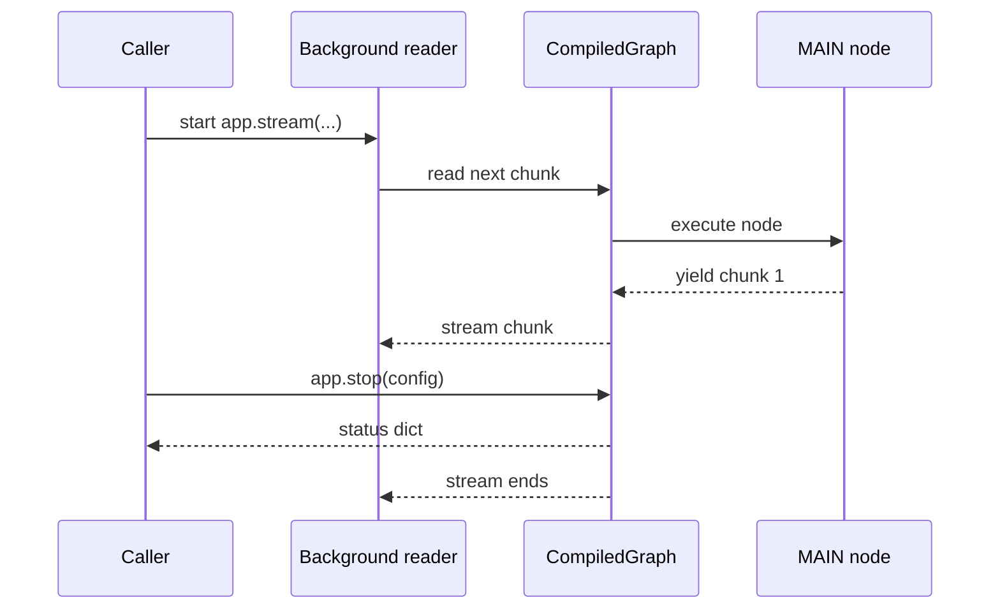
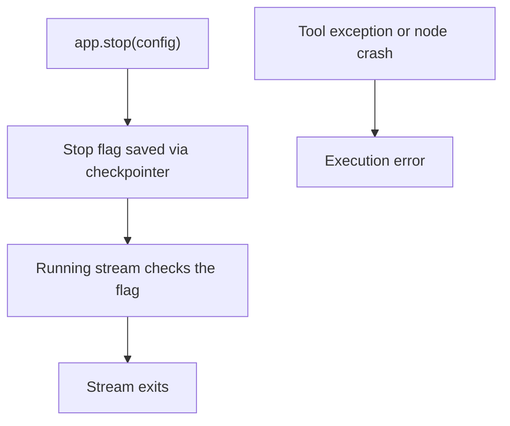

# Stop Stream

> Gracefully stop a running 10xGraph stream from the caller by using app.stop(config).

Source: https://10xgraph.com/docs/examples/stop-stream
Last updated: 2026-10-08

To stop a running 10xGraph stream from the caller, call `app.stop(config)` with the same `thread_id` the stream uses. The graph records a stop flag through its checkpointer and the running stream ends at its next check. This example streams from a background thread and stops it after one second.

**Source example:** [`examples/react_stream/stop_stream.py`](https://github.com/10xGraph/10xGraph/blob/main/examples/react_stream/stop_stream.py)

## What you will build

A long-running streaming graph that emits one chunk per second, and a caller that stops it long before the 50 chunks finish. Use this pattern when a user clicks "Stop generating" in a UI or an API client cancels a request.

## How to run this example

From the 10xGraph repo root, install the package and run the file. The example needs no API key because the node does not call an LLM.

```bash
# python-dotenv is imported by the example; the extra is not needed to run it
pip install 10xgraph python-dotenv
python examples/react_stream/stop_stream.py
```

No environment variables are required. The code calls `load_dotenv()`, which loads a `.env` file if you have one and does nothing otherwise.

## Why stream cancellation matters

Without cancellation, a streaming graph keeps producing chunks until the node finishes or the graph reaches `END`. In interactive apps that is often wrong. Users submit a better prompt and want the old run cancelled, navigate away from the page, or want to stop a costly or obviously wrong response.

`app.stop(config)` lets the caller request termination of the running execution identified by the config, in practice by its `thread_id`.



## Build a node that streams over time

The node is an async generator that yields a `Message` every second. It stands in for any long task: a streaming LLM response, a multi-step retrieval, or a report generator that reports progress.

```python
import asyncio

from tenxgraph.core.state import AgentState, Message

async def main_agent(state: AgentState, config: dict | None = None):
    # Emit 50 chunks, one per second, to simulate long-running work
    for idx in range(50):
        await asyncio.sleep(1)
        yield Message.text_message(f"Chunk {idx + 1} from MAIN")
```

## Wire the graph with a checkpointer

The graph has one node, `MAIN`, and a router that always returns `END`. The checkpointer is required: `stop()` stores its flag through the checkpointer, and without one it returns `{"ok": False, "reason": "no-checkpointer"}`.

```python
from tenxgraph.core.graph import StateGraph
from tenxgraph.storage.checkpointer import InMemoryCheckpointer
from tenxgraph.utils.constants import END

checkpointer = InMemoryCheckpointer()

def should_use_tools(state: AgentState) -> str:
    # Single node: always finish after MAIN
    return END

def build_app():
    graph = StateGraph()
    graph.add_node("MAIN", main_agent)
    graph.add_conditional_edges("MAIN", should_use_tools, {END: END})
    graph.set_entry_point("MAIN")
    return graph.compile(checkpointer=checkpointer)
```

## Read the stream in a background thread

`app.stream(...)` is a synchronous generator, so the caller reads it in a background thread and stays free to call `stop()`. The config sets a fixed `thread_id` and `is_stream` to `True`.

```python
import logging
import threading

def run_and_stop():
    app = build_app()
    inp = {"messages": [Message.text_message("Start streaming and then stop")]}
    config = {"thread_id": "stop-demo-thread", "recursion_limit": 10, "is_stream": True}

    def reader():
        for chunk in app.stream(inp, config=config):
            logging.info("STREAM: %s", getattr(chunk, "content", chunk))

    t = threading.Thread(target=reader, daemon=True)
    t.start()
```

## Request the stop from the caller

After a short delay the caller passes the same `config` to `app.stop(...)`. The `thread_id` is what ties the request to the running stream, so keep it stable for the life of a run.

```python
    # Inside run_and_stop(), after t.start()
    time.sleep(1.0)
    status = app.stop(config)
    logging.info("Requested stop: %s", status)

    # Give the reader a moment to finish
    t.join(timeout=5)
```

## Full example

This is the complete file, matching `examples/react_stream/stop_stream.py` apart from an unused `get_weather` helper that the source defines but never calls.

```python title="examples/react_stream/stop_stream.py"
import asyncio
import logging
import threading
import time

from dotenv import load_dotenv

from tenxgraph.core.graph import StateGraph
from tenxgraph.core.state import AgentState, Message
from tenxgraph.storage.checkpointer import InMemoryCheckpointer
from tenxgraph.utils.constants import END

logging.basicConfig(level=logging.INFO)
load_dotenv()

checkpointer = InMemoryCheckpointer()

async def main_agent(state: AgentState, config: dict | None = None):
    # Emit 50 chunks, one per second, to simulate long-running work
    for idx in range(50):
        await asyncio.sleep(1)
        yield Message.text_message(f"Chunk {idx + 1} from MAIN")

def should_use_tools(state: AgentState) -> str:
    # Single node: always finish after MAIN
    return END

def build_app():
    graph = StateGraph()
    graph.add_node("MAIN", main_agent)
    graph.add_conditional_edges("MAIN", should_use_tools, {END: END})
    graph.set_entry_point("MAIN")
    return graph.compile(checkpointer=checkpointer)

def run_and_stop():
    app = build_app()
    inp = {"messages": [Message.text_message("Start streaming and then stop")]}
    config = {"thread_id": "stop-demo-thread", "recursion_limit": 10, "is_stream": True}

    def reader():
        for chunk in app.stream(inp, config=config):
            logging.info("STREAM: %s", getattr(chunk, "content", chunk))

    t = threading.Thread(target=reader, daemon=True)
    t.start()

    # Let it run briefly, then request stop
    time.sleep(1.0)
    status = app.stop(config)
    logging.info("Requested stop: %s", status)

    # Give it a moment to finish
    t.join(timeout=5)

if __name__ == "__main__":
    run_and_stop()
```

## Check that the stop worked

Run the file and look for three things: a few streamed chunks from the reader thread, a log line with the stop status, and no output beyond the first few chunks, since the node would otherwise emit 50 over 50 seconds.

```text
INFO:root:STREAM: Chunk 1 from MAIN
INFO:root:Requested stop: {'ok': True, 'running': True}
```

This output is an example. Timing decides how many chunks print, and the status can differ: because `stop()` fires about one second in, the same moment the first chunk is due, the thread may not be recorded as running yet and the status then carries a `reason` such as `no-state`. If that happens, increase the `time.sleep(1.0)` before `stop()`.

## What stop() is and is not

`app.stop(config)` is a caller-driven, graceful cancellation request. It sets a flag that the running graph checks between steps, so the stream exits cleanly rather than failing.



`stop()` is:

- a request from the caller, useful for UI stop buttons and client disconnects
- part of normal control flow for streaming apps

`stop()` is not:

- a tool failure or an error state
- a substitute for timeouts
- a replacement for cleanup logic in your own nodes

For the async equivalent, call `await app.astop(config)` from async code instead of `app.stop(config)`, which runs its own event loop internally.

## Common mistakes

- Compiling without a checkpointer. `stop()` then returns `{"ok": False, "reason": "no-checkpointer"}` and nothing stops.
- Calling `stop()` with a different `thread_id` than the active run.
- Assuming cancellation is instant. One more chunk may arrive before the stop is observed.
- Treating a stopped stream like a failed run in the UI.
- Forgetting to clean up caller-side resources after the stream ends.

## Key concepts

| Concept | Details |
|---|---|
| `app.stream(...)` | Starts a synchronous stream that yields chunks to the caller |
| `app.stop(config)` | Sets a stop flag for the matching thread and returns a status dict |
| `app.astop(config)` | Async version of `stop()` |
| `thread_id` | Stable execution identity used to route stop requests |
| Background reader thread | Lets a synchronous caller consume a live stream while another thread controls it |

## Next steps

See [React streaming](/docs/examples/react-streaming) for consuming streams in an agent application, or [MCP React agent](/docs/examples/mcp-react-agent) to add dynamic tool access to a streaming graph.

## Frequently asked questions

### What does app.stop(config) return?

It returns a status dict. {"ok": True, "running": True} means a stop flag was set for a running thread. Without a checkpointer it returns {"ok": False, "reason": "no-checkpointer"}, and for an unknown thread it returns {"ok": False, "running": False, "reason": "no-state"}.

### Does stop() need a checkpointer?

Yes. The stop flag is stored through the checkpointer and keyed by thread_id, so the graph must be compiled with one and the config passed to stop() must carry the same thread_id as the running stream.

### Is the stop instant?

No. The running graph checks the flag while it executes, so one more chunk can arrive before the stream ends.
