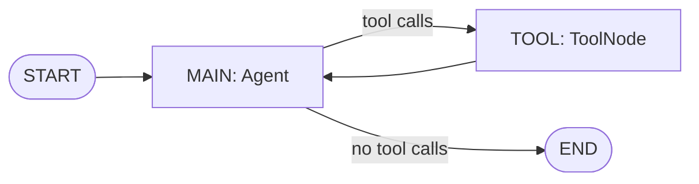

# Build a graph by hand

> Build a 10xGraph agent with a tool by hand, route between the agent and tool nodes, then compare it with ReactAgent.

Source: https://10xgraph.com/docs/get-started/tutorial/build-a-graph
Last updated: 2026-10-08

You build a two-node graph by hand: an `Agent` node that calls the model and a `ToolNode` that runs a Python function, joined by a conditional edge that loops between them until the model stops asking for tools. Then you rebuild it with `ReactAgent` in a few lines and learn when each approach fits.

## What you build in this step

You build an agent that can call a `get_weather` function. The model decides when it needs the tool, the graph runs the tool, and the result goes back to the model so it can write the final answer.

This is the same loop behind most tool-using agents, so building it once by hand makes every prebuilt agent easier to read. The graph looks like this:



## Prerequisites

You need the provider extra for the model you use, plus an API key in your environment. This page uses a Gemini model.

```bash
pip install "10xgraph[google-genai]"   # or "10xgraph[openai]" or "10xgraph[anthropic]"
export GEMINI_API_KEY="your-key"       # or GOOGLE_API_KEY
```

The provider is picked from the model name: names starting with `gemini-` use Google, `gpt-` and the `o1-`, `o3-`, `o4-` families use OpenAI, and `claude-` uses Anthropic. For OpenAI, set `OPENAI_API_KEY` and change the model name. If you skipped the previous step, read [the mental model](/docs/get-started/tutorial/mental-model) first so the terms node, edge and state are familiar.

## Write a tool function

A tool is a plain Python function with type hints and a docstring. 10xGraph reads the signature and docstring to build the schema the model sees, so a clear docstring is how you tell the model when to use the tool.

```python title="agent_with_tools.py"
def get_weather(location: str) -> str:
    """Get the current weather for a specific location."""
    # A real tool would call a weather API here.
    return f"The weather in {location} is sunny and 22 degrees C."
```

The model sees the parameter name and type (`location: str`) and the description from the docstring. Keep both specific: vague docstrings lead to tools being called at the wrong time.

## Create the agent and the tool node

`ToolNode` wraps your functions so the graph can execute them. The `Agent` receives the same `ToolNode` so it knows which tools it may request.

```python title="agent_with_tools.py"
from tenxgraph.core.graph import Agent, StateGraph, ToolNode
from tenxgraph.core.state import AgentState, Message
from tenxgraph.utils import END

# get_weather is defined above in the same file.

# Wrap the function so the graph can run it.
tool_node = ToolNode([get_weather])

# The agent sends the conversation to the model and may request tools.
agent = Agent(
    model="gemini-2.5-flash",
    system_prompt=[
        {
            "role": "system",
            "content": "You are a helpful assistant. Use the get_weather tool when you need weather information.",
        }
    ],
    tool_node=tool_node,
)
```

## Route between the agent and the tools

A routing function reads the state after the agent runs and returns the name of the next node. It returns `"TOOL"` when the last message is an assistant message with tool calls, and `END` otherwise.

```python title="agent_with_tools.py"
def should_use_tools(state: AgentState) -> str:
    """Return "TOOL" if the last assistant message requested tools, else END."""
    if not state.context:
        return END

    last_message = state.context[-1]
    if (
        last_message.role == "assistant"
        and hasattr(last_message, "tools_calls")
        and last_message.tools_calls
    ):
        return "TOOL"

    return END
```

## Assemble and compile the graph

Add the two nodes, connect them, and compile. The conditional edge leaves `MAIN`, and a plain edge sends every tool result back to `MAIN` so the model can read it.

```python title="agent_with_tools.py"
graph = StateGraph(AgentState)
graph.add_node("MAIN", agent)
graph.add_node("TOOL", tool_node)

# From MAIN, the routing function picks TOOL or END.
graph.add_conditional_edges(
    "MAIN",
    should_use_tools,
    {"TOOL": "TOOL", END: END},
)

# After tools run, always return to MAIN so the model can answer.
graph.add_edge("TOOL", "MAIN")

# Start at MAIN.
graph.set_entry_point("MAIN")

# compile() returns the runnable graph.
app = graph.compile()
```

The loop ends when the model answers without requesting a tool. The run also stops at the recursion limit (25 steps by default, set with `recursion_limit` in `config`), which guards against a model that never stops calling tools.

## Run it and read the messages

`invoke` takes a dict with a `messages` list and returns a dict whose `messages` list holds the messages produced by the run. A `thread_id` in `config` names the conversation.

```python title="agent_with_tools.py"
if __name__ == "__main__":
    result = app.invoke(
        {"messages": [Message.text_message("What is the weather in London?")]},
        config={"thread_id": "graph-with-tools-demo"},
    )

    for message in result["messages"]:
        print(f"{message.role}: {message.text()}")
```

```bash
python agent_with_tools.py
```

The exact wording varies by model. This is an example of the shape you should see:

```text
assistant: I'll check the weather in London for you.
tool: The weather in London is sunny and 22 degrees C.
assistant: The weather in London is sunny and 22 degrees C.
```

Read it as the loop ran: the assistant asked for the tool, the `ToolNode` ran `get_weather` and produced a `tool` message, and the assistant used that result for its final answer. If the model needs several tools at once, `ToolNode` runs them in parallel within the same step.

## Build the same agent with ReactAgent

`ReactAgent` is a prebuilt class that creates this exact graph for you: a `MAIN` agent node, a `TOOL` node, the routing function and the edge back to `MAIN`. You pass the functions directly with `tools`.

```python title="react_agent.py"
from tenxgraph.core.state import Message
from tenxgraph.prebuilt.agent import ReactAgent

def get_weather(location: str) -> str:
    """Get the current weather for a specific location."""
    return f"The weather in {location} is sunny and 22 degrees C."

# ReactAgent builds the nodes, routing and edges internally.
app = ReactAgent(
    model="gemini-2.5-flash",
    system_prompt=[
        {
            "role": "system",
            "content": "You are a helpful assistant. Use the get_weather tool when you need weather information.",
        }
    ],
    tools=[get_weather],
).compile()

if __name__ == "__main__":
    result = app.invoke(
        {"messages": [Message.text_message("What is the weather in London?")]},
        config={"thread_id": "react-agent-demo"},
    )

    for message in result["messages"]:
        print(f"{message.role}: {message.text()}")
```

You get the same kind of conversation with no routing code. See the [ReactAgent guide](/docs/guides/prebuilt/react-agent) for its options.

## Choose between ReactAgent and a hand-built graph

Use `ReactAgent` for the standard loop and build by hand when the flow is specific to your product. Both produce a compiled graph that you run, serve and test the same way, so you can start with `ReactAgent` and switch later.

| Situation | Use |
|---|---|
| Model calls tools, tools run, model answers | `ReactAgent` |
| Default `AgentState` is enough | `ReactAgent` |
| Custom routing, such as a validation or approval node between agent and tools | Hand-built graph |
| Custom state fields | Hand-built graph |
| Several agents with different roles in one graph | Hand-built graph, or a prebuilt multi-agent class |

For help picking among all building blocks, see [Choosing a building block](/docs/concepts/choosing-a-building-block).

## Handle tool errors

If a tool raises an exception, `ToolNode` catches it and returns a failed tool message instead of crashing the run. The model reads the error text on its next turn and can retry, try something else or tell the user.

Make the tool fail some of the time to watch this happen:

```python title="flaky_weather.py"
import random

def get_weather(location: str) -> str:
    """Get the current weather for a specific location."""
    if random.random() < 0.3:  # about 30 percent of calls fail
        raise RuntimeError(f"Failed to fetch weather for {location}")
    return f"The weather in {location} is sunny and 22 degrees C."
```

Swap this function into either version above and run it several times. On a failure the `tool` message contains the error text, and the next assistant message reacts to it. Do not rely on this for tools with side effects such as payments: make those tools idempotent or have them return a clear error string, because the model may retry.

## What you learned

- A tool is a Python function whose signature and docstring become the schema the model sees.
- `ToolNode` runs the functions the model requests, in parallel when there are several.
- A routing function passed to `add_conditional_edges` decides between `TOOL` and `END`, and a plain edge sends results back to `MAIN`.
- `ReactAgent` builds the same loop for you, and a hand-built graph gives full control over routing and state.
- Tool exceptions reach the model as failed tool messages, so the model can recover.

## Next step

Keep conversation state across calls with [Add memory](/docs/get-started/tutorial/threads-and-memory).

## Frequently asked questions

### When should I use ReactAgent instead of building the graph by hand?

Use ReactAgent when you want the standard loop where the model calls tools and then answers. Build by hand when you need custom routing, extra nodes or custom state fields.

### What happens when a tool raises an exception?

ToolNode catches the exception and returns it to the model as a failed tool message. The model can retry, try another approach or explain the failure to the user.

### Which API key do I need?

Set the key for the provider your model name resolves to. Gemini models read GEMINI_API_KEY or GOOGLE_API_KEY, and OpenAI models read OPENAI_API_KEY.
