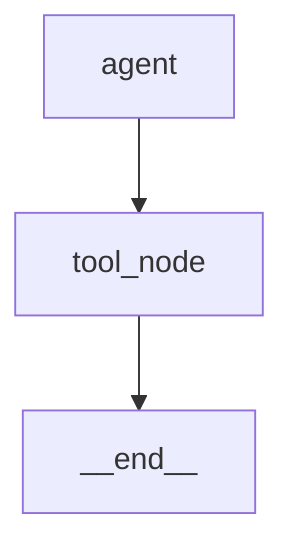

# Visualize a graph

> Inspect and visualize your compiled graph structure to understand agent flow and debug routing.

Source: https://10xgraph.com/docs/guides/visualize-a-graph
Last updated: 2026-10-08

Understanding your agent's structure is critical when debugging behavior, validating routing logic, and communicating your design to teammates. 10xGraph provides a straightforward way to inspect and visualize the compiled graph structure as JSON, which you can then render as diagrams or integrate into dashboards.

## Why visualize your graph

Agents built with 10xGraph are cyclic state machines: messages flow through nodes, conditional edges route to the next node, and loops continue until the agent reaches `END`. As graphs grow, it becomes easy to lose track of:

- Which nodes exist and how they connect
- How conditional routing splits execution into parallel or sequential paths
- Whether interrupts are set on the right nodes
- Whether all paths eventually reach `END` or a valid terminal state

A visual inspection of the compiled graph catches routing mistakes before they surface in production. It also helps new team members understand the agent's flow at a glance.

## Inspect the graph locally

Once your graph is compiled, call `generate_graph()` to retrieve its structure as a JSON-compatible dictionary.

```python
from tenxgraph import StateGraph, Agent, END
from tenxgraph.core.state import AgentState

# Build a simple graph
graph = StateGraph(AgentState)

agent = Agent(model="gemini/gemini-2.5-flash")
graph.add_node("agent", agent)

def route_to_end(state):
    return "end"

graph.add_conditional_edges("agent", route_to_end, {"end": END})
graph.set_entry_point("agent")

# Compile the graph
compiled = graph.compile()

# Inspect the structure
graph_data = compiled.generate_graph()

print(graph_data)
```

The returned dictionary contains three sections:

**`nodes`**: A list of every node in the graph. Each node has an `id` (unique identifier) and `name` (the node's label). The name matches what you passed to `add_node()`.

**`edges`**: A list of connections between nodes. Each edge has an `id`, a `source` node name, and a `target` node name. Edges include both explicit edges (from `add_edge()`) and conditional edges (from `add_conditional_edges()`).

**`info`**: Metadata about the graph, including:
- `node_count` and `edge_count`: totals
- `checkpointer` and `checkpointer_type`: persistence configuration
- `state_type` and `state_fields`: the state shape
- `interrupt_before` and `interrupt_after`: human-in-the-loop settings
- `context_type`, `id_generator`: runtime configuration

Example output:

```json
{
  "nodes": [
    {"id": "abc-123", "name": "agent"},
    {"id": "def-456", "name": "tool_node"},
    {"id": "ghi-789", "name": "__end__"}
  ],
  "edges": [
    {"id": "edge-1", "source": "agent", "target": "tool_node"},
    {"id": "edge-2", "source": "tool_node", "target": "__end__"}
  ],
  "info": {
    "node_count": 3,
    "edge_count": 2,
    "checkpointer": true,
    "checkpointer_type": "PgCheckpointer",
    "state_type": "AgentState",
    "state_fields": ["messages"]
  }
}
```

## Retrieve the graph from the API server

If you are running 10xGraph as a FastAPI server, you can fetch the compiled graph structure over HTTP without needing direct access to the Python code.

```bash
curl http://localhost:8000/v1/graph \
  -H "Authorization: Bearer YOUR_JWT_TOKEN"
```

The response includes the same structure as `generate_graph()` plus an additional `is_realtime` field in `info` that indicates whether the agent uses Anthropic's Realtime API.

Example:

```bash
curl -s http://localhost:8000/v1/graph | jq '.nodes'
```

Returns:

```json
[
  {"id": "abc-123", "name": "agent"},
  {"id": "def-456", "name": "tool_node"}
]
```

Use this endpoint to inspect live production agents without deploying extra code, or to build admin dashboards that visualize agent topology.

## Render the graph as a diagram

The nodes and edges structure is generic JSON, so you can render it with any visualization library. Here are two common approaches:

### Convert to Mermaid

Mermaid is a plain-text diagram syntax supported by GitHub, Confluence, and Notion. You can programmatically convert your 10xGraph output to Mermaid:

```python
def graph_to_mermaid(graph_data):
    """Convert generate_graph() output to Mermaid diagram syntax."""
    lines = ["graph TD"]
    
    for edge in graph_data["edges"]:
        source = edge["source"]
        target = edge["target"]
        # Escape special characters in node names
        source = source.replace("-", "_")
        target = target.replace("-", "_")
        lines.append(f'  {source} --> {target}')
    
    return "\n".join(lines)

# Usage
mermaid_code = graph_to_mermaid(graph_data)
print(mermaid_code)
# Output:
# graph TD
#   agent --> tool_node
#   tool_node --> __end__
```

Paste the output into a Markdown file or Mermaid editor to visualize it:



For conditional edges with multiple routes, you can label the arrows:

```python
def graph_to_mermaid_with_labels(graph_data):
    """Convert to Mermaid with conditional edge labels."""
    lines = ["graph TD"]
    
    # Note: the current generate_graph() output does not include edge labels.
    # You can extend this by modifying your graph inspection code.
    for edge in graph_data["edges"]:
        source = edge["source"].replace("-", "_")
        target = edge["target"].replace("-", "_")
        lines.append(f'  {source} --> {target}')
    
    return "\n".join(lines)
```

### Visualize with a web dashboard

If you prefer interactive exploration, render the nodes and edges in a web UI using D3.js, Vis.js, or Cytoscape:

```python
import json
from tenxgraph import StateGraph, Agent, END

graph = StateGraph(AgentState)
agent = Agent(model="gemini/gemini-2.5-flash")
graph.add_node("agent", agent)
graph.add_conditional_edges("agent", lambda s: "end", {"end": END})
graph.set_entry_point("agent")

compiled = graph.compile()
graph_data = compiled.generate_graph()

# Serialize to JSON for your frontend
with open("graph.json", "w") as f:
    json.dump(graph_data, f)
```

Then load and render in JavaScript:

```javascript
fetch("/graph.json")
  .then(r => r.json())
  .then(data => {
    // Use Vis.js, Cytoscape, or D3 to render nodes and edges
    const nodes = data.nodes.map(n => ({ id: n.name, label: n.name }));
    const edges = data.edges.map(e => ({ from: e.source, to: e.target }));
    // Pass to your visualization library
  });
```

## Verify your graph structure

After building and compiling a graph, use `generate_graph()` to verify:

**All nodes are present**: Check that every node you added with `add_node()` appears in the `nodes` list.

**Connections are correct**: Verify that each edge in `edges` matches your intended routing logic. Ensure that nodes you expected to be connected are present and in the right order.

**No orphaned nodes**: Ensure every node has at least one incoming edge (except `START`) and at least one outgoing edge (except `END`).

**Conditional edges are resolved**: If you use conditional routing, the `edges` list includes the resolved target nodes. Check that all branches you defined are present.

Example verification:

```python
graph_data = compiled.generate_graph()

# Verify expected nodes exist
expected_nodes = {"agent", "tool_node", "__end__"}
actual_nodes = {n["name"] for n in graph_data["nodes"]}
assert expected_nodes == actual_nodes, f"Missing nodes: {expected_nodes - actual_nodes}"

# Verify no stray edges
assert graph_data["info"]["edge_count"] == len(graph_data["edges"])
```

## Common patterns

### Fan-out and fan-in

When your graph has a tool node that runs multiple tools in parallel, the structure looks like:

```
agent --> tool_node --> agent (loop back for more tools or end)
```

Verify that the tool node executes all tools before returning to the agent, by checking that there is one edge from the tool node back to the agent (or to `__end__`).

### Multi-step workflows

For workflows with sequential steps (e.g., Plan -> Act -> Reflect):

```
entry --> plan_node --> act_node --> reflect_node --> end
```

Check that each step has exactly one outgoing edge to the next step.

### Conditional branching

When you have branches (e.g., `if error then retry, else continue`):

```
agent --> conditional_node --> [path_a, path_b, ...]
```

Verify that all conditional branches eventually reconverge or reach a terminal state. A branch that has no outgoing edge is a bug.

## Debugging graph issues

If your agent behaves unexpectedly:

1. **Call `generate_graph()`** to see the compiled structure.
2. **Check the entry point** in the `info` section or by looking for a node with an incoming edge from `__start__`.
3. **Trace all paths** from entry to exit to ensure none are orphaned.
4. **Look for loops** (cycles) where a node feeds back into itself; these should be intentional (e.g., agent calls tools, tools return, agent loops).

If you suspect a conditional edge is routing incorrectly, add logging inside your conditional function:

```python
def my_router(state):
    choice = ...  # your logic
    print(f"Router decided: {choice}")  # Log the decision
    return choice

graph.add_conditional_edges("agent", my_router, {
    "path_a": "node_a",
    "path_b": "node_b",
})
```

Then run the agent and check the logs to see which branch was taken.

## Next steps

- Learn more about [graph structure and state](/docs/concepts/state-graph) to understand the nodes and edges you are visualizing.
- Configure [routing and conditional edges](/docs/guides/build-a-graph#add-routing) in your graph.
- Set up [human-in-the-loop interrupts](/docs/guides/add-human-approval) to pause execution at specific nodes.

## Frequently asked questions

### Can I export the graph as a diagram?

Yes. The `generate_graph()` method returns nodes and edges as structured JSON, which you can render as a Mermaid diagram, SVG, or PNG using external libraries.

### When should I visualize my graph?

Visualize your graph when building it (to validate structure), after adding conditional routing (to verify paths), and when debugging why runs take unexpected paths.

### Can I visualize a running agent?

Yes. Call `GET /v1/graph` on the API server to retrieve the compiled graph structure at runtime, which reflects the current agent configuration.
