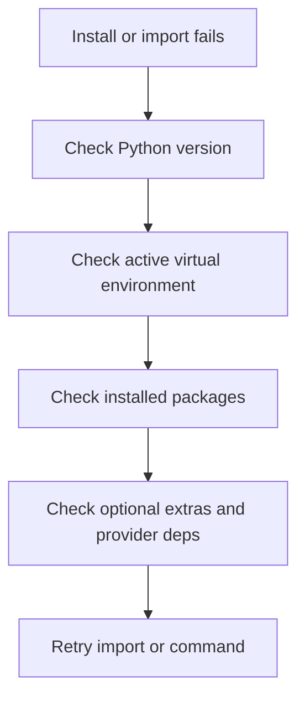

# Installation troubleshooting

> Fix 10xGraph install and environment problems, from failed pip installs and a missing 10xgraph command to import errors, missing extras and ignored .env files.

Source: https://10xgraph.com/docs/troubleshooting/installation
Last updated: 2026-10-08

If 10xGraph fails before your app starts, the cause is almost always the Python version, the wrong active environment, a missing package or extra, or an unloaded `.env` file. This page lists each symptom with its likely causes and a fix, starting with the checks that rule out the most.

## Find the failing layer

Work from the interpreter outward: confirm the Python version, then the active environment, then the installed packages, then optional extras, and only then your own code. Each section below covers one of these layers.



Two commands answer most questions at once:

```bash
# Interpreter version and where it lives
python --version
which python

# Installed 10xGraph packages and their versions
pip list | grep -i -E "10xgraph|agentflow"
```

## Fix a failed pip install

A failed install is usually an unsupported Python version, a stale virtual environment or a conflict with packages installed earlier. Check the version first, then retry in a fresh environment.

**Likely causes**

- Python older than 3.12
- a stale virtual environment with conflicting packages
- build tools or package resolution failing on an old pip

**Fix**

```bash
# Confirm Python 3.12 or newer
python3 --version

# Create and activate a clean environment
python3 -m venv .venv
source .venv/bin/activate

# Upgrade pip, then install with the provider extra you need
pip install --upgrade pip
pip install "10xgraph[google-genai]"
```

## Fix a missing 10xgraph command

The `10xgraph` command comes from the `10xgraph-api` package, not from the core `10xgraph` package. If your shell cannot find it, the CLI package is missing or the environment that holds it is not active.

```bash
# Install the API server and CLI
pip install 10xgraph-api

# Confirm the command resolves inside the active environment
which 10xgraph
10xgraph version

# Check interpreter, packages, project config and the default port
10xgraph audit
```

If `which 10xgraph` points somewhere unexpected, activate the correct environment and run it again. `10xgraph audit` reports the interpreter it runs under and the installed CLI and core versions, so it also exposes a CLI/core version mismatch. It exits with a non-zero code only when a required check fails; a missing `10xgraph.json` or a busy port is reported as a warning.

## Upgrade from the old agentflow packages

If you installed the project under its earlier names, remove those packages before installing the new ones. The old `10xscale-agentflow` and `10xscale-agentflow-cli` packages each ship an `agentflow` module, so leaving them installed next to `10xgraph` and `10xgraph-api` makes `agentflow` imports resolve to the wrong code.

```bash
# Remove the old distributions
pip uninstall 10xscale-agentflow-cli 10xscale-agentflow

# Install the renamed API package (it pulls in the 10xgraph core)
pip install 10xgraph-api
```

Then run `10xgraph` instead of `agentflow`. Until 2.0 the old `agentflow` command, `agentflow.json` and `agentflow_cli` imports keep working as deprecated aliases, so you can rename your config file and imports at your own pace.

## Fix import errors after installing

A `ModuleNotFoundError` or `ImportError` after a successful install usually means the package went into a different environment than the one running your code, or your code uses an outdated import path.

**Likely causes**

- package installed in a different environment than the one you run
- an optional dependency is not installed
- imports still use the old `agentflow` name

**Fix**

```bash
# Show which interpreter and which install of the core package you are using
python -c "import sys, tenxgraph; print(sys.executable); print(tenxgraph.__file__)"
```

If this fails, install into the environment printed by `which python`. Use `tenxgraph` for the core library and `tenxgraph_api` for the server, for example `from tenxgraph import StateGraph`.

## Fix optional features that fail at runtime

Provider SDKs and storage backends are optional extras, so the core installs and imports fine and then fails when you first use a feature. The error names a package that is not installed.

Install the extra that matches the feature you use:

| Feature | Install |
|---|---|
| Google GenAI | `pip install "10xgraph[google-genai]"` |
| OpenAI | `pip install "10xgraph[openai]"` |
| Anthropic | `pip install "10xgraph[anthropic]"` |
| Postgres and Redis checkpointer | `pip install "10xgraph[pg_checkpoint]"` |
| SQLite checkpointer | `pip install "10xgraph[sqlite_checkpoint]"` |
| MCP tools | `pip install "10xgraph[mcp]"` |

The full list of extras is in [Installation](/docs/get-started/installation). Provider-specific errors such as bad keys or unknown models are covered in [Provider troubleshooting](/docs/troubleshooting/providers).

## Fix environment variables that seem ignored

When provider keys look unset, the `.env` file is usually not being found. The CLI reads the file named by the `env` key in `10xgraph.json`, resolves a relative path against the folder that holds `10xgraph.json`, and skips it silently if the file does not exist.

**Likely causes**

- no `env` key in `10xgraph.json`
- the `.env` file is in a different directory than `10xgraph.json`
- variables exported in one shell while the server starts from another

**Fix**

```json title="10xgraph.json"
{
  "agent": "graph.react:app",
  "env": ".env"
}
```

Check that `.env` sits next to `10xgraph.json`, then start the server from the same shell. To rule out the file entirely, export the variable in the shell you start the server from and retry.

## Related docs

- [Installation](/docs/get-started/installation)
- [Configure 10xgraph.json](/docs/server/configure)
- [Production checklist](/docs/server/production-checklist)
- [Error codes reference](/docs/reference/error-codes)

## What you learned

- How to isolate an installation problem to the Python version, the active environment, the installed packages, or the config file.
- How to use `10xgraph audit` to check the interpreter, package versions and project config in one run.
- How to remove the old `agentflow` packages and install the extras a feature needs.

## Frequently asked questions

### Which Python version does 10xGraph need?

Python 3.12 or newer. Both the 10xgraph core package and the 10xgraph-api package declare requires-python >=3.12, so pip refuses or fails to resolve on older interpreters.

### How do I check that my environment is set up correctly?

Run `10xgraph audit`. It reports the Python interpreter, the installed 10xgraph-api and 10xgraph versions, whether 10xgraph.json is valid, and whether the default port is free.

### Why does the old agentflow package conflict with 10xgraph?

The old 10xscale-agentflow and 10xscale-agentflow-cli packages each ship an agentflow module, which collides with the deprecated alias shipped by the new packages. Uninstall the old ones before installing 10xgraph-api.
