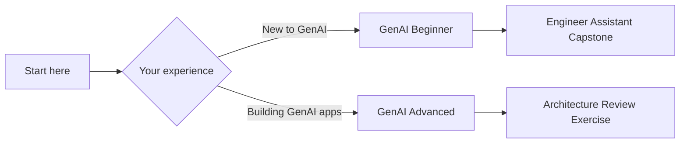

The 10xGraph courses are free, written lessons on building GenAI applications as an engineer. There are two tracks: a seven-lesson beginner course that ends in a small assistant with tools, memory and streaming, and an eight-lesson advanced course on architecture, durable execution and deployment. A shared set of foundation pages covers LLM basics, tokens, embeddings and retrieval. The courses are for software engineers; the beginner track assumes Python and no LLM experience.

## Start here

If you are new to LLM applications, begin with the [GenAI Beginner course](/docs/courses/genai-beginner), and read [LLM basics for engineers](/docs/courses/shared/llm-basics-for-engineers) alongside it for the mental model. It ends with a [capstone](/docs/courses/genai-beginner/capstone) and the [release checklist](/docs/courses/shared/release-checklist).

If you already ship GenAI features, go to the [GenAI Advanced course](/docs/courses/genai-advanced). Lesson 7, [memory, checkpoints, artifacts and durable execution](/docs/courses/genai-advanced/lesson-7-memory-checkpoints-artifacts-and-durable-execution), is the one closest to what sets 10xGraph apart: runs that survive failure. The final lesson covers observability, testing, security and deployment, and the track closes with an [architecture review exercise](/docs/courses/genai-advanced/architecture-review-exercise).

If you want a hands-on build without the theory, use the [beginner path](/docs/beginner) or the [tutorials](/docs/tutorials) instead.

## Two tracks for different experience levels

---

## GenAI Beginner

**For software engineers new to LLM applications.**

Go from "I know what an LLM is" to "I can build a production-shaped GenAI app with 10xGraph."

### What you will build

A small engineer-facing assistant that:
- Answers using a curated knowledge source
- Uses one or two tools safely
- Accepts file or multimodal input
- Returns structured output
- Supports thread continuity or memory
- Streams responses to a client
- Includes a lightweight evaluation and release checklist

### What you will learn

| Lesson | Topic |
|--------|-------|
| 1 | Use cases, models, and the LLM app lifecycle |
| 2 | Prompting, context engineering, and structured outputs |
| 3 | Tools, files, and MCP basics |
| 4 | Retrieval, grounding, and citations |
| 5 | State, memory, threads, and streaming |
| 6 | Multimodal and client/server integration |
| 7 | Evals, safety, cost, and release |

### Prerequisites

- Python basics (functions, classes, async)
- Can read and write API request/response formats
- No prior LLM or agent experience needed

### Time commitment

- 7 lessons × 30-45 minutes each
- 1 capstone exercise
- 1 shared release checklist

[Start the Beginner course](/docs/courses/genai-beginner)

---

## GenAI Advanced

**For engineers who understand the basics and need to make reliable architecture choices.**

Design runtime boundaries, choose between single-agent and multi-agent patterns, and prepare 10xGraph systems for production.

### What you will learn

| Lesson | Topic |
|--------|-------|
| 1 | Agentic product fit and system boundaries |
| 2 | Single-agent runtime and bounded autonomy |
| 3 | Context engineering, long context, and caching |
| 4 | Knowledge systems and advanced RAG |
| 5 | Router, manager, and specialist patterns |
| 6 | Handoffs, human review, and control surfaces |
| 7 | Memory, checkpoints, artifacts, and durable execution |
| 8 | Observability, testing, security, and deployment |

### Prerequisites

- Completed the GenAI Beginner course (or equivalent experience)
- Comfortable with 10xGraph core concepts
- Building or maintaining GenAI applications in production

### Time commitment

- 8 lessons × 45-75 minutes each
- 1 architecture review exercise
- 1 production readiness worksheet

[Start the Advanced course](/docs/courses/genai-advanced)

---

## Shared foundations

Both courses depend on shared foundational concepts:

| Topic | Description |
|-------|-------------|
| [LLM basics for engineers](/docs/courses/shared/llm-basics-for-engineers) | Mental model of what an LLM is, does well, and where it fails |
| [Transformer basics](/docs/courses/shared/transformer-basics) | Enough architecture intuition to understand attention and context windows |
| [Tokenization and context windows](/docs/courses/shared/tokenization-and-context-windows) | Token budgets, prompt size, chunking, and cost reasoning |
| [Embeddings and similarity](/docs/courses/shared/embeddings-vectorization-and-similarity) | Vectorization, cosine similarity, and nearest-neighbor retrieval |
| [Chunking and retrieval primitives](/docs/courses/shared/chunking-and-retrieval-primitives) | From embeddings theory to real retrieval systems |
| [Prompt and output patterns](/docs/courses/shared/prompt-and-output-patterns-cheatsheet) | Reusable quick-reference for both tracks |

---

## How the courses reinforce 10xGraph's value proposition

These courses teach you to:

1. **Start simple**, pick the right use case before adding complexity
2. **Add tools and structured outputs**, reliable interfaces between model and code
3. **Introduce memory and checkpoints**, durable conversation state
4. **Grow into multi-agent only when needed**, not every problem needs orchestration
5. **Ship with testing, safety, and deployment discipline**, production-minded from day one

<aside class="callout callout-note" role="note">
Draft

This curriculum is actively being developed. Share feedback in the [10xGraph GitHub repository](https://github.com/10xHub/Agentflow).

</aside>
