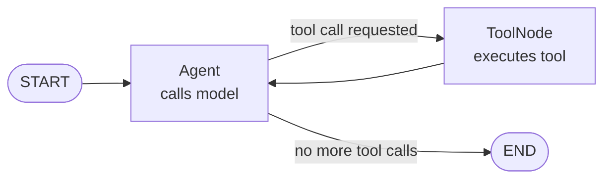

# Add a tool

Tools let the agent call your application logic during a conversation. The model decides when to call a tool, and `ToolNode` handles the execution.

This page adds a `get_weather` tool to the agent from the previous page.

## How tool calling works



1. The model returns a message with one or more tool calls.
2. `ToolNode` executes the requested functions.
3. The results go back to the model as `tool` messages.
4. The model uses the results to form a final reply.
5. When there are no more tool calls, the graph ends.

## Write the tool

A tool is a regular Python function with a docstring. The docstring becomes the description the model sees.

```python
def get_weather(location: str) -> str:
    """Get the current weather for a specific location."""
    # In a real app this would call a weather API
    return f"The weather in {location} is sunny and 22°C."
```

## Build the graph with tools

Create `agent_with_tool.py`:

```python
from agentflow.core.graph import Agent, StateGraph, ToolNode
from agentflow.core.state import AgentState, Message
from agentflow.utils import END


def get_weather(location: str) -> str:
    """Get the current weather for a specific location."""
    return f"The weather in {location} is sunny and 22°C."


# Wrap your functions in a ToolNode
tool_node = ToolNode([get_weather])

# Agent knows to route to "TOOL" when it needs to call a function
agent = Agent(
    model="google/gemini-2.5-flash",
    system_prompt=[
        {
            "role": "system",
            "content": "You are a helpful assistant. Use tools when you need specific information.",
        }
    ],
    tool_node="TOOL",
)

graph = StateGraph(AgentState)
graph.add_node("MAIN", agent)
graph.add_node("TOOL", tool_node)


def route(state: AgentState) -> str:
    """Route to TOOL if the last message has tool calls, otherwise END."""
    if not state.context:
        return END
    last = state.context[-1]
    if hasattr(last, "tools_calls") and last.tools_calls and last.role == "assistant":
        return "TOOL"
    if last.role == "tool":
        return "MAIN"
    return END


graph.add_conditional_edges("MAIN", route, {"TOOL": "TOOL", END: END})
graph.add_edge("TOOL", "MAIN")
graph.set_entry_point("MAIN")

app = graph.compile()

result = app.invoke(
    {"messages": [Message.text_message("What is the weather in London?")]},
    config={"thread_id": "beginner-tool-demo"},
)

print(result["messages"][-1].text())
```

Run it:

```bash
python agent_with_tool.py
```

Expected output (exact wording varies):

```text
The weather in London is sunny and 22°C.
```

## Injectable parameters

Tool functions can receive extra information automatically. Add `tool_call_id` or `state` as optional parameters and AgentFlow injects them without exposing them in the tool schema:

```python
from agentflow.core.state import AgentState

def get_weather(
    location: str,
    state: AgentState | None = None,
    tool_call_id: str | None = None,
) -> str:
    """Get the current weather for a specific location."""
    if state:
        print(f"Messages in context: {len(state.context)}")
    return f"The weather in {location} is sunny and 22°C."
```

The injected parameters are not visible to the model. Only `location` appears in the tool schema.

## What you learned

- Wrap functions in `ToolNode` to make them available to the agent.
- The `route` function checks the last message to decide whether to call tools or end.
- Tool functions can receive `state` and `tool_call_id` as injectable parameters.
- `tool_node="TOOL"` tells the `Agent` which node name to expect tool results from.

## Next step

Preserve conversation state across calls with [Add memory](./add-memory.md).
