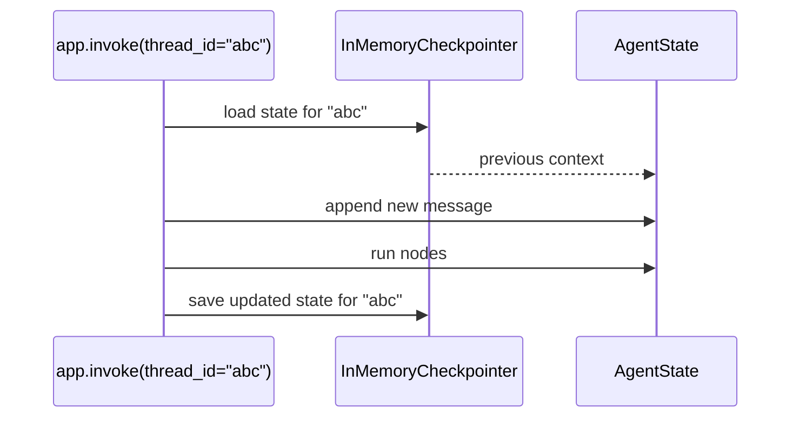

# Add memory

Without a checkpointer, each `app.invoke` call is independent — the agent starts fresh every time. A checkpointer saves state after each run and restores it when the same `thread_id` is used again.

This page adds `InMemoryCheckpointer` so your agent remembers the conversation.

## Why thread IDs matter now

Every call to `app.invoke` takes a `config` with a `thread_id`. Once a checkpointer is attached, all calls sharing the same `thread_id` share the same conversation history:



Without a checkpointer, the "load state" step is skipped and history is lost between calls.

## Add InMemoryCheckpointer

`InMemoryCheckpointer` stores state in memory. It works for development and testing. For production, use `PgCheckpointer` with a database.

Update your graph to compile with a checkpointer:

```python
from agentflow.core.graph import Agent, StateGraph, ToolNode
from agentflow.core.state import AgentState, Message
from agentflow.storage.checkpointer import InMemoryCheckpointer
from agentflow.utils import END

checkpointer = InMemoryCheckpointer()

agent = Agent(
    model="google/gemini-2.5-flash",
    system_prompt=[
        {
            "role": "system",
            "content": "You are a helpful assistant.",
        }
    ],
)

graph = StateGraph(AgentState)
graph.add_node("assistant", agent)
graph.set_entry_point("assistant")
graph.add_edge("assistant", END)

# Pass the checkpointer when compiling
app = graph.compile(checkpointer=checkpointer)
```

## Test multi-turn conversation

Create `agent_with_memory.py` with the graph above, then add these calls:

```python
THREAD = "memory-demo-1"

# First turn
result = app.invoke(
    {"messages": [Message.text_message("My name is Alex.")]},
    config={"thread_id": THREAD},
)
print(result["messages"][-1].text())

# Second turn — same thread_id, agent remembers
result = app.invoke(
    {"messages": [Message.text_message("What is my name?")]},
    config={"thread_id": THREAD},
)
print(result["messages"][-1].text())
```

Run it:

```bash
python agent_with_memory.py
```

Expected output (exact wording varies):

```text
Nice to meet you, Alex!
Your name is Alex.
```

The agent remembered "Alex" from the first turn because both calls shared the same `thread_id`.

## Use a different thread

Each `thread_id` is an independent conversation. Using a different ID gives the agent a fresh start:

```python
# New thread — agent has no memory of "Alex"
result = app.invoke(
    {"messages": [Message.text_message("What is my name?")]},
    config={"thread_id": "memory-demo-2"},
)
print(result["messages"][-1].text())
```

Expected output:

```text
I don't know your name yet. Could you tell me?
```

## Key imports

```python
from agentflow.storage.checkpointer import InMemoryCheckpointer
```

For production:

```python
from agentflow.storage.checkpointer import PgCheckpointer
# Requires: pip install 10xscale-agentflow[pg_checkpoint]
```

## What you learned

- A checkpointer saves and restores `AgentState` between calls.
- Conversations are isolated by `thread_id`.
- `InMemoryCheckpointer` is for development; `PgCheckpointer` is for production.
- Pass the checkpointer to `graph.compile(checkpointer=...)`.

## Next step

Serve the agent over HTTP with [Run with the API](./run-with-api.md).
