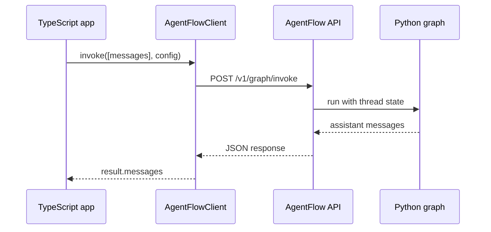

# Call from TypeScript

Once your agent is running behind the API, any TypeScript application can call it using `AgentFlowClient`. The client handles HTTP requests, message formatting, and optional streaming.

## Prerequisites

Keep the API server running from the previous page:

```bash
agentflow api --host 127.0.0.1 --port 8000
```

## Install the client

In your TypeScript or Node.js project:

```bash
npm install @10xscale/agentflow-client
```

## Invoke the agent

Create `call-agent.ts`:

```typescript
import { AgentFlowClient, Message } from "@10xscale/agentflow-client";

const client = new AgentFlowClient({
  baseUrl: "http://127.0.0.1:8000",
});

const result = await client.invoke(
  [Message.text_message("What is the weather in Tokyo?")],
  {
    config: {
      thread_id: "ts-beginner-demo",
    },
  },
);

const reply = result.messages.at(-1);
console.log(reply?.text());
```

Run it (using `tsx` or your project's TypeScript runner):

```bash
npx tsx call-agent.ts
```

Expected output:

```text
The weather in Tokyo is sunny and 22°C.
```

## Multi-turn conversation

Reuse the same `thread_id` to continue the conversation. Each call adds to the conversation history on the server side:

```typescript
const THREAD = "ts-multi-turn-demo";

// First message
const first = await client.invoke(
  [Message.text_message("My name is Alex.")],
  { config: { thread_id: THREAD } },
);
console.log(first.messages.at(-1)?.text());

// Second message — server remembers the thread
const second = await client.invoke(
  [Message.text_message("What is my name?")],
  { config: { thread_id: THREAD } },
);
console.log(second.messages.at(-1)?.text());
```

Expected output:

```text
Nice to meet you, Alex!
Your name is Alex.
```

## Stream responses

For a better UX, stream the response instead of waiting for the full reply:

```typescript
const stream = client.stream(
  [Message.text_message("Tell me a short story about a robot.")],
  { config: { thread_id: "ts-stream-demo" } },
);

for await (const chunk of stream) {
  if (chunk.type === "message_chunk") {
    process.stdout.write(chunk.content ?? "");
  }
}
console.log(); // newline after stream ends
```

## What the client sends

`AgentFlowClient` posts to `POST /v1/graph/invoke` (or `/v1/graph/stream` for streaming). The `Message.text_message` helper creates the same message shape used by the Python API.



## Add authentication

If your API server is configured with a JWT secret, pass a bearer token:

```typescript
const client = new AgentFlowClient({
  baseUrl: "http://127.0.0.1:8000",
  headers: {
    Authorization: `Bearer ${yourToken}`,
  },
});
```

## What you learned

- Install `@10xscale/agentflow-client` and create an `AgentFlowClient` with your API URL.
- Use `client.invoke` for a full response or `client.stream` for incremental chunks.
- Pass the same `thread_id` across calls to maintain conversation history.
- Add authentication headers to the client constructor when the API requires them.

## What you built

You have completed the beginner path. Your agent can now:

- Call a language model with a system prompt
- Use tools to retrieve external information
- Persist multi-turn conversations with a checkpointer
- Serve requests over HTTP
- Be tested in the hosted playground
- Be called from TypeScript

## Next steps

- **Core concepts** — understand how the pieces fit together at scale ([Concepts](/docs/concepts/architecture.md))
- **Add a real checkpointer** — replace `InMemoryCheckpointer` with Postgres for production ([Checkpointing guide](/docs/how-to/production/checkpointing.md))
- **Python library reference** — explore the full `StateGraph` and `Agent` API ([Reference](/docs/reference/python/agent.md))
