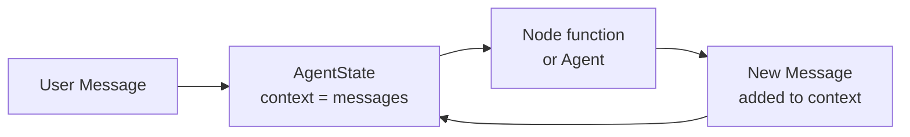
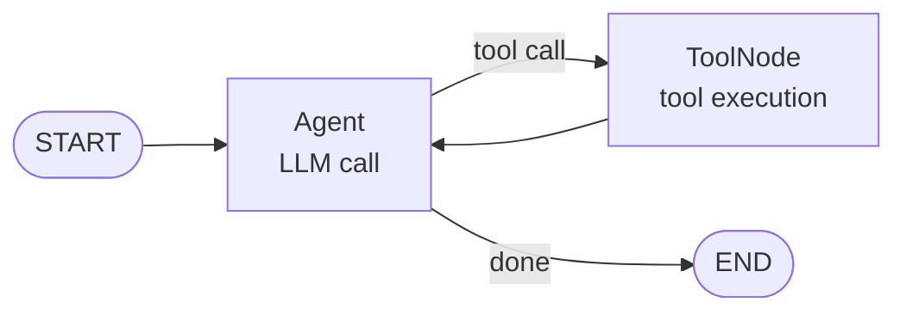

# Mental model

Before writing code, it helps to understand how AgentFlow thinks about agent applications. There are four concepts you will see on every page in this path.

## The four concepts

### 1. Message

A `Message` is the unit of communication. Every input and output in AgentFlow is a message. Messages have a `role` (`user`, `assistant`, or `tool`) and one or more content blocks (text, image, audio, file).

```python
from agentflow.core.state import Message

user_msg = Message.text_message("What is the capital of France?", role="user")
assistant_msg = Message.text_message("Paris.", role="assistant")
```

### 2. State

`AgentState` is the shared container that moves through the graph. It holds the conversation history in a field called `context`. Every node in the graph receives the current state and can return updates to it.

```python
from agentflow.core.state import AgentState

# Access the conversation history
state.context          # list of Message objects
state.context[-1]      # the most recent message
state.context[-1].text() # the text content of that message
```

You can extend `AgentState` to add custom fields your application needs.

### 3. Node

A node is a Python function that receives state and returns a message or a state update. Nodes contain your application logic. An `Agent` node calls a language model. A `ToolNode` calls your tool functions.

```python
def my_node(state: AgentState) -> Message:
    # read from state
    user_input = state.context[-1].text()
    # return a new message
    return Message.text_message(f"You said: {user_input}", role="assistant")
```

### 4. Graph

A `StateGraph` connects nodes into a workflow. You define the entry point and the edges between nodes, then compile the graph into a runnable application.

```python
from agentflow.core.graph import StateGraph
from agentflow.core.state import AgentState
from agentflow.utils import END

graph = StateGraph(AgentState)
graph.add_node("my_node", my_node)
graph.set_entry_point("my_node")
graph.add_edge("my_node", END)

app = graph.compile()
```

## How they fit together



1. You invoke the app with an initial message.
2. The graph adds the message to `AgentState.context`.
3. The graph runs the first node with the current state.
4. The node returns a message, which gets appended to `context`.
5. The graph moves to the next node, or ends.

The same flow applies whether the node is a simple function, an LLM agent, or a tool call.

## Agent and ToolNode

`Agent` is a built-in node that wraps a language model. `ToolNode` is a built-in node that dispatches tool calls the model requested. They are both regular nodes — they just do more work internally.



The conditional routing between `Agent` and `ToolNode` is the standard ReAct loop you will build in [Add a tool](./add-a-tool.md).

## What you learned

- Messages are the unit of communication.
- `AgentState` holds conversation history in `context`.
- Nodes are functions that read state and return messages.
- A `StateGraph` wires nodes into a compiled app.

## Next step

Build your [first working agent](./your-first-agent.md).
