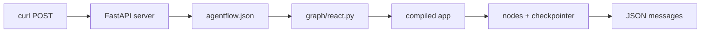

# Run with the API

Running the agent as a script is fine for testing, but production use requires an HTTP API. The `agentflow-cli` package provides two commands that handle this: `agentflow init` scaffolds the project and `agentflow api` starts the server.

## Install the CLI

```bash
pip install 10xscale-agentflow-cli
```

## Scaffold the project

Create a new folder for your API project, then run:

```bash
mkdir my-agent-api && cd my-agent-api
agentflow init
```

This creates:

```
my-agent-api/
  agentflow.json      # configuration file
  graph/
    __init__.py
    react.py          # default graph module
```

The default `agentflow.json` points to `graph.react:app`:

```json
{
  "agent": "graph.react:app"
}
```

This means: find the variable `app` in the `graph/react.py` module and use it as the compiled graph.

## Add your graph

Replace `graph/react.py` with the agent you built in the previous pages:

```python
from agentflow.core.graph import Agent, StateGraph, ToolNode
from agentflow.core.state import AgentState
from agentflow.storage.checkpointer import InMemoryCheckpointer
from agentflow.utils import END


def get_weather(location: str) -> str:
    """Get the current weather for a specific location."""
    return f"The weather in {location} is sunny and 22°C."


tool_node = ToolNode([get_weather])
checkpointer = InMemoryCheckpointer()

agent = Agent(
    model="google/gemini-2.5-flash",
    system_prompt=[
        {
            "role": "system",
            "content": "You are a helpful assistant. Use tools when you need specific information.",
        }
    ],
    tool_node="TOOL",
)

graph = StateGraph(AgentState)
graph.add_node("MAIN", agent)
graph.add_node("TOOL", tool_node)


def route(state: AgentState) -> str:
    from agentflow.utils import END
    if not state.context:
        return END
    last = state.context[-1]
    if hasattr(last, "tools_calls") and last.tools_calls and last.role == "assistant":
        return "TOOL"
    if last.role == "tool":
        return "MAIN"
    return END


graph.add_conditional_edges("MAIN", route, {"TOOL": "TOOL", END: END})
graph.add_edge("TOOL", "MAIN")
graph.set_entry_point("MAIN")

app = graph.compile(checkpointer=checkpointer)
```

## Start the API server

From the folder that contains `agentflow.json`:

```bash
agentflow api --host 127.0.0.1 --port 8000
```

Expected output:

```text
INFO: AgentFlow API starting on http://127.0.0.1:8000
INFO: Uvicorn running on http://127.0.0.1:8000
```

## Test it

In a second terminal, send a request with `curl`:

```bash
curl -X POST http://127.0.0.1:8000/v1/graph/invoke \
  -H "Content-Type: application/json" \
  -d '{
    "messages": [{"role": "user", "content": "What is the weather in Tokyo?"}],
    "config": {"thread_id": "api-demo-1"}
  }'
```

Expected response (trimmed):

```json
{
  "messages": [
    {"role": "user", "content": "What is the weather in Tokyo?"},
    {"role": "assistant", "content": "The weather in Tokyo is sunny and 22°C."}
  ]
}
```

## What happened



The CLI started a FastAPI server. The server loaded your graph module based on `agentflow.json`, compiled it once at startup, and now handles each HTTP request by invoking the graph.

## Available endpoints

| Endpoint | Description |
| --- | --- |
| `POST /v1/graph/invoke` | Invoke the graph and return all messages |
| `POST /v1/graph/stream` | Stream messages as server-sent events |
| `GET /v1/graph/threads/{thread_id}` | Get thread state |
| `GET /health` | Health check |

## What you learned

- `agentflow init` scaffolds a project with `agentflow.json` and a graph module.
- `agentflow api` starts a FastAPI server that loads your compiled graph.
- The `agent` field in `agentflow.json` uses `module.path:variable` notation.
- The API exposes `/v1/graph/invoke` and `/v1/graph/stream`.

## Next step

Use the hosted playground to inspect requests without writing client code — [Test with the playground](./test-with-playground.md).
