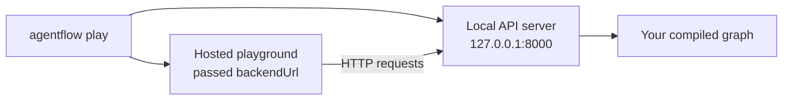

# Test with the playground

The hosted playground gives you a chat UI for your agent without writing any frontend code. You reach it through one command: `agentflow play`.

## How it works

`agentflow play` does two things at once:

1. Starts the same local API server as `agentflow api`.
2. Opens the hosted playground in your browser with your local backend URL pre-configured.



Your graph runs locally. The hosted playground is just a UI that calls your local API.

## Start the playground

From the folder that contains `agentflow.json`:

```bash
agentflow play --host 127.0.0.1 --port 8000
```

Expected output:

```text
INFO: AgentFlow API starting on http://127.0.0.1:8000
INFO: Opening playground at https://playground.agentflow.dev?backendUrl=http://127.0.0.1:8000
```

The browser should open automatically. If it does not, copy the URL from the terminal output and open it manually.

## What you can test

In the playground chat UI:

1. **Send a message** — type a question and press send. The playground calls `POST /v1/graph/invoke` on your local API.
2. **See tool calls** — if your agent uses tools, the playground shows which tools were called and what they returned.
3. **Inspect raw messages** — use the debug panel to see the full message array including `tool` role messages.
4. **Test multiple threads** — create a new conversation to start a fresh `thread_id`.

Example messages to try with the agent from the previous pages:

```text
What is the weather in Paris?
What about London?
What did I ask about first?
```

The last question tests memory — the agent should remember your earlier question because the checkpointer saved the conversation.

## Thread IDs in the playground

Each conversation the playground starts gets a generated `thread_id`. The playground passes it with every request so the checkpointer can restore context between messages.

## Stop the playground

Press `Ctrl+C` in the terminal to stop the API server. The hosted playground will lose its backend and show a connection error until the server is restarted.

## What you learned

- `agentflow play` starts the API server and opens the hosted playground in one command.
- The playground calls your local API — your graph never leaves your machine.
- You can test multi-turn memory, tool calls, and raw message structure from the UI.

## Next step

Call the agent programmatically from a TypeScript application — [Call from TypeScript](./call-from-typescript.md).
