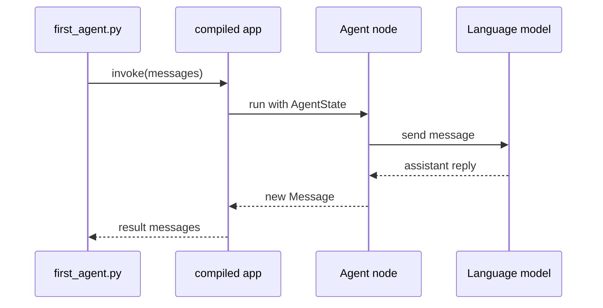

# Your first agent

This page builds a working agent backed by a real language model. You will write the graph, run it in Python, and see a response.

## What you need

- AgentFlow installed: `pip install 10xscale-agentflow`
- A language model API key (this example uses Google Gemini)

Set your API key:

```bash
export GOOGLE_API_KEY=your-api-key
```

## The graph

Create `first_agent.py`:

```python
from agentflow.core.graph import Agent, StateGraph, ToolNode
from agentflow.core.state import AgentState
from agentflow.utils import END

# Create the agent node backed by a language model
agent = Agent(
    model="google/gemini-2.5-flash",
    system_prompt=[
        {
            "role": "system",
            "content": "You are a helpful assistant. Answer questions clearly and concisely.",
        }
    ],
)

# Build the graph
graph = StateGraph(AgentState)
graph.add_node("assistant", agent)
graph.set_entry_point("assistant")
graph.add_edge("assistant", END)

app = graph.compile()
```

## Run it

Add the invocation code at the bottom of `first_agent.py`:

```python
from agentflow.core.state import Message

result = app.invoke(
    {"messages": [Message.text_message("What is the capital of France?")]},
    config={"thread_id": "beginner-demo-1"},
)

print(result["messages"][-1].text())
```

Run the file:

```bash
python first_agent.py
```

Expected output (the exact words will vary):

```text
The capital of France is Paris.
```

## What happened



1. `app.invoke` adds your message to `AgentState.context`.
2. The graph routes to the `assistant` node.
3. `Agent` sends the conversation to the language model.
4. The model returns a reply, which becomes an assistant `Message`.
5. The graph reaches `END` and returns the updated state.

The `thread_id` in `config` groups this conversation. Every call with the same `thread_id` will eventually share history once you add a checkpointer.

## Key imports

```python
from agentflow.core.graph import Agent, StateGraph
from agentflow.core.state import AgentState, Message
from agentflow.utils import END
```

## What you learned

- `Agent` wraps a language model as a graph node.
- `StateGraph` wires the node into a runnable app.
- `app.invoke` runs the graph and returns updated state.
- A `thread_id` in `config` identifies the conversation.

## Next step

Give the agent something it can do — [add a tool](./add-a-tool.md).
