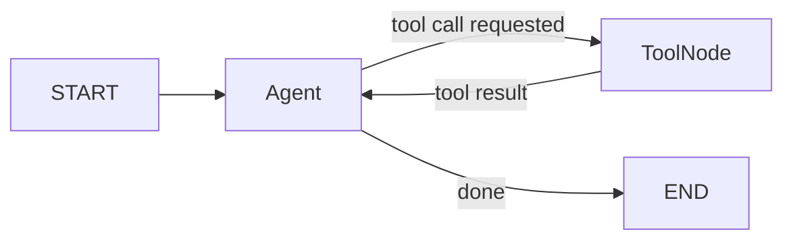
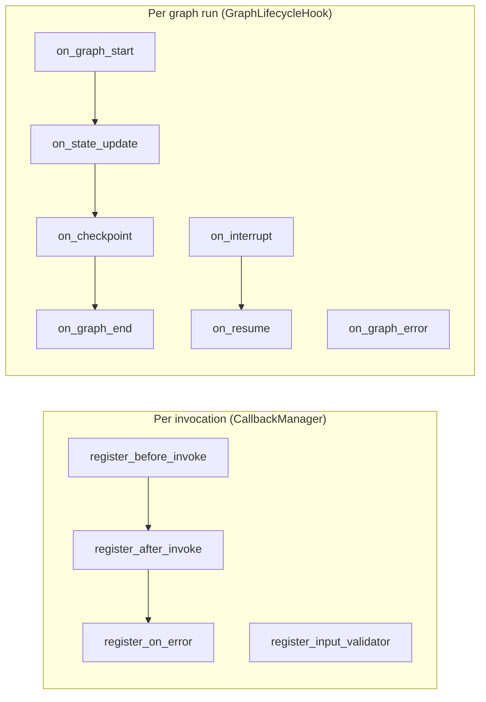

# Agents, Tools & Control

This page covers how agents and tools interact in the ReAct loop, how to write tools, which prebuilt agents are available, and the three surfaces for controlling and observing execution: `Command`, `CallbackManager`, and `GraphLifecycleHook`.

---

## The ReAct loop

An `Agent` and a `ToolNode` alternate: the LLM decides what to call, the tool node runs it, the result flows back to the LLM. This continues until the LLM produces a final answer.



---

## Writing tools

Any Python function decorated with `@tool` becomes a tool. The docstring becomes the description sent to the LLM. The decorator can be used with or without arguments:

```python
from agentflow.utils import tool

# Without arguments — name and description inferred from function
@tool
def get_weather(city: str) -> str:
    """Return current weather for the given city."""
    return f"It is 22°C and sunny in {city}."

# With arguments — explicit name, description, and tags
@tool(name="web_search", description="Search the web for a query.", tags=["search"])
def search(query: str) -> str:
    ...
```

Pass tools to `ToolNode`:

```python
from agentflow.core.graph import ToolNode

tool_node = ToolNode([get_weather, search])
```

Or attach them inline to an `Agent`:

```python
from agentflow.core.graph import Agent, ToolNode

agent = Agent(
    model="gpt-4o",
    tool_node=ToolNode([get_weather]),
)
```

Reference a named graph node instead of an inline `ToolNode` — resolved at compile time:

```python
agent = Agent(model="gpt-4o", tool_node="TOOL")
```

---

## Prebuilt agents

For common patterns, use a prebuilt agent instead of wiring the graph manually.

| Class | Pattern |
|---|---|
| `ReactAgent` | Single agent + tool loop; auto-wires MAIN + TOOL nodes and routing |
| `RAGAgent` | ReAct + retrieval-augmented generation |
| `PlanActReflectAgent` | Plan → Act → Reflect loop |
| `StructuredOutputAgent` | Guaranteed Pydantic-model output |
| `SupervisorTeamAgent` | Supervisor routes to named worker agents |
| `SwarmAgent` | Peer-to-peer handoff via `transfer_to_<name>` tools |

`ReactAgent` takes `model` and `tools` directly — no separate `Agent` or `ToolNode` construction needed:

```python
from agentflow.prebuilt.agent import ReactAgent

compiled = ReactAgent(
    model="gpt-4o",
    tools=[get_weather, search],
    system_prompt=[{"role": "system", "content": "You are a helpful assistant."}],
).compile()
```

All prebuilt agents accept `checkpointer`, `store`, `interrupt_before`, and `interrupt_after` in `.compile()`.

---

## Prebuilt tools

| Import path | Callable name | What it does |
|---|---|---|
| `agentflow.prebuilt.tools` | `google_web_search` | Google web search |
| `agentflow.prebuilt.tools` | `vertex_ai_search` | Vertex AI search |
| `agentflow.prebuilt.tools` | `fetch_url` | Fetch and extract text from a URL |
| `agentflow.prebuilt.tools` | `file_read` | Read a file from the local filesystem |
| `agentflow.prebuilt.tools` | `file_write` | Write a file to the local filesystem |
| `agentflow.prebuilt.tools` | `file_search` | Search files by glob pattern |
| `agentflow.prebuilt.tools` | `safe_calculator` | Safe arithmetic expression evaluator |
| `agentflow.prebuilt.tools` | `memory_tool` | Agent long-term memory (store / search / delete) |
| `agentflow.prebuilt.tools` | `create_handoff_tool` | Factory for swarm handoff tools |

```python
from agentflow.prebuilt.tools import fetch_url, safe_calculator, file_read

tool_node = ToolNode([fetch_url, safe_calculator, file_read])
```

---

## Control: `Command`

Return a `Command` from a node to jump to a specific node and optionally update state in one step. Use this when the routing target is determined by data computed inside the node — not by a separate route function.

```python
from agentflow.utils import Command, END
from agentflow.core.state import AgentState

class MyState(AgentState):
    score: float = 0.0
    attempts: int = 0

async def review_node(state: MyState) -> Command:
    if state.score < 0.5:
        # goto a node name, optionally carry a state update
        return Command(goto="RETRY", update={"attempts": state.attempts + 1})
    return Command(goto=END)
```

`Command` vs conditional edges:

| | `Command` | `add_conditional_edges` |
|---|---|---|
| Routing logic location | Inside the node | Separate route function |
| Can update state while routing | Yes | No |
| Best for | Data-driven jumps, retry loops | Structural branching |

---

## Observability: `CallbackManager`

`CallbackManager` fires on every individual LLM call, tool call, MCP call, or skill call. Register callbacks per `InvocationType` using `register_before_invoke`, `register_after_invoke`, and `register_on_error`.

`InvocationType` values:

| Value | Fires |
|---|---|
| `InvocationType.AI` | Before/after each LLM call |
| `InvocationType.TOOL` | Before/after each local tool function |
| `InvocationType.MCP` | Before/after each MCP server call |
| `InvocationType.INPUT_VALIDATION` | Before messages are sent to the LLM |
| `InvocationType.SKILL` | Before/after each skill invocation |

Each callback receives a `CallbackContext` (`invocation_type`, `node_name`, `function_name`, `metadata`) as its first argument:

```python
from agentflow.utils.callbacks import (
    CallbackManager,
    CallbackContext,
    InvocationType,
)

cb = CallbackManager()

# before_invoke(context, input_data) → return input_data (optionally modified)
async def log_before(context: CallbackContext, input_data):
    print(f"→ {context.invocation_type} on node '{context.node_name}'")
    return input_data

# after_invoke(context, input_data, output_data) → return output_data (optionally modified)
async def log_after(context: CallbackContext, input_data, output_data):
    print(f"← {context.invocation_type}")
    return output_data

# on_error(context, input_data, error) → return a recovery value or None to re-raise
async def handle_error(context: CallbackContext, input_data, error: Exception):
    print(f"✗ {context.invocation_type}: {error}")
    return None

cb.register_before_invoke(InvocationType.AI,   log_before)
cb.register_after_invoke(InvocationType.AI,    log_after)
cb.register_on_error(InvocationType.TOOL,      handle_error)

compiled = graph.compile(callback_manager=cb)
```

Register input validators on `CallbackManager` to screen messages before they reach the LLM:

```python
from agentflow.utils.validators import PromptInjectionValidator

cb.register_input_validator(PromptInjectionValidator())
```

`GraphLifecycleHook` can also be registered via `CallbackManager` rather than passed directly to `compile()`:

```python
cb.register_lifecycle_hook(MyHook())
```

---

## Observability: `GraphLifecycleHook`

`GraphLifecycleHook` fires on graph-level structural events — once per run start/end, on each node transition, checkpoint, interrupt, or error. All methods are optional; only override what you need.

Each method receives a `GraphLifecycleContext` as its first argument, which carries `.thread_id` and `.run_id`.

```python
from agentflow.utils.callbacks import GraphLifecycleHook, GraphLifecycleContext

class MyHook(GraphLifecycleHook):

    async def on_graph_start(self, ctx: GraphLifecycleContext, state):
        # Called after state is loaded, before execution loop starts.
        # Return modified state to replace the initial state, or None to keep it.
        self.span = tracer.start_span(ctx.run_id)
        return None

    async def on_graph_end(self, ctx: GraphLifecycleContext, final_state, messages, total_steps):
        # Called after successful completion, before final state sync.
        # Return modified state to persist, or None to keep current state.
        self.span.finish()
        return None

    async def on_graph_error(self, ctx: GraphLifecycleContext, error, partial_state, messages, step, node_name):
        # Called when an unhandled error escapes the execution loop.
        # Return (modified_state, error_message) or None. Exception is always re-raised.
        self.span.set_error(error)
        return None

    async def on_checkpoint(self, ctx: GraphLifecycleContext, state, messages, is_context_trimmed):
        # Called before every durable checkpoint write.
        # Return (state, messages), state only, or None.
        return None

    async def on_state_update(self, ctx: GraphLifecycleContext, node_name, old_state, new_state, step):
        # Called after each node result is merged into state.
        # Return modified state to replace new_state, or None.
        metrics.record(node_name)
        return None

    async def on_interrupt(self, ctx: GraphLifecycleContext, interrupted_node, interrupt_type, state):
        # Called when execution pauses at an interrupt node.
        # Return modified state to persist at interrupt, or None.
        notify_human(ctx.thread_id)
        return None

    async def on_resume(self, ctx: GraphLifecycleContext, resumed_node, state, resume_data):
        # Called when a previously interrupted execution is about to resume.
        # Return modified state to continue with, or None.
        return None

cb = CallbackManager()
cb.register_lifecycle_hook(MyHook())
compiled = graph.compile(callback_manager=cb)
```

---

## Validators

Validators run before each LLM call to screen messages. Two built-ins ship with the framework:

| Class | What it checks |
|---|---|
| `PromptInjectionValidator` | Detects common injection and jailbreak patterns in user messages |
| `MessageContentValidator` | Enforces allowed roles and content block schemas |

```python
from agentflow.utils.validators import PromptInjectionValidator, MessageContentValidator

cb.register_input_validator(PromptInjectionValidator(strict_mode=True))
cb.register_input_validator(MessageContentValidator(allowed_roles=["user", "assistant", "system"]))
```

Implement custom validation by extending `BaseValidator`. `validate` is `async` and returns `bool` — raise to block, return `True` to pass:

```python
from agentflow.utils.callbacks import BaseValidator
from agentflow.core.state import Message

class ProfanityValidator(BaseValidator):
    async def validate(self, messages: list[Message]) -> bool:
        for msg in messages:
            if contains_profanity(msg.text()):
                raise ValueError("Message rejected by profanity filter")
        return True

cb.register_input_validator(ProfanityValidator())
```

---

## `CallbackManager` vs `GraphLifecycleHook`



| | `CallbackManager` | `GraphLifecycleHook` |
|---|---|---|
| Fires | Every LLM / tool / MCP / skill call | Every graph run or node transition |
| Input validation | Yes — `register_input_validator` | No |
| State access | Input/output data + `CallbackContext` | Full `AgentState` |
| Best for | Per-call logging, validation, cost tracking | Tracing, metrics, PII redaction, interrupt handling |

---

## Background tasks

Use `BackgroundTaskManager` to fire-and-forget async work from inside a node without blocking the graph — logging, analytics writes, cache warming, notifications.

```python
from agentflow.utils.background_task_manager import BackgroundTaskManager
from injectq import Inject

async def my_node(
    state: MyState,
    task_manager: Inject[BackgroundTaskManager],
) -> Message:
    # Fire and forget — does not block the graph
    task_manager.create_task(
        log_to_analytics(state),
        name="analytics_log",
        timeout=5.0,
    )
    return Message.assistant_message("Done")
```

`BackgroundTaskManager` is automatically registered in the DI container at compile time — inject it in any node with `Inject[BackgroundTaskManager]`.

| Method | Purpose |
|---|---|
| `create_task(coro, name, timeout)` | Schedule a coroutine to run in the background |
| `wait_for_all(timeout)` | Block until all tracked tasks finish |
| `cancel_all()` | Cancel all running tasks |
| `get_task_count()` | Number of currently active tasks |

**Always call `aclose()` on shutdown** — it flushes all pending background tasks (including async checkpointer writes) before the process exits:

```python
# In a FastAPI lifespan, signal handler, or test teardown
await compiled.aclose()
```

Skipping `aclose()` on a server with a `PgCheckpointer` can cause the last state write to be lost.

---

## Streaming

Streaming is how you interact with a compiled graph in real time. It is independent of memory — chunks arrive while state is being built and checkpointed in the background.

### Execution methods compared

| Method | Returns | Use when |
|---|---|---|
| `compiled.invoke(input, config)` | Final `AgentState` | You only need the end result |
| `compiled.stream(input, config)` | Sync generator of `StreamChunk` | Sync context, real-time display |
| `compiled.astream(input, config)` | Async generator of `StreamChunk` | Async context (FastAPI, WebSocket) |
| `compiled.ainvoke(input, config)` | Awaitable `AgentState` | Async context, no streaming needed |

Always use `ainvoke` / `astream` inside an async context. `invoke` and `stream` are sync wrappers over `asyncio.run()`.

### StreamChunk fields

| Field | Type | Description |
|---|---|---|
| `event` | `StreamEvent` | `MESSAGE`, `STATE`, `ERROR`, `UPDATES` |
| `delta` | `bool` | Indicates if this chunk is an incremental text fragment (only on `MESSAGE` events) |
| `message` | `Message \| None` | The new message produced in this chunk |
| `state` | `AgentState \| None` | Full state snapshot (only on `STATE` events) |
| `data` | `dict \| None` | Event-specific metadata |
| `thread_id` | `str` | The thread this chunk belongs to |
| `run_id` | `str` | The run this chunk belongs to |
| `timestamp` | `datetime` | When the chunk was emitted |

```python
async for chunk in compiled.astream({"messages": [...]}, {"thread_id": "abc"}):
    if chunk.event == StreamEvent.MESSAGE and chunk.message:
        print(chunk.message.text(), end="", flush=True)
```

---

## What's next

| Page | What it covers |
|---|---|
| [Memory](./memory.md) | Three memory layers: running state, per-thread checkpointing, long-term vector store |
| [Serving Agents](./serving-agents.md) | FastAPI server, CLI, auth, authorization, publishers |
| [Extensibility](./extensibility.md) | `BaseAgent`, `BaseValidator` and every other ABC you can subclass |
| [Quality & Observability](./qa.md) | Using `GraphLifecycleHook` with OpenTelemetry, testing, evaluation |
