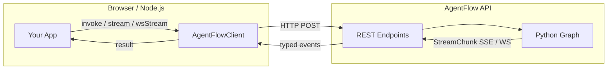
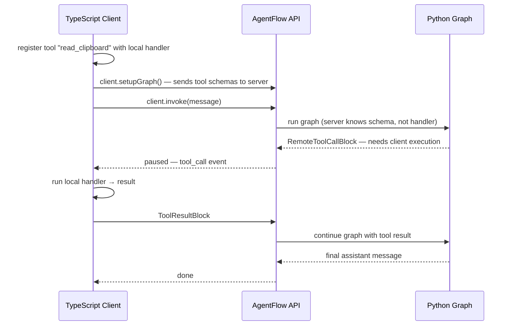

# Connecting Clients

`@10xscale/agentflow-client` is a typed HTTP wrapper that connects any browser or Node.js app to a running AgentFlow API. It handles REST, SSE streaming, WebSockets, auth headers, and client-side tool execution.



---

## Installation and setup

```bash
npm install @10xscale/agentflow-client
```

```typescript
import { AgentFlowClient, Message, StreamRequest } from '@10xscale/agentflow-client';

const client = new AgentFlowClient({
  baseUrl: 'http://localhost:8000',
  authToken: 'your-api-key',   // sent as Authorization: Bearer
  timeout: 30_000,              // ms; default 5 min
  debug: false,
});
```

---

## Invoke vs Stream

| Method | Transport | Returns | Use when |
|---|---|---|---|
| `client.invoke(messages, options?)` | HTTP POST | `Promise<InvokeResult>` | You only need the final response |
| `client.stream(messages, options?)` | SSE | `AsyncGenerator<StreamChunk>` | Real-time token-by-token display |
| `client.wsStream(messages, options?)` | WebSocket | `AsyncGenerator<StreamChunk>` | Low-latency or bidirectional use |

```typescript
import { Message, StreamEventType } from '@10xscale/agentflow-client';

// Invoke — wait for full response
const result = await client.invoke(
  [Message.text_message('What is the capital of France?')],
  { config: { thread_id: 'thread-abc' } }
);
console.log(result.messages.at(-1)?.text());

// Stream — async-iterate over chunks as they arrive
const stream = client.stream(
  [Message.text_message('Tell me a story.')],
  { config: { thread_id: 'thread-abc' } }
);

for await (const chunk of stream) {
  if (chunk.event === StreamEventType.MESSAGE && chunk.message) {
    process.stdout.write(chunk.message.text());
  }
}
```

### StreamChunk event types

| `StreamEventType` | When it fires |
|---|---|
| `MESSAGE` | A new `Message` was produced (assistant turn or tool result) |
| `UPDATES` | A full state snapshot was emitted |
| `ERROR` | An error occurred during streaming |

---

## Threads from the client

Pass the same `thread_id` on every call to resume a conversation. The server restores the full `AgentState` from the checkpointer automatically.

```typescript
const THREAD = 'user-123-support';

// Turn 1
await client.invoke(
  [Message.text_message('My order is late.')],
  { config: { thread_id: THREAD } }
);

// Turn 2 — full history is available to the agent
await client.invoke(
  [Message.text_message('Can you check the status?')],
  { config: { thread_id: THREAD } }
);
```

### Thread management

```typescript
const threads = await client.threads({ user_id: 'user-123' });
const detail  = await client.threadDetails('thread-abc');
const state   = await client.threadState('thread-abc');
await client.deleteThread({ thread_id: 'thread-abc' });
```

---

## Remote tools

Remote tools are the standout feature: **tool schemas live on the server, execution runs in the client**. This lets the agent call browser APIs (clipboard, geolocation, DOM state), access secrets that should never leave the client, or run integrations the server has no credentials for.



```typescript
import { AgentFlowClient, Message, StreamRequest } from '@10xscale/agentflow-client';

const client = new AgentFlowClient({ baseUrl: 'http://localhost:8000' });

// 1. Register tool with a local execution handler
const request: StreamRequest = {
  messages: [Message.text_message('What is on my clipboard?')],
  tools: [
    {
      name: 'read_clipboard',
      description: 'Read text from the user clipboard',
      parameters: { type: 'object', properties: {} },
      execute: async (_args) => {
        const text = await navigator.clipboard.readText();
        return { content: text };
      },
    },
  ],
};

// 2. Stream — client intercepts tool_call events, runs handler, sends result back
await client.stream(request, {
  onTextDelta: (text) => display(text),
  onDone: () => console.log('done'),
});
```

No server changes needed. The server sees the tool schema and calls it; the client sees the call, runs the handler, and returns the result — all within the same stream connection.

---

## Files from the client

Upload a file first, then reference the returned ID in a message:

```typescript
import { AgentFlowClient, Message } from '@10xscale/agentflow-client';

const uploaded = await client.uploadFile(file, { purpose: 'vision' });

await client.invoke({
  messages: [Message.withFile('What is in this image?', uploaded.file_id, 'image/jpeg')],
});
```

---

## Auth on the client

```typescript
// Bearer token (JWT or opaque)
const client = new AgentFlowClient({
  baseUrl: 'http://localhost:8000',
  authToken: 'eyJhbGci...',
});

// To rotate the token, create a new client instance with the refreshed value.
// AgentFlowClient has no mutable setApiKey() method.
```

The token is sent as `Authorization: Bearer <token>` on every request. The server validates it via the configured `BaseAuth` backend. See [Serving Agents](./serving-agents.md) for the server-side auth setup.

---

## Memory from the client

```typescript
await client.storeMemory({ user_id: 'u1', content: 'Prefers dark mode', metadata: {} });

const results = await client.searchMemory({ user_id: 'u1', query: 'UI preferences' });

await client.forgetMemories({ user_id: 'u1', topic: 'preferences' });
```

---

## Health check

```typescript
const ok = await client.ping();   // returns true if API is reachable
```

---

## Go deeper

| Guide | Link |
|---|---|
| Build a chat UI with React | [React agent tutorial](/docs/tutorials/from-examples/react-agent) |
| Server-side auth setup | [Serving Agents](./serving-agents.md) |
| Register remote tools on the server | [Agents, Tools & Control](./agents-tools-control.md) |
| Full client API reference | [API Reference](/docs/reference/client/agentflow-client) |
