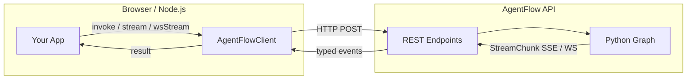
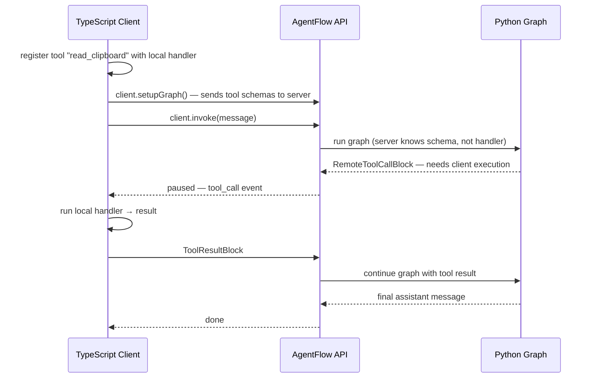

# Connecting Clients

`@10xscale/agentflow-client` is a typed HTTP wrapper that connects any browser or Node.js app to a running AgentFlow API. It handles REST, SSE streaming, WebSockets, auth headers, and client-side tool execution.



---

## Installation and setup

```bash
npm install @10xscale/agentflow-client
```

```typescript
import { AgentFlowClient } from '@10xscale/agentflow-client';

const client = new AgentFlowClient({
  baseUrl: 'http://localhost:8000',
  apiKey: 'your-api-key',      // sent as Authorization: Bearer
  timeout: 30_000,              // ms; default 30 s
  debug: false,
});
```

---

## Invoke vs Stream

| Method | Transport | Returns | Use when |
|---|---|---|---|
| `client.invoke(request)` | HTTP POST | `Promise<InvokeResponse>` | You only need the final response |
| `client.stream(request, callbacks)` | SSE | void; fires callbacks per chunk | Real-time text display in browser |
| `client.wsStream(request, callbacks)` | WebSocket | void; fires callbacks per chunk | Low-latency or bidirectional use |

```typescript
// Invoke — wait for full response
const response = await client.invoke({
  messages: [{ role: 'user', content: 'What is the capital of France?' }],
  thread_id: 'thread-abc',
});
console.log(response.messages.at(-1)?.content);

// Stream — receive chunks as they arrive
await client.stream(
  {
    messages: [{ role: 'user', content: 'Tell me a story.' }],
    thread_id: 'thread-abc',
  },
  {
    onTextDelta: (text) => process.stdout.write(text),
    onDone: (response) => console.log('\nDone'),
    onError: (err) => console.error(err),
  },
);
```

### Stream event callbacks

| Callback | Fires when |
|---|---|
| `onTextDelta(text)` | A new text fragment arrives (`text_delta` event) |
| `onToolCall(toolCall)` | The LLM requested a tool call |
| `onToolResult(result)` | A tool result was returned |
| `onStateUpdate(state)` | Full state snapshot emitted |
| `onThinking(text)` | Reasoning token from a thinking model |
| `onMetadata(meta)` | Run/thread metadata (ids, timestamps) |
| `onError(error)` | Stream error |
| `onDone(response)` | Stream complete; final response |

---

## Threads from the client

Pass the same `thread_id` on every call to resume a conversation. The server restores the full `AgentState` from the checkpointer automatically.

```typescript
const THREAD = 'user-123-support';

// Turn 1
await client.invoke({ messages: [{ role: 'user', content: 'My order is late.' }], thread_id: THREAD });

// Turn 2 — full history is available to the agent
await client.invoke({ messages: [{ role: 'user', content: 'Can you check the status?' }], thread_id: THREAD });
```

### Thread management

```typescript
const threads = await client.threads({ user_id: 'user-123' });
const detail  = await client.threadDetails('thread-abc');
const state   = await client.threadState('thread-abc');
await client.deleteThread({ thread_id: 'thread-abc' });
```

---

## Remote tools

Remote tools are the standout feature: **tool schemas live on the server, execution runs in the client**. This lets the agent call browser APIs (clipboard, geolocation, DOM state), access secrets that should never leave the client, or run integrations the server has no credentials for.



```typescript
import { AgentFlowClient } from '@10xscale/agentflow-client';

const client = new AgentFlowClient({ baseUrl: 'http://localhost:8000' });

// 1. Register tool with a local execution handler
const request: StreamRequest = {
  messages: [{ role: 'user', content: 'What is on my clipboard?' }],
  tools: [
    {
      name: 'read_clipboard',
      description: 'Read text from the user clipboard',
      parameters: { type: 'object', properties: {} },
      execute: async (_args) => {
        const text = await navigator.clipboard.readText();
        return { content: text };
      },
    },
  ],
};

// 2. Stream — client intercepts tool_call events, runs handler, sends result back
await client.stream(request, {
  onTextDelta: (text) => display(text),
  onDone: () => console.log('done'),
});
```

No server changes needed. The server sees the tool schema and calls it; the client sees the call, runs the handler, and returns the result — all within the same stream connection.

---

## Files from the client

Upload a file first, then reference the returned ID in a message:

```typescript
const uploaded = await client.uploadFile(file, { purpose: 'vision' });

await client.invoke({
  messages: [{
    role: 'user',
    content: [
      { type: 'text', text: 'What is in this image?' },
      { type: 'image', file_id: uploaded.file_id },
    ],
  }],
});
```

---

## Auth on the client

```typescript
// Bearer token (JWT or opaque)
const client = new AgentFlowClient({
  baseUrl: 'http://localhost:8000',
  apiKey: 'eyJhbGci...',
});

// Refresh the token at runtime (e.g. after Firebase refresh)
client.setApiKey(newToken);
```

The token is sent as `Authorization: Bearer <token>` on every request. The server validates it via the configured `BaseAuth` backend. See [Serving Agents](./serving-agents.md) for the server-side auth setup.

---

## Memory from the client

```typescript
await client.storeMemory({ user_id: 'u1', content: 'Prefers dark mode', metadata: {} });

const results = await client.searchMemory({ user_id: 'u1', query: 'UI preferences' });

await client.forgetMemories({ user_id: 'u1', topic: 'preferences' });
```

---

## React hooks (a2ui)

For React apps, `@10xscale/agentflow-client/a2ui` exposes hooks that manage connection, streaming state, and message lists:

```tsx
import { useAgent, useChat } from '@10xscale/agentflow-client/a2ui';

function Chat() {
  const { messages, send, isStreaming } = useChat({
    baseUrl: 'http://localhost:8000',
    threadId: 'thread-abc',
  });

  return (
    <>
      {messages.map((m) => <div key={m.id}>{m.content}</div>)}
      <button onClick={() => send('Hello')} disabled={isStreaming}>Send</button>
    </>
  );
}
```

For a full drop-in UI with sidebar, thread list, and streaming chat, see `@10xscale/agentflow-ui` — it builds on the same client and hooks.

---

## Health check

```typescript
const ok = await client.ping();   // returns true if API is reachable
```

---

## Go deeper

| Guide | Link |
|---|---|
| Build a chat UI with React | [agentflow-ui docs](/packages/agentflow-ui) |
| Server-side auth setup | [Serving Agents](./serving-agents.md) |
| Register remote tools on the server | [Agents, Tools & Control](./agents-tools-control.md) |
| Full client API reference | [API Reference](/api/client) |
