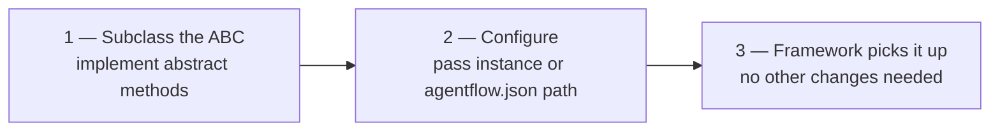

# Extensibility

Every major component in AgentFlow has an abstract base class you can subclass. Swap storage, auth, LLM provider, ID scheme, rate limiting, or event routing — without touching your graph logic.

---

## Extension points at a glance

```mermaid
flowchart TB
  subgraph "Storage"
    BCP[BaseCheckpointer]
    BS[BaseStore]
    BE[BaseEmbedding]
    BMS[BaseMediaStore]
  end
  subgraph "Agent & LLM"
    BA[BaseAgent]
    BC[BaseConverter]
    BCM[BaseContextManager]
  end
  subgraph "API / Server"
    BAUTH[BaseAuth]
    BAUTHZ[AuthorizationBackend]
    BRL[BaseRateLimitBackend]
    TNG[ThreadNameGenerator]
    BID[BaseIDGenerator]
  end
  subgraph "Events & QA"
    BP[BasePublisher]
    BV[BaseValidator]
    BCR[BaseCriterion]
    BR[BaseReporter]
  end
  YOUR[Your Subclass] -->|extend any| BCP & BS & BE & BMS
  YOUR -->|extend any| BA & BC & BCM
  YOUR -->|extend any| BAUTH & BAUTHZ & BRL & TNG & BID
  YOUR -->|extend any| BP & BV & BCR & BR
```



| ABC | File | What you override |
|---|---|---|
| `BaseAgent` | `agentflow/agentflow/core/graph/base_agent.py` | `execute()` |
| `BaseContextManager` | `agentflow/agentflow/core/state/base_context.py` | `trim_context()`, `atrim_context()` |
| `BaseCheckpointer` | `agentflow/agentflow/storage/checkpointer/base_checkpointer.py` | State / message / thread / cache API |
| `BaseStore` | `agentflow/agentflow/storage/store/base_store.py` | Vector store read / write |
| `BaseEmbedding` | `agentflow/agentflow/storage/store/embedding/base_embedding.py` | `aembed()`, `aembed_batch()`, `dimension` |
| `BaseMediaStore` | `agentflow/agentflow/storage/media/storage/base.py` | `store()`, `retrieve()`, `delete()`, `exists()` |
| `BasePublisher` | `agentflow/agentflow/runtime/publisher/base_publisher.py` | `publish(EventModel)`, `close()` |
| `BaseConverter` | `agentflow/agentflow/runtime/adapters/llm/base_converter.py` | `convert_response()`, `convert_streaming_response()` |
| `BaseValidator` | `agentflow/agentflow/utils/callbacks.py` | `validate(messages)` |
| `BaseIDGenerator` | `agentflow/agentflow/utils/id_generator.py` | `generate()` |
| `BaseAuth` | `agentflow-api/agentflow_cli/src/app/core/auth/base_auth.py` | `authenticate(request)` |
| `AuthorizationBackend` | `agentflow-api/agentflow_cli/src/app/core/auth/authorization.py` | `check(user, operation, resource)` |
| `BaseRateLimitBackend` | `agentflow-api/agentflow_cli/src/app/core/middleware/rate_limit/base.py` | `check(key, limit, window)`, `close()` |
| `ThreadNameGenerator` | `agentflow-api/agentflow_cli/src/app/utils/thread_name_generator.py` | `generate_name(messages)` |
| `BaseCriterion` | `agentflow/agentflow/qa/evaluation/criteria/base.py` | `score(trajectory, response)` |
| `BaseReporter` | `agentflow/agentflow/qa/evaluation/reporters/base.py` | `generate(report, output_dir)` |

---

## Common pattern

Every extension follows three steps:



1. Subclass the ABC and implement its abstract methods.
2. Pass the instance at compile time (`graph.compile(checkpointer=...)`) or set the path in `agentflow.json` for server-layer ABCs.
3. The framework picks it up — graph logic, routing, and API endpoints are unchanged.

---

## Storage extension points

All four storage ABCs follow the same pattern: subclass, implement the abstract methods, pass the instance at compile time.

### `BaseCheckpointer` — conversational state

The minimum required methods are the six that control state and thread lifecycle. The message and cache methods have default no-op implementations in the base class — override them only if your backend can serve them efficiently.

```python
from agentflow.storage.checkpointer.base_checkpointer import BaseCheckpointer

class DynamoCheckpointer(BaseCheckpointer):
    # ── Required ──────────────────────────────────────────────────────────────
    async def asetup(self) -> None: ...                                  # create tables / connect
    async def aput_state(self, config, state) -> None: ...               # persist full state
    async def aget_state(self, config) -> AgentState | None: ...         # load state by thread_id
    async def aclear_state(self, config) -> None: ...                    # delete state for thread
    async def aclean_thread(self, config) -> None: ...                   # delete all thread data
    async def arelease(self) -> None: ...                                # close connections

    # ── Optional — override if your backend supports them efficiently ─────────
    async def aput_state_cache(self, config, state) -> None: ...         # hot-path write cache
    async def aget_state_cache(self, config) -> AgentState | None: ...   # hot-path read cache
    async def aput_messages(self, config, messages) -> None: ...         # store messages separately
    async def aget_message(self, config, message_id) -> Message: ...     # fetch single message
    async def alist_messages(self, config) -> list[Message]: ...         # list thread messages
    async def adelete_message(self, config, message_id) -> None: ...     # delete single message
    async def aput_thread(self, config, info) -> None: ...               # store thread metadata
    async def aget_thread(self, config) -> dict | None: ...              # fetch thread metadata
    async def alist_threads(self, config) -> list[dict]: ...             # list threads for user

compiled = graph.compile(checkpointer=DynamoCheckpointer())
```

### `BaseStore` — long-term vector memory

```python
from agentflow.storage.store.base_store import BaseStore

class PineconeStore(BaseStore):
    async def astore(self, user_id, content, metadata) -> str: ...
    async def asearch(self, user_id, query, limit) -> list[dict]: ...
    async def aget(self, memory_id) -> dict | None: ...
    async def aupdate(self, memory_id, content) -> None: ...
    async def adelete(self, memory_id) -> None: ...
    async def alist(self, user_id) -> list[dict]: ...

compiled = graph.compile(store=PineconeStore())
```

### `BaseEmbedding` — custom embedding model

```python
from agentflow.storage.store.embedding.base_embedding import BaseEmbedding

class CohereEmbedding(BaseEmbedding):
    @property
    def dimension(self) -> int:
        return 1024

    async def aembed(self, text: str) -> list[float]:
        return await cohere_client.embed(text)

    async def aembed_batch(self, texts: list[str]) -> list[list[float]]:
        return await cohere_client.embed_batch(texts)
```

### `BaseMediaStore` — file storage backend

```python
from agentflow.storage.media.storage.base import BaseMediaStore

class S3MediaStore(BaseMediaStore):
    async def store(self, data: bytes, mime_type: str, metadata: dict | None = None) -> str:
        """Store bytes and return an opaque storage key."""
        ...

    async def retrieve(self, storage_key: str) -> tuple[bytes, str]:
        """Return (bytes, mime_type). Raise KeyError if not found."""
        ...

    async def delete(self, storage_key: str) -> bool:
        """Delete by storage key. Return True if deleted."""
        ...

    async def exists(self, storage_key: str) -> bool: ...
```

---

## Agent and LLM extension

### `BaseAgent` — bring your own LLM

`Agent` extends `BaseAgent`. Subclass it to call any LLM provider, add pre/post-processing, or change how messages are constructed.

```python
from agentflow.core.graph.base_agent import BaseAgent
from agentflow.core.state import AgentState, Message

class AnthropicAgent(BaseAgent):
    async def execute(self, state: AgentState, config: dict) -> Message:
        # Convert AgentFlow messages to the format Anthropic expects
        messages = [
            {"role": m.role, "content": m.text}
            for m in state.context
            if m.role in ("user", "assistant")
        ]
        response = await anthropic_client.messages.create(
            model="claude-opus-4-7",
            messages=messages,
        )
        return Message.text_message(response.content[0].text, role="assistant")
```

### `BaseConverter` — LLM response normalisation

`BaseConverter` maps a raw provider response into AgentFlow's `Message` format. Implement one when integrating a provider that isn't OpenAI or Google.

```python
from agentflow.runtime.adapters.llm.base_converter import BaseConverter

class MyProviderConverter(BaseConverter):
    async def convert_response(self, raw_response) -> Message:
        return Message.text_message(raw_response["output"], role="assistant")

    async def convert_streaming_response(self, chunk) -> Message | None:
        text = chunk.get("delta", "")
        return Message.text_message(text, role="assistant") if text else None
```

### `BaseContextManager` — custom context trimming

```python
from agentflow.core.state.base_context import BaseContextManager
from agentflow.core.state import AgentState

class PriorityContextManager(BaseContextManager):
    def trim_context(self, state: AgentState) -> AgentState:
        # keep system message + last N turns + any pinned messages
        ...
        return state

    async def atrim_context(self, state: AgentState) -> AgentState:
        return self.trim_context(state)

graph = StateGraph(state=MyState(), context_manager=PriorityContextManager())
```

---

## ID generation

Five built-in generators cover most needs. Swap them globally or per-graph.

| Class | Format | Example |
|---|---|---|
| `UUIDGenerator` | UUID v4 | `550e8400-e29b-41d4-a716-446655440000` |
| `BigIntIDGenerator` | 64-bit integer | `7891234567890123` |
| `TimestampIDGenerator` | ms timestamp + random suffix | `1716480000000-a3f2` |
| `HexIDGenerator` | Hex string | `4a8f3c1d` |
| `ShortIDGenerator` | Short alphanumeric | `xK9mP2` |

```python
from agentflow.utils.id_generator import TimestampIDGenerator

compiled = graph.compile(id_generator=TimestampIDGenerator())
```

Custom generator:

```python
from agentflow.utils.id_generator import BaseIDGenerator

class PrefixedIDGenerator(BaseIDGenerator):
    def generate(self) -> str:
        return f"run_{uuid4().hex[:8]}"
```

---

## API / server extension

All four server-layer ABCs are wired via `agentflow.json` — no code changes to the server required.

### `BaseAuth`

```python
from agentflow_cli.src.app.core.auth.base_auth import BaseAuth

class ApiKeyAuth(BaseAuth):
    async def authenticate(self, request) -> dict | None:
        key = request.headers.get("X-API-Key")
        return await lookup_api_key(key)   # None → 401
```

### `AuthorizationBackend`

```python
from agentflow_cli.src.app.core.auth.authorization import AuthorizationBackend

class RBACBackend(AuthorizationBackend):
    async def check(self, user: dict, operation: str, resource: str) -> bool:
        return operation in ROLE_PERMISSIONS[user["role"]]
```

### `BaseRateLimitBackend`

```python
from agentflow_cli.src.app.core.middleware.rate_limit.base import BaseRateLimitBackend

class RedisClusterRateLimiter(BaseRateLimitBackend):
    async def check(self, key: str, limit: int, window: int) -> bool: ...
    async def close(self) -> None: ...
```

### `ThreadNameGenerator`

```python
from agentflow_cli.src.app.utils.thread_name_generator import ThreadNameGenerator

class DatePrefixNameGenerator(ThreadNameGenerator):
    async def generate_name(self, messages: list) -> str:
        return f"{date.today()} — {messages[0].text[:30]}"
```

Wire any of these in `agentflow.json`. Each server-layer ABC has a dedicated top-level key — they are not registered in `injectq`:

```json
{
  "auth": { "method": "custom", "path": "auth.my_auth:ApiKeyAuth" },
  "authorization": "auth.my_auth:RBACBackend",
  "thread_name_generator": "services.naming:DatePrefixNameGenerator",
  "rate_limit": {
    "enabled": true,
    "backend": "custom",
    "backend_path": "services.rate_limit:RedisClusterRateLimiter",
    "requests": 100,
    "window": 60
  }
}
```

The string format for class references is `module.path:ClassName` (dot-separated module path, colon, then the class or instance name).

---

## Event stream extension

```python
from agentflow.runtime.publisher.base_publisher import BasePublisher
from agentflow.runtime.publisher.events import EventModel

class WebhookPublisher(BasePublisher):
    def __init__(self, url: str):
        self.url = url

    async def publish(self, event: EventModel) -> None:
        await httpx.post(self.url, json=event.dict())

    async def close(self) -> None:
        pass

    def sync_close(self) -> None:
        pass
```

Compose multiple publishers:

```python
from agentflow.runtime.publisher import CompositePublisher

compiled = graph.compile(
    publisher=CompositePublisher([ConsolePublisher(), WebhookPublisher("https://...")])
)
```

---

## Validation and QA extension

### `BaseValidator` — input screening

```python
from agentflow.utils.callbacks import BaseValidator

class LengthValidator(BaseValidator):
    def validate(self, messages: list[Message]) -> list[Message]:
        for m in messages:
            if len(m.text) > 10_000:
                raise ValueError("Message exceeds maximum length")
        return messages

cb = CallbackManager()
cb.register_input_validator(LengthValidator())
```

### `BaseCriterion` — custom eval criterion

```python
from agentflow.qa.evaluation.criteria.base import BaseCriterion

class KeywordCriterion(BaseCriterion):
    def __init__(self, keywords: list[str]):
        self.keywords = keywords

    async def score(self, trajectory, response) -> float:
        hits = sum(1 for kw in self.keywords if kw in response.text)
        return hits / len(self.keywords)
```

### `BaseReporter` — custom eval report

```python
from agentflow.qa.evaluation.reporters.base import BaseReporter

class SlackReporter(BaseReporter):
    async def generate(self, report, output_dir: str) -> None:
        summary = f"Score: {report.overall_score:.2f}"
        await slack_client.post(channel="#evals", text=summary)
```

---

## What's next

| Page | What it covers |
|---|---|
| [Agents, Tools & Control](./agents-tools-control.md) | `BaseValidator`, `CallbackManager`, `GraphLifecycleHook` in practice |
| [Serving Agents](./serving-agents.md) | `BaseAuth`, `AuthorizationBackend`, `BasePublisher` wired to a running server |
| [Memory](./memory.md) | `BaseCheckpointer`, `BaseStore`, `BaseEmbedding` in the memory layer context |
| [Quality & Observability](./qa.md) | `BaseCriterion`, `BaseReporter` in the evaluation pipeline |
