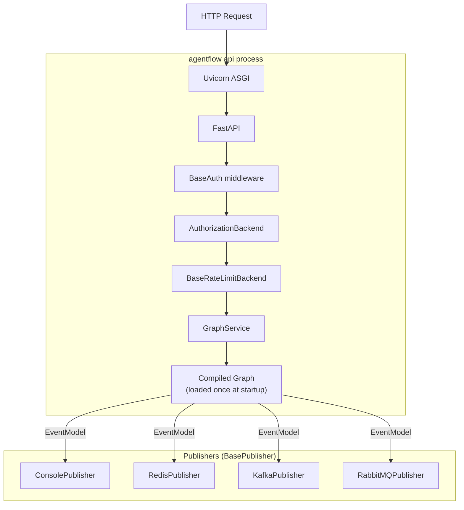
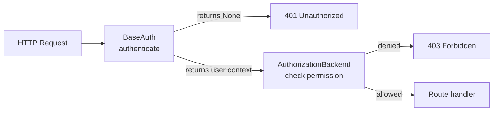
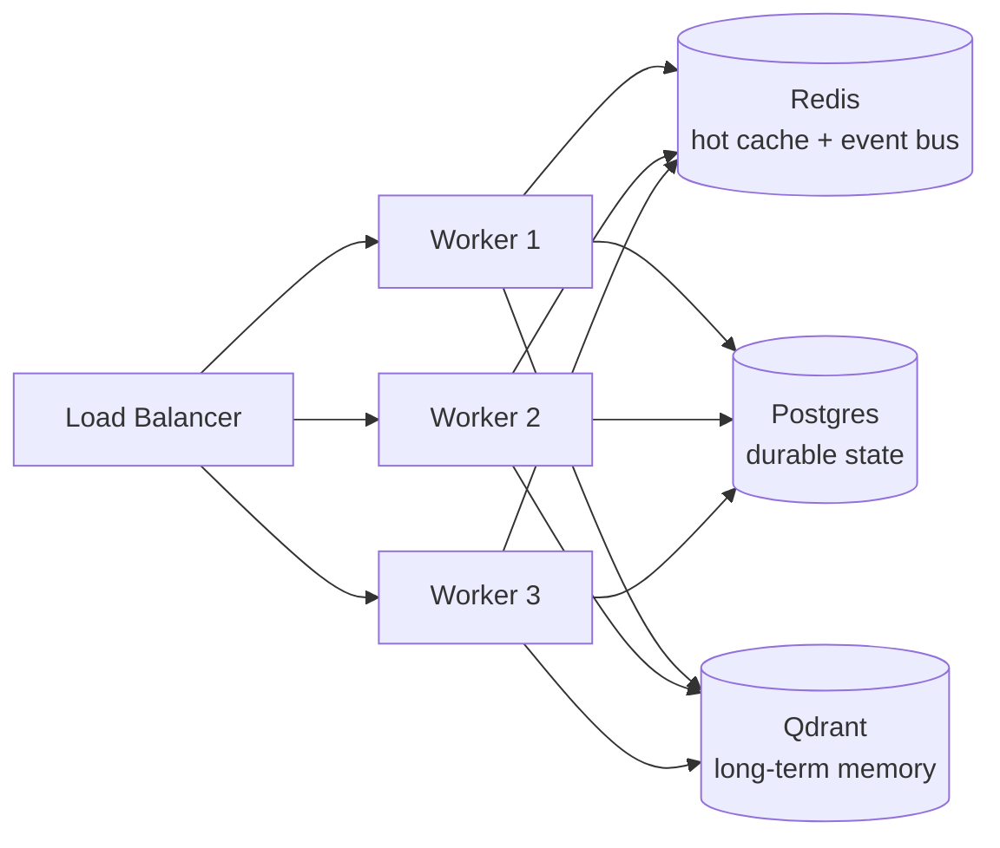
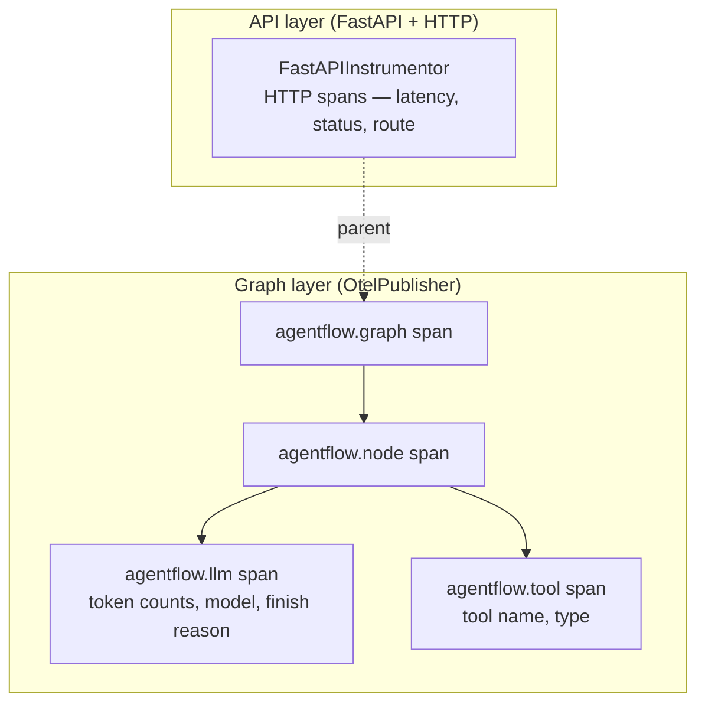

# Serving Agents

This page covers how the API/CLI layer exposes your compiled graph over HTTP, how authentication and authorization protect it, how publishers route execution events to external systems, and what a production deployment looks like.

---

## `agentflow.json` — the project config

`agentflow.json` is the single file that wires everything together. The CLI and API server read it at startup.

```json
{
  "agent": "graph/agent.py:get_compiled_graph",
  "auth": "auth/agent_auth.py:MyAuth",
  "authorization": "auth/agent_auth.py:MyAuthorizationBackend",
  "injectq": {
    "DatabaseService": "services/db.py:DatabaseService"
  },
  "evaluation": {
    "evals_dir": "evals/",
    "threshold": 0.8
  }
}
```

| Key | Purpose |
|---|---|
| `agent` | `module:callable` that returns a `CompiledGraph` |
| `auth` | Custom `BaseAuth` subclass (optional — omit to disable auth) |
| `authorization` | Custom `AuthorizationBackend` subclass (optional) |
| `injectq` | Services registered in the DI container |
| `evaluation` | Eval directory and pass threshold |

---

## Starting the server

```bash
agentflow api                                    # starts with auto-reload (development default)
agentflow api --host 0.0.0.0 --port 8000        # bind address
agentflow api --config agentflow.json            # explicit config path
agentflow play                                   # API + hosted playground in browser
```

The server loads the compiled graph once at startup and keeps it in memory. All requests share the same graph instance; per-request isolation comes from `thread_id`. In development `--reload` is on by default — any change to your source files restarts the server automatically. In production, run with multiple workers (see [Production deployment](#production-deployment)) and omit `--reload`.

---

## REST endpoints



| Router | Prefix | Key endpoints |
|---|---|---|
| Graph | `/v1/graph` | `POST /invoke`, `POST /stream`, `WebSocket /ws`, `POST /stop`, `GET /` |
| Checkpointer | `/v1/checkpointer` | Thread state CRUD, message CRUD |
| Store | `/v1/store` | Memory store, search, get, update, delete, list, forget |
| Media | `/v1/media` | File upload / download |
| A2A | `/a2a` | Agent-to-Agent protocol |
| Health | `/ping` | Health check |

---

## Authentication

Authentication is pluggable via `BaseAuth`. The framework ships with `JwtAuth`; you can replace it with any backend.



**Built-in: `JwtAuth`**

Point to the built-in class in `agentflow.json` using its importable path:

```json
{
  "auth": "agentflow_cli.src.app.core.auth.jwt_auth:JwtAuth"
}
```

Then set the required environment variables:

```bash
export JWT_SECRET_KEY="your-secret"
export JWT_ALGORITHM="HS256"      # default; optional
```

**Custom auth** — subclass `BaseAuth` and point `agentflow.json` to your class:

```python
# auth/agent_auth.py
from agentflow_cli.src.app.core.auth.base_auth import BaseAuth
from fastapi import Request

class FirebaseAuth(BaseAuth):
    async def authenticate(self, request: Request) -> dict | None:
        token = request.headers.get("Authorization", "").removeprefix("Bearer ")
        try:
            return firebase_admin.auth.verify_id_token(token)
        except Exception:
            return None   # returning None → 401
```

```json
{
  "auth": "auth/agent_auth.py:FirebaseAuth"
}
```

---

## Authorization

Authorization is a separate extension point from authentication. After a user is identified, `AuthorizationBackend` decides whether they can perform a specific operation on a specific resource.

```python
# auth/agent_auth.py
from agentflow_cli.src.app.core.auth.authorization import AuthorizationBackend

class TenantAuthorizationBackend(AuthorizationBackend):
    async def check(self, user: dict, operation: str, resource: str) -> bool:
        # operation: "invoke" | "read_thread" | "delete_thread" | "store_memory" | ...
        # resource:  thread_id, memory_id, etc.
        return user["tenant_id"] == extract_tenant(resource)
```

```json
{
  "authorization": "auth/agent_auth.py:TenantAuthorizationBackend"
}
```

The default `DefaultAuthorizationBackend` allows all authenticated users. Override it for RBAC, tenant scoping, or fine-grained permission checks.

---

## Rate limiting

Rate limiting is pluggable via `BaseRateLimitBackend`. Two backends are built in; swap or extend via dependency injection.

| Backend | When to use |
|---|---|
| In-memory | Single-process development |
| Redis | Multi-worker production — set `REDIS_URL` |
| Custom | Subclass `BaseRateLimitBackend` and register via `injectq` |

```python
# services/rate_limit.py
from agentflow_cli.src.app.core.middleware.rate_limit.base import BaseRateLimitBackend

class CustomRateLimitBackend(BaseRateLimitBackend):
    async def check(self, key: str, limit: int, window: int) -> bool:
        # return True to allow, False to rate-limit (→ 429)
        ...

    async def close(self) -> None:
        ...
```

```json
{
  "injectq": {
    "BaseRateLimitBackend": "services/rate_limit.py:CustomRateLimitBackend"
  }
}
```

---

## Publishers

`BasePublisher` emits an `EventModel` on every execution event — node start/end, tool calls, state updates, errors. Wire one or more publishers at graph compile time; they compose automatically.

```python
from agentflow.runtime.publisher import RedisPublisher, KafkaPublisher, CompositePublisher

publisher = CompositePublisher([
    RedisPublisher(url="redis://localhost:6379", channel="agentflow.events"),
    KafkaPublisher(bootstrap_servers="kafka:9092", topic="agentflow"),
])

compiled = graph.compile(publisher=publisher)
```

| Publisher | Transport | Use case |
|---|---|---|
| `ConsolePublisher` | stdout | Development / debugging |
| `RedisPublisher` | Redis pub/sub | Real-time dashboards, fan-out |
| `KafkaPublisher` | Kafka topic | High-throughput event pipelines |
| `RabbitMQPublisher` | RabbitMQ exchange | Queue-based workflows, notifications |

Custom publisher — subclass `BasePublisher`:

```python
from agentflow.runtime.publisher.base_publisher import BasePublisher
from agentflow.runtime.publisher.events import EventModel

class DatadogPublisher(BasePublisher):
    async def publish(self, event: EventModel) -> None:
        datadog.send_event(event.dict())

    async def close(self) -> None:
        pass
```

---

## Dependency injection

The DI container (`injectq`) is populated at compile time. Node functions and services declare what they need; the framework injects it.

`injectq` ships as a dependency of `10xscale-agentflow` — no separate install needed.

```python
from injectq import Inject

class DatabaseService:
    async def query(self, sql: str): ...

async def my_node(
    state: MyState,
    config: dict,
    db: Inject[DatabaseService],   # injected automatically from the DI container
) -> Message:
    result = await db.query("SELECT ...")
    return Message.text_message(str(result), role="assistant")
```

Always-injected parameters — no annotation needed:

| Parameter name | Value |
|---|---|
| `state` | Current `AgentState` |
| `config` | Run config dict (`thread_id`, `user_id`, etc.) |
| `tool_call_id` | ID of the tool call (inside `ToolNode` only) |

Register services via `agentflow.json` — the value is a `module:class` import path:

```json
{
  "injectq": {
    "DatabaseService": "services/db.py:DatabaseService"
  }
}
```

---

## A2A and ACP protocols

Serve your graph as an Agent-to-Agent (A2A) endpoint, or call remote A2A agents as nodes inside your own graph.

A2A is activated by setting `a2a: true` in `agentflow.json`. The `/a2a` route is then mounted automatically when `agentflow api` starts — no extra code required:

```json
{
  "agent": "graph/agent.py:get_compiled_graph",
  "a2a": true
}
```

To call a remote A2A agent as a node inside your own graph:

```python
from agentflow.runtime.protocols.a2a import A2AClient

remote_agent = A2AClient(url="https://other-service/a2a")
graph.add_node("REMOTE", remote_agent)
graph.add_edge("MAIN", "REMOTE")
```

ACP (Agent Communication Protocol) follows the same pattern via `agentflow.runtime.protocols.acp`.

---

## Thread name generator

By default the API generates an AI-powered name for each new thread. Override it by subclassing `ThreadNameGenerator` and registering it via `injectq`:

```python
# services/naming.py
from agentflow_cli.src.app.utils.thread_name_generator import ThreadNameGenerator

class SlugThreadNameGenerator(ThreadNameGenerator):
    async def generate_name(self, messages: list) -> str:
        return slugify(messages[0].text[:40])
```

```json
{
  "injectq": {
    "ThreadNameGenerator": "services/naming.py:SlugThreadNameGenerator"
  }
}
```

---

## Production deployment



`agentflow build` generates a production-ready `Dockerfile` (and optional `docker-compose.yml`):

```bash
agentflow build                          # Dockerfile only
agentflow build --docker-compose         # + docker-compose.yml
agentflow build --python-version 3.13
```

Key environment variables — set them in a `.env` file, via `export`, or as Docker `ENV` / `--env-file`:

```bash
# .env  (or export VAR=value, or Docker ENV in Dockerfile)
MODE=production           # enables production guards (warns on ORIGINS=*, etc.)
REDIS_URL=redis://redis:6379
JWT_SECRET_KEY=your-secret-here
SENTRY_DSN=https://...@sentry.io/123
OTEL_ENABLED=true
OTEL_SERVICE_NAME=my-agent
OTEL_EXPORTER_OTLP_ENDPOINT=http://collector:4317
OTEL_LEVEL=standard
```

| Variable | Default | Purpose |
|---|---|---|
| `MODE` | `development` | Set to `production` to enable security guards |
| `REDIS_URL` | `None` | Redis for state cache, rate limiter, pub/sub |
| `JWT_SECRET_KEY` | `None` | Required for `JwtAuth` |
| `JWT_ALGORITHM` | `HS256` | JWT signing algorithm |
| `SENTRY_DSN` | `None` | Sentry error tracking |
| `OTEL_ENABLED` | `false` | Enable OpenTelemetry tracing (see [OpenTelemetry](#opentelemetry)) |
| `OTEL_SERVICE_NAME` | `agentflow-api` | Service name reported in all traces |
| `OTEL_EXPORTER_OTLP_ENDPOINT` | `None` | OTLP collector URL — omit to print spans to console |
| `OTEL_LEVEL` | `standard` | Span detail level: `spans` \| `standard` \| `full` |
| `ORIGINS` | `*` | CORS allowed origins — restrict in production |

---

## OpenTelemetry

AgentFlow has first-class OpenTelemetry support at two independent layers. You can use either or both.



### API layer — automatic when `OTEL_ENABLED=true`

Setting `OTEL_ENABLED=true` in your environment is all that's required. The API server automatically:

- Creates a `TracerProvider` with your `OTEL_SERVICE_NAME`
- Instruments the FastAPI app with `FastAPIInstrumentor` (HTTP-level spans)
- Wires `OtelPublisher` into the graph so every LLM call, tool call, and node transition becomes a child span
- Exports via OTLP when `OTEL_EXPORTER_OTLP_ENDPOINT` is set; falls back to console output in non-production

```bash
OTEL_ENABLED=true
OTEL_SERVICE_NAME=my-agent
OTEL_EXPORTER_OTLP_ENDPOINT=http://collector:4317   # omit to print spans to console
OTEL_LEVEL=standard                                  # spans | standard | full
```

No code changes are needed. The SDK does not need to be configured separately — the API configures `OtelPublisher` automatically and merges it with any existing publisher (such as `RedisPublisher`) without replacing it.

### Graph layer — `OtelPublisher` and `ObservabilityLevel`

When running the graph directly (without `agentflow api`), add `OtelPublisher` manually using the `setup_tracing` helper:

```python
from agentflow.runtime.publisher.otel_publisher import setup_tracing, ObservabilityLevel

# Call before graph.compile()
setup_tracing(graph, level=ObservabilityLevel.STANDARD)
compiled = graph.compile(...)
```

`ObservabilityLevel` controls how much data is emitted as span attributes:

| Level | What it includes |
|---|---|
| `SPANS` | Timing and structure only — no I/O data |
| `STANDARD` | Token counts, model name, request params, finish reason *(default)* |
| `FULL` | All of STANDARD + prompt messages, completions, tool I/O — may contain PII |

With an explicit `TracerProvider` (e.g. to export to Jaeger or Honeycomb):

```python
from opentelemetry.sdk.trace import TracerProvider
from opentelemetry.sdk.trace.export import BatchSpanProcessor
from opentelemetry.exporter.otlp.proto.grpc.trace_exporter import OTLPSpanExporter
from opentelemetry import trace

provider = TracerProvider()
provider.add_span_processor(BatchSpanProcessor(OTLPSpanExporter(endpoint="http://collector:4317")))
trace.set_tracer_provider(provider)

setup_tracing(graph, level=ObservabilityLevel.FULL)
compiled = graph.compile(...)
```

### Span hierarchy

Every graph run produces a consistent span tree:

```
agentflow.graph          ← one per ainvoke / astream call
  agentflow.node         ← one per node execution (e.g. "MAIN", "TOOL")
    agentflow.llm        ← one per LLM call (tokens, model, finish reason)
    agentflow.tool       ← one per tool call (name, type: local | mcp)
```

The `agentflow.graph` span carries `thread_id` as `session.id` so tools like Langfuse automatically group multi-turn conversations.

**Install:**

```bash
pip install "10xscale-agentflow[otel]"           # graph-level spans (OtelPublisher)
pip install "10xscale-agentflow-cli[otel]"       # API layer (FastAPIInstrumentor + OTLP exporter)
```

---

## What's next

| Page | What it covers |
|---|---|
| [Connecting Clients](./connecting-clients.md) | TypeScript SDK, streaming, remote tools |
| [Memory](./memory.md) | `PgCheckpointer`, Redis cache, long-term vector store |
| [Extensibility](./extensibility.md) | `BaseAuth`, `AuthorizationBackend`, `BasePublisher` and all other ABCs |
| [Quality & Observability](./qa.md) | `GraphLifecycleHook` with OpenTelemetry, evaluation, testing |
