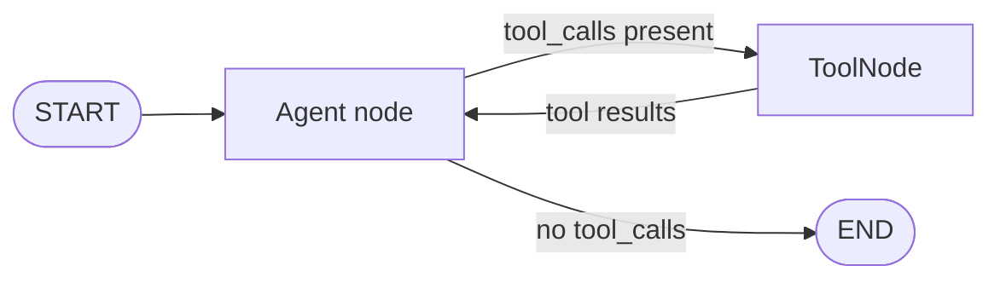

# Agents and tools

`Agent` and `ToolNode` are the two built-in node types that handle language model interaction. `Agent` calls the model. `ToolNode` executes the functions the model requested.

---

## Agent

`Agent` is a graph node that wraps any LLM provider. When the graph reaches an `Agent` node it sends the current conversation to the model and appends the response to state.

### Constructor

```python
from agentflow.core.graph import Agent

agent = Agent(
    # --- Required ---
    model="gemini-2.5-flash",        # Any model name; no parsing needed
    provider="google",               # "openai" | "google"; auto-detected if omitted

    # --- Output type ---
    output_type="text",              # "text" | "image" | "video" | "audio"

    # --- System prompt ---
    system_prompt=[
        {"role": "system", "content": "You are a helpful assistant."},
        {"role": "user",   "content": "Today is {date}."},  # state interpolation
    ],

    # --- Tool integration ---
    tool_node=tool_node,             # ToolNode instance, or str name of a graph node

    # --- Context management ---
    trim_context=True,               # trim old messages to stay within token limits

    # --- Reasoning ---
    reasoning_config={"effort": "medium"},  # see Reasoning section below

    # --- Retry & fallback ---
    retry_config=True,               # True = default RetryConfig(3 retries, 1s delay)
    fallback_models=["gpt-4o-mini"], # fallback when all retries exhausted

    # --- Multimodal ---
    multimodal_config=MultimodalConfig(...),

    # --- Long-term memory ---
    memory=MemoryConfig(...),

    # --- Skills ---
    skills=SkillConfig(...),

    # --- Extra provider kwargs ---
    temperature=0.7,
    max_tokens=2048,
    base_url="http://localhost:11434",  # for Ollama / openrouter / vllm
)
```

### System prompt interpolation

The system prompt supports `{field_name}` placeholders. Fields are resolved against the current `AgentState` at runtime:

```python
class MyState(AgentState):
    user_name: str = "Guest"
    occasion: str = "casual"

agent = Agent(
    model="gpt-4o",
    system_prompt=[
        {"role": "system", "content": "You are helping {user_name} with {occasion} planning."}
    ],
)
# At runtime the placeholder is replaced with state.user_name, state.occasion
```

### Retry and fallback

```python
from agentflow.core.graph.agent_internal.constants import RetryConfig

agent = Agent(
    model="gemini-2.5-flash",
    # Custom retry: 5 attempts, 2 s initial delay, 2x backoff, 60 s max
    retry_config=RetryConfig(
        max_retries=5,
        initial_delay=2.0,
        backoff_factor=2.0,
        max_delay=60.0,
        retryable_status_codes=frozenset({429, 500, 502, 503, 529}),
    ),
    # Cross-provider fallback after all retries are exhausted
    fallback_models=[
        "gpt-4o-mini",                          # inherits agent's provider
        ("gemini-2.0-flash", "google"),         # explicit (model, provider) tuple
    ],
)
```

### Reasoning config

```python
# OFF
reasoning_config=None

# On — medium effort (default for Google: thinking_budget=8192)
reasoning_config={"effort": "medium"}

# High effort, Google
reasoning_config={"effort": "high"}          # translates to thinking_budget=24576

# Google exact budget
reasoning_config={"thinking_budget": 5000}

# OpenAI with summary
reasoning_config={"effort": "low", "summary": "auto"}
```

Default is `{"effort": "medium"}` — thinking is **on by default** for Google models.

---

## ToolNode

`ToolNode` is a unified registry and executor for callable functions. It supports local Python functions, MCP tools, Composio integrations, and LangChain tools.

### Basic usage

```python
from agentflow.core.graph import ToolNode

def get_weather(location: str) -> str:
    """Get the current weather for a location."""
    return f"Sunny in {location}, 22°C."

def calculate(expression: str) -> str:
    """Evaluate a mathematical expression."""
    return str(eval(expression))

tool_node = ToolNode([get_weather, calculate])
```

The function's **docstring** becomes the tool description shown to the model. **Type annotations** define the parameter schema. Both are required for good model behavior.

### Adding tools after creation

```python
tool_node = ToolNode([get_weather])

def search_db(query: str) -> str:
    """Search the internal database."""
    ...

tool_node.add_tool(search_db)
```

### Injectable parameters

Tool functions can declare special parameters that `ToolNode` injects automatically. These are invisible to the model — they do not appear in the tool schema:

| Parameter | Type | What is injected |
|---|---|---|
| `state` | `AgentState \| None` | Current graph state |
| `tool_call_id` | `str \| None` | ID of this specific tool call |
| `config` | `dict` | Current execution config (includes `thread_id`, `user_id`, etc.) |

```python
from agentflow.core.state import AgentState

def get_weather(
    location: str,                        # from model tool call
    state: AgentState | None = None,       # injected — invisible to model
    tool_call_id: str | None = None,       # injected — invisible to model
    config: dict | None = None,            # injected — invisible to model
) -> str:
    """Get weather for a location."""
    user = config.get("user_id", "anon") if config else "anon"
    return f"Sunny in {location} (user: {user})"
```

### Returning state updates from a tool

Use `ToolResult` when a tool needs to update state fields **and** return a message to the model:

```python
from agentflow.core.state.tool_result import ToolResult

class MyState(AgentState):
    selected_city: str = ""

def select_city(city: str) -> ToolResult:
    """Set the currently selected city."""
    return ToolResult(
        message=f"City set to '{city}'.",
        state={"selected_city": city},  # updates state.selected_city
    )
```

### MCP tools

Connect to an MCP server and expose its tools alongside local functions:

```bash
pip install "10xscale-agentflow[mcp]"
```

```python
from fastmcp import FastMCP
from agentflow.core.graph import ToolNode

mcp_client = ...  # your MCP client

tool_node = ToolNode(
    [local_function],
    client=mcp_client,
    pass_user_info_to_mcp=True,  # forward config["user"] to MCP context
)
```

---

## The `@tool` decorator

Use `@tool` to attach metadata to any function. Metadata does not change injection behavior — it enriches the schema the model receives:

```python
from agentflow.utils import tool

@tool(
    name="web_search",
    description="Search the web for up-to-date information on any topic.",
    tags=["search", "web"],
    provider="custom",
    capabilities=["network_access"],
    metadata={"rate_limit": 100, "timeout": 30},
)
async def search_web(query: str, max_results: int = 5) -> list[str]:
    """Search the web."""
    ...
```

The decorator stores metadata as private attributes (`_py_tool_name`, `_py_tool_description`, `_py_tool_tags`, …) which `ToolNode` reads when building the schema.

You can also use it without arguments (function name and docstring as defaults):

```python
@tool
def multiply(x: int, y: int) -> int:
    """Multiply two numbers."""
    return x * y
```

---

## The ReAct loop pattern

The standard routing pattern for tool-using agents is a loop between `Agent` and `ToolNode`. The routing function inspects the last message to decide where to go next:

```python
from agentflow.core.state import AgentState
from agentflow.utils import END

def route(state: AgentState) -> str:
    if not state.context:
        return END
    last = state.context[-1]
    # Model wants to call a tool
    if hasattr(last, "tools_calls") and last.tools_calls and last.role == "assistant":
        return "TOOL"
    # Tool result came back — go back to agent for final answer
    if last.role == "tool":
        return "MAIN"
    return END
```

```python
from agentflow.core.graph import StateGraph, Agent, ToolNode
from agentflow.utils import END

tool_node = ToolNode([get_weather, search_web])
agent = Agent(model="gemini-2.5-flash", provider="google", tool_node=tool_node)

graph = StateGraph()
graph.add_node("MAIN", agent)
graph.add_node("TOOL", tool_node)
graph.add_conditional_edges("MAIN", route, {"TOOL": "TOOL", END: END})
graph.add_edge("TOOL", "MAIN")
graph.set_entry_point("MAIN")

app = graph.compile()
```



---

## Passing tool_node by name

Instead of passing the `ToolNode` instance directly to `Agent`, you can pass a string that names an existing graph node. The agent resolves it at runtime via the DI container:

```python
agent = Agent(
    model="gemini-2.5-flash",
    tool_node="TOOL",          # resolved from the graph node named "TOOL"
)

graph.add_node("MAIN", agent)
graph.add_node("TOOL", tool_node)
```

This is useful when you want to share one `ToolNode` across multiple agents.

---

## What you learned

- `Agent` wraps a language model and handles system prompt templating.
- `ToolNode` dispatches the tool calls returned by the model.
- `state` and `tool_call_id` are injectable parameters that do not appear in the tool schema.
- The ReAct loop uses a conditional edge to route between `Agent` and `ToolNode`.

## Related concepts

- [StateGraph and nodes](./state-graph.md)
- [Dependency injection](./dependency-injection.md)
- [State and messages](./state-and-messages.md)
