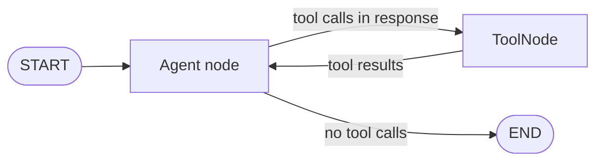

# Agents and tools

`Agent` and `ToolNode` are the two built-in node types that handle language model interaction. `Agent` calls the model. `ToolNode` executes the functions the model requested.

## Agent

`Agent` is a graph node that wraps a language model provider. When the graph reaches an `Agent` node, it sends the current conversation to the model and appends the response to state.

```python
from agentflow.core.graph import Agent

agent = Agent(
    model="google/gemini-2.5-flash",
    provider="google",           # optional if model path includes provider
    system_prompt=[
        {"role": "system", "content": "You are a helpful assistant."}
    ],
    tool_node="TOOL",            # name of the ToolNode in the graph (optional)
    trim_context=True,           # trim old messages to stay within token limits
    reasoning_config=True,       # enable chain-of-thought if supported
)
```

### System prompt templating

The system prompt supports state interpolation using `{field_name}` syntax. If your state has a `user_name` field, you can reference it:

```python
system_prompt=[
    {"role": "system", "content": "You are helping {user_name}. Today is {date}."},
    {"role": "user", "content": "Today is {date}."},
],
```

Each message is rendered with the current state fields before being sent to the model.

## ToolNode

`ToolNode` takes a list of Python functions and dispatches tool calls that the model requests. The results are appended to state as `tool` role messages.

```python
from agentflow.core.graph import ToolNode

def get_weather(location: str) -> str:
    """Get the current weather for a location."""
    return f"Sunny in {location}, 22°C."

tool_node = ToolNode([get_weather])
```

The function's docstring becomes the tool description the model receives. Type annotations define the parameter schema.

### Injectable parameters

Tool functions can declare optional parameters that AgentFlow injects automatically. These are not exposed in the tool schema:

| Parameter | Type | What is injected |
| --- | --- | --- |
| `state` | `AgentState \| None` | The current graph state |
| `tool_call_id` | `str \| None` | The ID of the specific tool call |

```python
def get_weather(
    location: str,
    state: AgentState | None = None,
    tool_call_id: str | None = None,
) -> str:
    """Get weather for a location."""
    return f"Sunny in {location}."
```

## The ReAct loop

The standard pattern for tool-using agents is a loop between the `Agent` node and `ToolNode`:



The routing function checks the last message to decide which path to take:

```python
from agentflow.utils import END

def route(state: AgentState) -> str:
    last = state.context[-1]
    if hasattr(last, "tools_calls") and last.tools_calls and last.role == "assistant":
        return "TOOL"
    if last.role == "tool":
        return "MAIN"
    return END

graph.add_conditional_edges("MAIN", route, {"TOOL": "TOOL", END: END})
graph.add_edge("TOOL", "MAIN")
```

## Tool decorator

For richer metadata, use the `@tool` decorator:

```python
from agentflow.utils import tool

@tool(
    name="web_search",
    description="Search the web for current information",
    tags=["search", "web"],
)
def search_web(query: str, max_results: int = 5) -> list[str]:
    """Search the web."""
    ...
```

The decorator adds name, description, tags, and other metadata without changing how the function is called.

## What you learned

- `Agent` wraps a language model and handles system prompt templating.
- `ToolNode` dispatches the tool calls returned by the model.
- `state` and `tool_call_id` are injectable parameters that do not appear in the tool schema.
- The ReAct loop uses a conditional edge to route between `Agent` and `ToolNode`.

## Related concepts

- [StateGraph and nodes](./state-graph.md)
- [Dependency injection](./dependency-injection.md)
