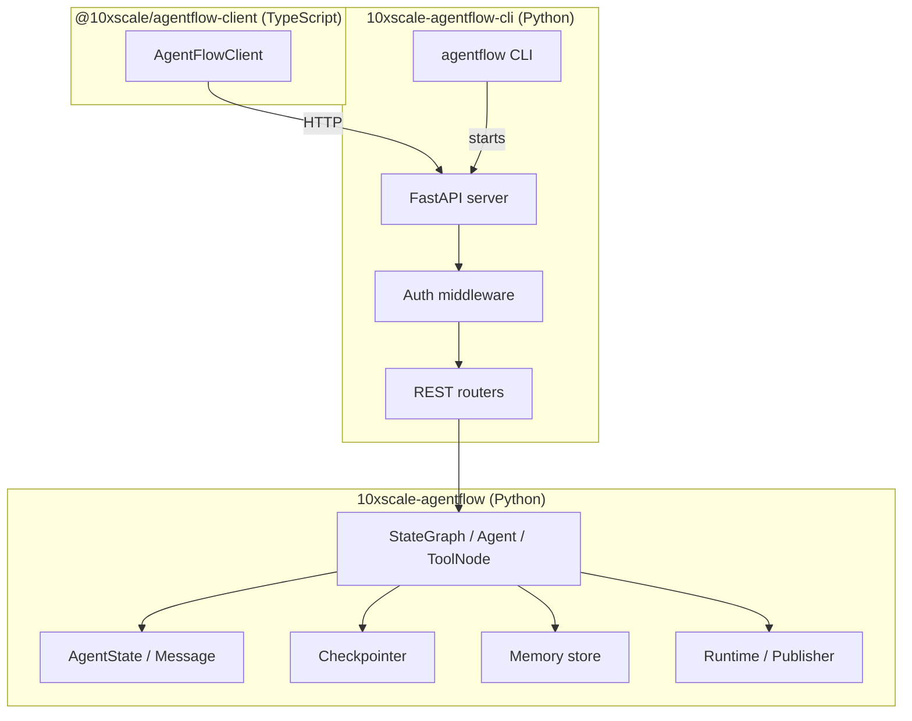
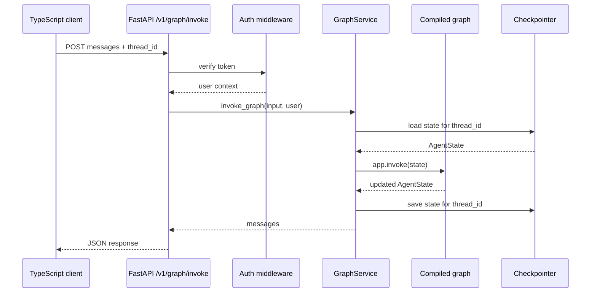

# Architecture

AgentFlow is a set of layered packages. Each layer has a single responsibility. You can use just the core Python library, or add the API and client layers when you need to serve agents over HTTP.

## Package layers

### `10xscale-agentflow`

The core Python library. Contains:

- **`agentflow.core`** — `StateGraph`, `Agent`, `ToolNode`, `AgentState`, `Message`
- **`agentflow.storage`** — `InMemoryCheckpointer`, `PgCheckpointer`, `QdrantStore`, `Mem0Store`
- **`agentflow.runtime`** — publisher adapters for streaming and async execution
- **`agentflow.qa`** — testing utilities

### `10xscale-agentflow-cli`

The API and CLI package. Contains:

- **`agentflow api`** — starts a FastAPI server that serves a compiled graph
- **`agentflow play`** — same as `api`, plus opens the hosted playground
- **`agentflow init`** — scaffolds `agentflow.json` and `graph/react.py`
- **`agentflow build`** — generates a Dockerfile
- REST routers for graph invoke, streaming, threads, memory store, and file uploads

### `@10xscale/agentflow-client`

The TypeScript HTTP client. Wraps the REST API with typed methods for invoke, stream, threads, and memory.

## Request flow: invoke

## Request flow: stream

The stream flow is identical through authentication and state loading. The difference is the graph sends chunks incrementally using server-sent events (SSE), and the response is a `StreamingResponse`.

## Key design decisions

| Decision | Rationale |
| --- | --- |
| Graph is compiled once at startup | Avoids repeated module loading per request |
| `thread_id` in every request | Allows stateless servers to restore conversation history |
| Checkpointer is injected, not hardcoded | Graph code does not depend on the storage backend |
| Auth is middleware, not in the graph | Business logic stays separate from access control |

## Next step

Read about [StateGraph and nodes](./state-graph.md) to understand how the core workflow engine works.
