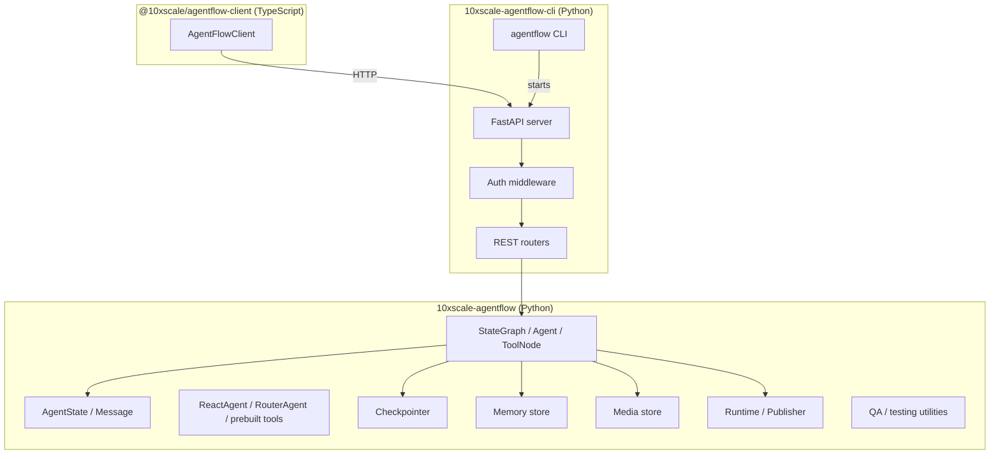
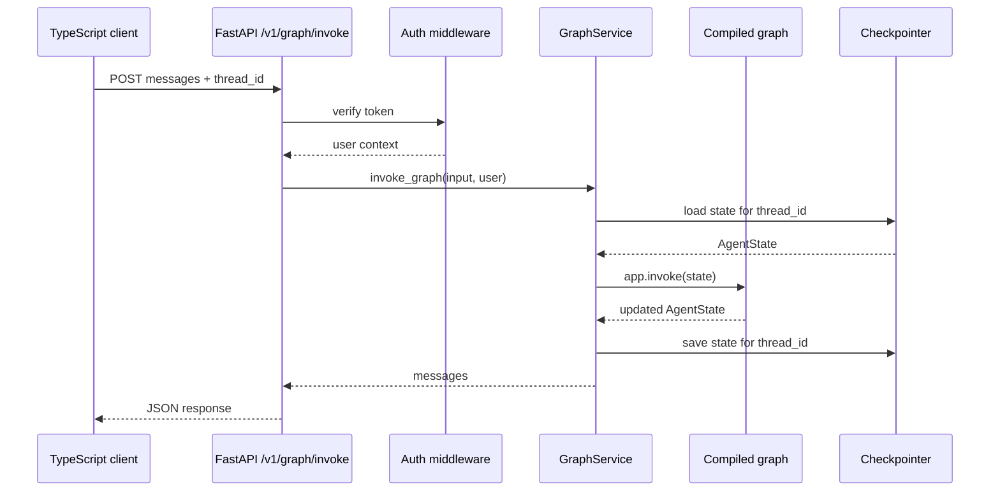

# Architecture

AgentFlow is a set of layered packages. Each layer has a single responsibility. You can use just the core Python library, or add the API and client layers when you need to serve agents over HTTP.

## Package layers

---

### `10xscale-agentflow` — core Python library

| Sub-package | Key exports |
|---|---|
| `agentflow.core` | `StateGraph`, `Agent`, `ToolNode`, `AgentState`, `Message`, `StreamChunk` |
| `agentflow.prebuilt.agent` | `ReactAgent`, `RouterAgent`, `RAGAgent`, `create_react_agent` |
| `agentflow.prebuilt.tools` | `safe_calculator`, `fetch_url`, `google_web_search`, `file_read`, `file_write`, `memory_tool`, `create_handoff_tool` |
| `agentflow.storage.checkpointer` | `InMemoryCheckpointer`, `PgCheckpointer` |
| `agentflow.storage.store` | `QdrantStore`, `Mem0Store` |
| `agentflow.storage.media` | `InMemoryMediaStore`, `LocalFileMediaStore`, `CloudMediaStore` |
| `agentflow.runtime` | Publisher adapters (SSE, A2A) |
| `agentflow.utils` | `ResponseGranularity`, `CallbackManager`, `tool` decorator |
| `agentflow.qa` | Testing helpers and evaluation tools |

### `10xscale-agentflow-cli` — API and CLI

- **`agentflow api`** — starts a FastAPI server that serves a compiled graph
- **`agentflow play`** — same as `api`, plus opens the hosted playground
- **`agentflow init`** — scaffolds `agentflow.json` and `graph/react.py`
- **`agentflow build`** — generates a Dockerfile and docker-compose
- REST routers for graph invoke, streaming, threads, memory store, and file uploads

### `@10xscale/agentflow-client` — TypeScript HTTP client

Wraps the REST API with typed methods for invoke, stream, threads, and memory.

---

## Request flow: invoke

## Request flow: stream

The stream flow is identical through authentication and state loading. The difference is the graph sends `StreamChunk` events incrementally using server-sent events (SSE), and the response is a `StreamingResponse`. Each `StreamChunk` carries an `event` field (`"message"`, `"state"`, `"error"`, or `"updates"`).

---

## Key design decisions

| Decision | Rationale |
|---|---|
| Graph compiled once at startup | Avoids repeated module loading per request |
| `thread_id` in every request | Allows stateless servers to restore conversation history |
| Checkpointer is injected, not hardcoded | Graph code does not depend on the storage backend |
| Auth is middleware, not in the graph | Business logic stays separate from access control |
| `injectq` for service wiring | Nodes and tools declare dependencies declaratively; the runtime resolves them |

---

## Next step

Read about [StateGraph and nodes](./state-graph.md) to understand how the core workflow engine works.
