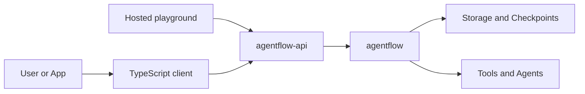

# Architecture

:::note Draft
This page is a sprint-0 placeholder for the final architecture concept guide.
:::

AgentFlow is organized around a small set of package boundaries.

## Package responsibilities

| Package | Responsibility |
| --- | --- |
| `agentflow` | Core Python runtime for workflows, agents, tools, state, checkpoints, storage, and evaluation primitives. |
| `agentflow-api` | API and CLI layer for invoking workflows, deployment workflows, and integration surfaces. |
| `agentflow-client` | TypeScript client for calling AgentFlow APIs from frontend or full-stack applications. |
| `agentflow-playground` | Hosted playground opened by `agentflow play` for testing a local or deployed API. |
| `agentflow-docs` | Documentation, learning paths, API reference, and production guides. |

## Documentation principle

Each concept page should explain the idea first, then show the smallest working code, then link to deeper reference material.
