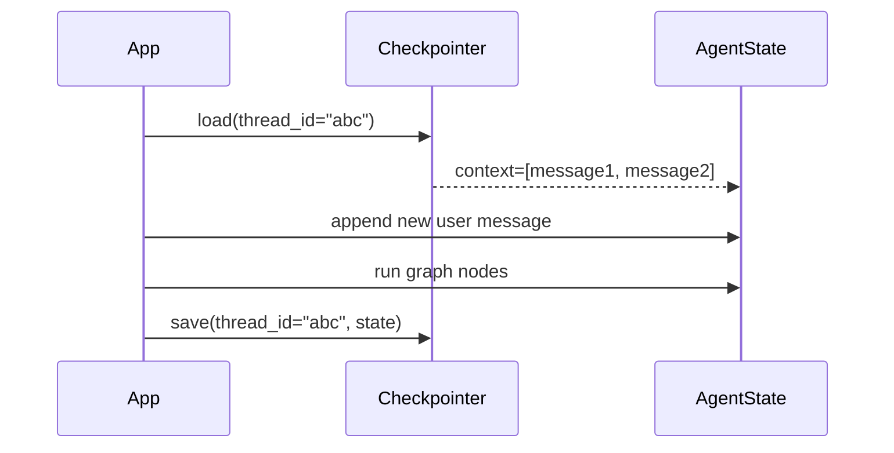
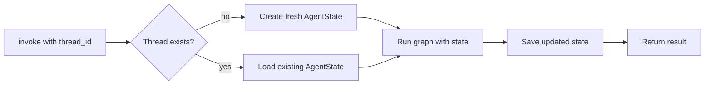

# Checkpointing and threads

By default, every `app.invoke` call is independent. A checkpointer adds persistence: state is saved after each run and restored at the start of the next run for the same thread.

## Why threads matter

Each conversation is identified by a `thread_id`. When you call `app.invoke` with the same `thread_id`, the checkpointer loads the previous state so the agent can continue the conversation:



Without a checkpointer the "load" step is skipped and the agent starts fresh every time.

## Attaching a checkpointer

Pass the checkpointer when compiling:

```python
from agentflow.storage.checkpointer import InMemoryCheckpointer

checkpointer = InMemoryCheckpointer()
app = graph.compile(checkpointer=checkpointer)
```

A `thread_id` is now required in every call:

```python
app.invoke(
    {"messages": [Message.text_message("Hello")]},
    config={"thread_id": "my-thread"},
)
```

## Available checkpointers

| Class | Module | Use case |
| --- | --- | --- |
| `InMemoryCheckpointer` | `agentflow.storage.checkpointer` | Development and testing |
| `PgCheckpointer` | `agentflow.storage.checkpointer` | Production with Postgres + Redis |

`PgCheckpointer` requires the `pg_checkpoint` extra:

```bash
pip install 10xscale-agentflow[pg_checkpoint]
```

## Thread lifecycle



A thread is created automatically on the first call. It persists until you explicitly delete it or until the checkpointer is cleared (for `InMemoryCheckpointer`, clearing happens when the process restarts).

## Reading thread state via REST

When your graph runs behind the API, you can read or update thread state through the REST endpoints:

```bash
# Read state
GET /v1/threads/{thread_id}/state

# Update state
PUT /v1/threads/{thread_id}/state

# Read messages
GET /v1/threads/{thread_id}/messages

# List all threads
GET /v1/threads
```

See [REST API: Threads](../reference/rest-api/threads.md) for full details.

## Using a checkpointer from the API

In the API, the checkpointer is configured in `agentflow.json`, not in the graph module. This keeps the graph code independent of the storage backend:

```json
{
  "agent": "graph.react:app",
  "checkpointer": "graph.dependencies:my_checkpointer"
}
```

See [Configure agentflow.json](../how-to/api-cli/configure-agentflow-json.md) for all configuration options.

## What you learned

- A checkpointer saves and restores `AgentState` between calls.
- Each conversation is isolated by `thread_id`.
- `InMemoryCheckpointer` is for development; `PgCheckpointer` is for production.
- In the API layer, the checkpointer is configured in `agentflow.json`.

## Related concepts

- [Memory and store](./memory-and-store.md)
- [State and messages](./state-and-messages.md)
