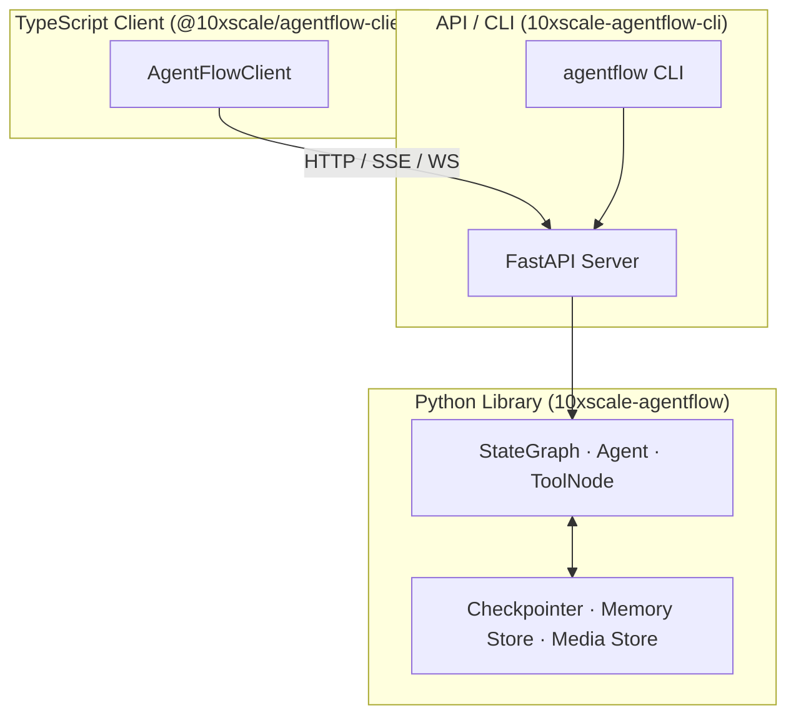
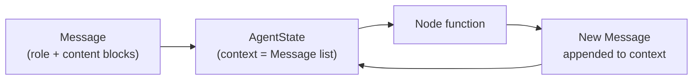
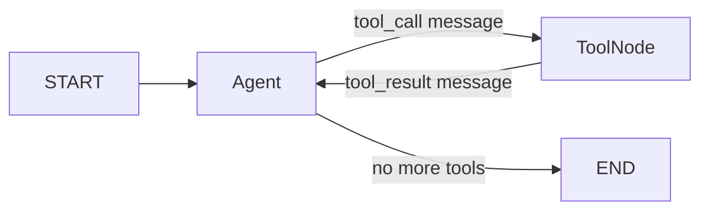
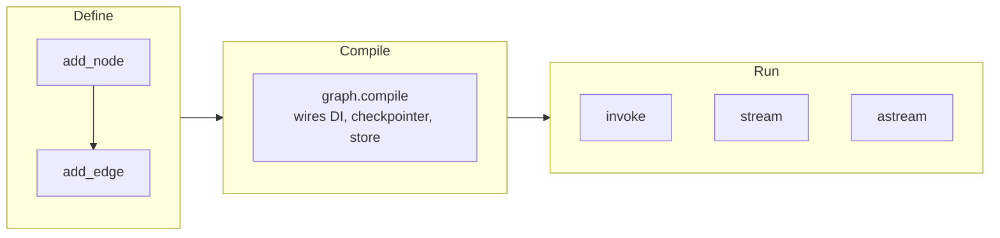

# The Big Picture

AgentFlow is a production-grade multi-agent framework: you wire Python functions and LLMs into a graph, compile it once, and the runtime handles state persistence, streaming, memory, auth, and observability — so you ship agents instead of plumbing.

---

## Three layers



| Layer | Package | Role |
|---|---|---|
| Core library | `10xscale-agentflow` | Graph engine, agents, tools, state, storage |
| API / CLI | `10xscale-agentflow-cli` | FastAPI server, `agentflow` CLI, auth, publishers |
| TypeScript client | `@10xscale/agentflow-client` | Typed HTTP wrapper for browser and Node.js |

---

## The execution model

Four concepts form the foundation. Everything else builds on these.

### Message

The unit of all communication. Every piece of information flowing through a graph is a `Message`.

```python
from agentflow.core.state import Message

Message.text_message("Hello")                           # role="user" (default)
Message.text_message("Hello", role="user")              # explicit user message
Message.text_message("Hi",    role="assistant")         # assistant message
Message.text_message("...",   role="system")            # system message
```

A message carries one or more **content blocks**: `TextBlock`, `ToolCallBlock`, `ToolResultBlock`, `ImageBlock`, `AudioBlock`, `VideoBlock`, `DocumentBlock`, `ReasoningBlock`, `ErrorBlock`.

### AgentState

The moving container passed from node to node. `AgentState` has three built-in fields; subclass it and add your own on top.

| Field | Type | Purpose |
|---|---|---|
| `context` | `list[Message]` | Live message list; appended to by every node via the `add_messages` reducer |
| `context_summary` | `str \| None` | Optional summary text written by `SummaryContextManager` when old messages are trimmed |
| `execution_meta` | `ExecMeta` | Internal runtime bookkeeping (current node, step count, interrupt status) — managed by the framework, not by user code |

```python
from agentflow.core.state import AgentState
from pydantic import Field

class MyState(AgentState):
    # context, context_summary, and execution_meta are already defined
    user_name: str = "Guest"
    data: dict = Field(default_factory=dict)
```

Fields use **annotated reducers** to control how values merge across node executions. `context` is already wired this way in `AgentState`:

```python
from typing import Annotated
from agentflow.core.state import add_messages, Message

context: Annotated[list[Message], add_messages]   # appends new messages; deduplicates by id
```

### Node

Any Python function that receives `AgentState` and returns a message or a state update. Nodes are the unit of work.

```python
async def my_node(state: MyState) -> Message:
    return Message.text_message(f"Hello {state.user_name}", role="assistant")
```

The graph injects `state`, `config`, and any `Inject[T]` dependencies automatically — you never construct a node manually.

### Message → State → Node → State

Each node receives the full state, does its work, and returns a message or partial update. The graph merges it back via reducers, checkpoints, then routes to the next node.



### Edge

Edges connect nodes. Two kinds:

```python
graph.add_edge("A", "B")                          # static — always goes to B
graph.add_conditional_edges("A", route_fn)         # dynamic — route_fn(state) returns node name
graph.add_conditional_edges("A", route_fn, {       # mapped — route_fn returns a key
    "tool":  "TOOL",
    "done":  END,
})
```

---

## ToolNode and the ReAct loop

`ToolNode` is a built-in node that dispatches tool-call messages, runs the registered functions, and returns results. Pair it with an `Agent` to get a ReAct loop:



```python
from agentflow.core.graph import ToolNode

tool_node = ToolNode([search, calculator])
```

---

## Agent

`Agent` is a built-in node that wraps an LLM call. It handles provider selection, retries, structured output, reasoning, context trimming, and the tool loop.

```python
from agentflow.core.graph import Agent

agent = Agent(
    model="gpt-4o",
    system_prompt=[{"role": "system", "content": "You are a helpful assistant."}],
    tool_node=tool_node,
)
```

`Agent` extends `BaseAgent` — you can subclass it to bring your own LLM or override the call logic entirely. See [Extensibility](./extensibility.md).

---

## Define → Compile → Run

`START` and `END` are special sentinel strings (`"__start__"` and `"__end__"`) that mark the entry and exit points of the graph. Import them from `agentflow.utils`.



The snippet below is illustrative — `route_fn`, `search`, and `calculator` are placeholders for your own routing logic and tool functions:

```python
from agentflow.core.graph import StateGraph, Agent, ToolNode
from agentflow.utils import START, END

# route_fn receives state and returns "tool" or "done"
def route_fn(state: MyState) -> str:
    last = state.context[-1] if state.context else None
    if last and last.tools_calls:   # tools_calls is the real attribute name
        return "tool"
    return "done"

graph = StateGraph()
graph.add_node("MAIN", agent)        # agent defined above
graph.add_node("TOOL", tool_node)    # tool_node defined above
graph.add_edge(START, "MAIN")        # START → first node
graph.add_conditional_edges("MAIN", route_fn, {"tool": "TOOL", "done": END})
graph.add_edge("TOOL", "MAIN")       # tool results loop back to agent

compiled = graph.compile()
```

Execution — pass `messages` as the initial message list:

```python
from agentflow.core.state import Message

input_state = {"messages": [Message.text_message("What is the weather in Paris?", role="user")]}
config      = {"thread_id": "abc"}

# sync
result = compiled.invoke(input_state, config)

# async
result = await compiled.ainvoke(input_state, config)

# streaming (async)
async for chunk in compiled.astream(input_state, config):
    print(chunk)
```

Pass the same `thread_id` on the next call and the graph resumes exactly where it left off — the checkpointer handles it.

---

## Prebuilt agents

For common patterns you don't need to wire the graph manually. AgentFlow ships six prebuilt agents — `ReactAgent`, `RAGAgent`, `PlanActReflectAgent`, `StructuredOutputAgent`, `SupervisorTeamAgent`, and `SwarmAgent` — each exposing `.compile()` and returning a ready `CompiledGraph`. Full details and examples are on [Agents, Tools & Control](./agents-tools-control.md).

```python
from agentflow.prebuilt.agent import ReactAgent

# compile() returns a CompiledGraph — same API as the manual graph above
compiled = ReactAgent(
    model="gpt-4o",
    tools=[search, calculator],   # your tool functions
).compile()
```

---

## What's next

| Page | What it covers |
|---|---|
| [Agents, Tools & Control](./agents-tools-control.md) | ReAct loop, tool authoring, prebuilt agents, callbacks, validators, `Command` |
| [Memory](./memory.md) | Three memory layers: running state, per-thread checkpointing, long-term vector store |
| [Serving Agents](./serving-agents.md) | FastAPI server, CLI, auth, authorization, publishers, production runtime |
| [Connecting Clients](./connecting-clients.md) | TypeScript SDK, streaming, remote tools |
| [Extensibility](./extensibility.md) | Every ABC you can subclass — 16 extension points |
| [Quality & Observability](./qa.md) | Unit testing, evaluation criteria, user simulation, observability hooks |
