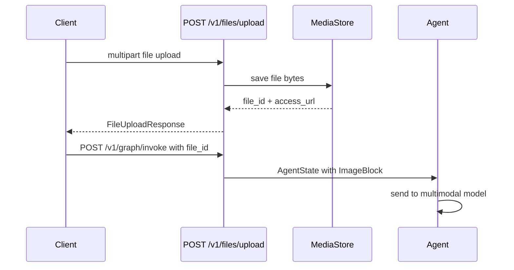

# Media and files

AgentFlow supports multimodal messages. You can include images, audio, and documents alongside text in a conversation. The API layer provides a file upload endpoint that returns a reference ID you include in subsequent messages.

## File upload flow



## Uploading a file via REST

```bash
curl -X POST http://127.0.0.1:8000/v1/files/upload \
  -F "file=@photo.jpg"
```

Response:

```json
{
  "file_id": "f_abc123",
  "filename": "photo.jpg",
  "content_type": "image/jpeg",
  "size_bytes": 24576,
  "access_url": "/v1/files/f_abc123"
}
```

## Including a file in a message

Use the `file_id` returned from the upload in the messages array:

```json
{
  "messages": [
    {
      "role": "user",
      "content": [
        {"type": "text", "text": "What is in this image?"},
        {"type": "image", "file_id": "f_abc123"}
      ]
    }
  ],
  "config": {"thread_id": "media-demo"}
}
```

## Uploading via TypeScript client

```typescript
import { AgentFlowClient } from "@10xscale/agentflow-client";

const client = new AgentFlowClient({ baseUrl: "http://127.0.0.1:8000" });

const file = new File([imageBytes], "photo.jpg", { type: "image/jpeg" });
const upload = await client.uploadFile(file);

const result = await client.invoke(
  [
    {
      role: "user",
      content: [
        { type: "text", text: "Describe this image." },
        { type: "image", file_id: upload.file_id },
      ],
    },
  ],
  { config: { thread_id: "ts-media-demo" } },
);
```

## Supported file types

| Type | MIME types | Content block |
| --- | --- | --- |
| Image | `image/jpeg`, `image/png`, `image/webp`, `image/gif` | `ImageBlock` |
| Audio | `audio/mpeg`, `audio/wav`, `audio/ogg` | `AudioBlock` |
| Document | `application/pdf`, `text/plain` | `ContentBlock` |

Not all language model providers support all types. Check your provider's documentation for supported formats.

## Accessing an uploaded file

```bash
GET /v1/files/{file_id}
```

This returns the raw file bytes with the correct `Content-Type` header.

## What you learned

- Upload files with `POST /v1/files/upload` and receive a `file_id`.
- Reference the `file_id` in message content blocks.
- `AgentFlowClient.uploadFile` handles the multipart upload in TypeScript.
- File content is stored in the configured `MediaStore`.

## Related concepts

- [REST API: Files](../reference/rest-api/files.md)
- [State and messages](./state-and-messages.md)
