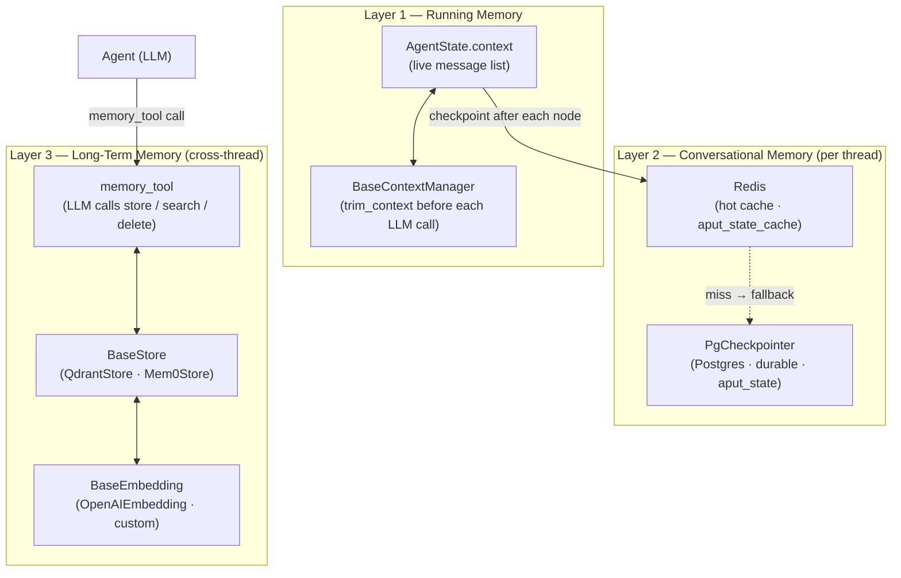
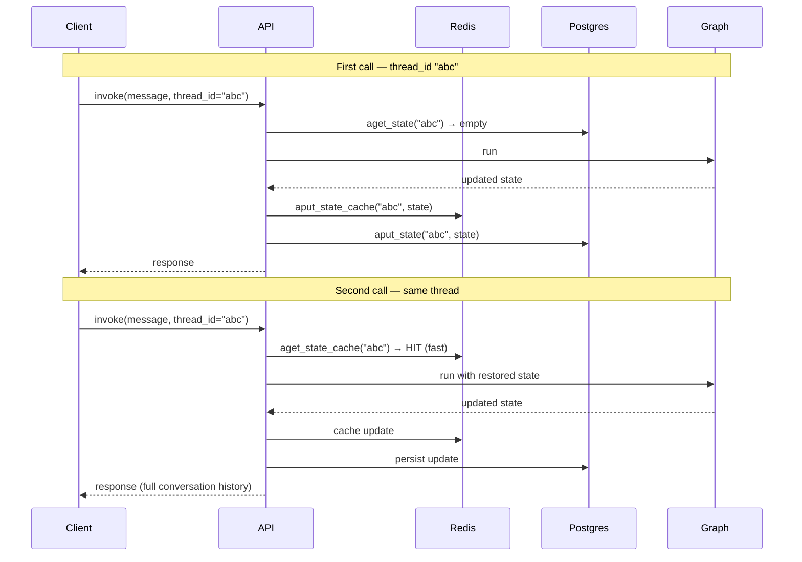
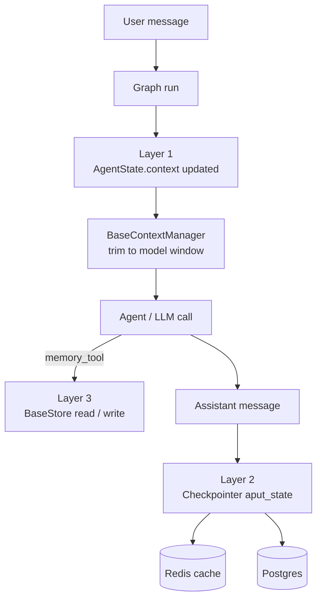

# Memory

AgentFlow has three distinct memory layers. Each solves a different problem; all three can run together in production.



---

## Layer 1 — Running Memory

**What it is:** the live message list carried through every node in a single run.

`AgentState.context` holds all messages for the current execution. Every node reads from it, every `Agent` sends it to the LLM, every new message is appended via the `add_messages` reducer.

```python
from typing import Annotated
from agentflow.core.state import AgentState, add_messages, Message

class MyState(AgentState):
    context: Annotated[list[Message], add_messages]
```

### BaseContextManager — keeping the window in budget

Before each LLM call the graph passes `AgentState.context` through the active `BaseContextManager`. It trims or summarises messages so the token count stays within the model's window.

```python
from agentflow.core.state import MessageContextManager, SummaryContextManager

# drop oldest messages beyond a count limit
graph = StateGraph(
    state=MyState(),
    context_manager=MessageContextManager(max_messages=50),
)

# summarise old messages with a secondary LLM call
graph = StateGraph(
    state=MyState(),
    context_manager=SummaryContextManager(model="gpt-4o-mini", max_tokens=4096),
)
```

To write your own strategy extend `BaseContextManager`:

```python
from agentflow.core.state import BaseContextManager

class PriorityContextManager(BaseContextManager):
    def trim_context(self, state: AgentState) -> AgentState:   # sync
        ...
        return state
    async def atrim_context(self, state: AgentState) -> AgentState:   # async
        return self.trim_context(state)
```

---

## Layer 2 — Conversational Memory

**What it is:** per-thread state persistence. Pass the same `thread_id` on the next call and the graph resumes exactly where it left off.

### How it works

Every compiled graph has a checkpointer. After each node completes the runtime calls `aput_state` to persist the full `AgentState`. On the next call it calls `aget_state` to restore it.

```python
from agentflow.storage.checkpointer import InMemoryCheckpointer, PgCheckpointer

# dev / test — state lives in process memory, lost on restart
compiled = graph.compile(checkpointer=InMemoryCheckpointer())

# production — state survives restarts and load-balanced workers
compiled = graph.compile(
    checkpointer=PgCheckpointer(
        postgres_dsn="postgresql+asyncpg://...",
        redis_url="redis://...",   # optional hot cache
    )
)
```

### Redis hot cache

`PgCheckpointer` accepts an optional Redis URL. When present it adds a two-level lookup:



Redis serves read-heavy deployments from memory; Postgres is the durable source of truth. A cache miss falls through to Postgres automatically.

### BaseCheckpointer — full interface

| Method | Purpose |
|---|---|
| `asetup()` | Create tables / indexes on first run |
| `aput_state(thread_id, state)` | Persist full `AgentState` |
| `aget_state(thread_id)` | Restore `AgentState` |
| `aclear_state(thread_id)` | Wipe state for a thread |
| `aput_state_cache` / `aget_state_cache` | Redis hot-cache layer |
| `aput_messages` / `aget_message` / `alist_messages` / `adelete_message` | Message-level CRUD |
| `aput_thread` / `aget_thread` / `alist_threads` / `aclean_thread` | Thread management |
| `arelease()` | Release connections on shutdown |

Extend `BaseCheckpointer` to plug in any storage backend:

```python
from agentflow.storage.checkpointer import BaseCheckpointer

class MyCheckpointer(BaseCheckpointer[MyState]):
    async def aput_state(self, thread_id, state): ...
    async def aget_state(self, thread_id): ...
    # ... implement all abstract methods
```

### Thread config keys

| Key | Type | Purpose |
|---|---|---|
| `thread_id` | `str` | Identifies the conversation; required for persistence |
| `user_id` | `str` | Scopes threads to a user; used by auth and stores |
| `run_id` | `str` | Identifies a single invoke/stream call |
| `recursion_limit` | `int` | Max node hops per run (default 25) |

---

## Layer 3 — Long-Term Memory

**What it is:** cross-thread, cross-user facts stored as vector embeddings. Survives beyond any single conversation.

### How the LLM writes and reads memory

The `memory_tool` is injected into the agent's tool list when you configure `MemoryConfig`. The LLM decides when to call it:

```python
from agentflow.storage.store.memory_config import MemoryConfig
from agentflow.storage.store import QdrantStore, ReadMode
from agentflow.storage.store.embedding import OpenAIEmbedding

store = QdrantStore(
    url="http://localhost:6333",
    collection="agent-memory",
    embedding=OpenAIEmbedding(model="text-embedding-3-small"),
)

agent = Agent(
    model="gpt-4o",
    memory=MemoryConfig(
        store=store,
        retrieval_mode=ReadMode.PRELOAD,  # inject relevant memories before each LLM call
    ),
)
```

The LLM calls `memory_tool(action="store", content="...")` to write facts and `memory_tool(action="search", query="...")` to recall them. Writes are async and non-blocking.

### Retrieval modes

| Mode | Behaviour |
|---|---|
| `ReadMode.NO_RETRIEVAL` | LLM must explicitly call `memory_tool(action="search")` |
| `ReadMode.PRELOAD` | Framework searches and injects relevant memories into the system prompt before each LLM call |
| `ReadMode.POSTLOAD` | Framework retrieves memories after the LLM call and appends them for the next turn |

### Backends

| Class | Backend | Notes |
|---|---|---|
| `QdrantStore` | Qdrant (local or cloud) | `pip install "10xscale-agentflow[qdrant]"` |
| `Mem0Store` | mem0 managed service | `pip install "10xscale-agentflow[mem0]"` |

### BaseStore and BaseEmbedding

```python
from agentflow.storage.store import BaseStore
from agentflow.storage.store.embedding import BaseEmbedding

class MyStore(BaseStore):
    async def astore(self, user_id, content, metadata): ...
    async def asearch(self, user_id, query, top_k): ...
    async def adelete(self, user_id, memory_id): ...

class MyEmbedding(BaseEmbedding):
    async def aembed(self, text) -> list[float]: ...
    async def aembed_batch(self, texts) -> list[list[float]]: ...
    dimension: int = 1536
```

---

## Putting all three layers together



---

## Go deeper

| Guide | Link |
|---|---|
| Add per-thread checkpointing | [How-To: Checkpointing](/docs/how-to/production/checkpointing) |
| Add long-term memory to an agent | [How-To: Memory Store](/docs/how-to/python/use-memory-store) |
| Custom storage backends | [Extensibility](./extensibility.md) |
| Thread management via API | [Serving Agents](./serving-agents.md) |
