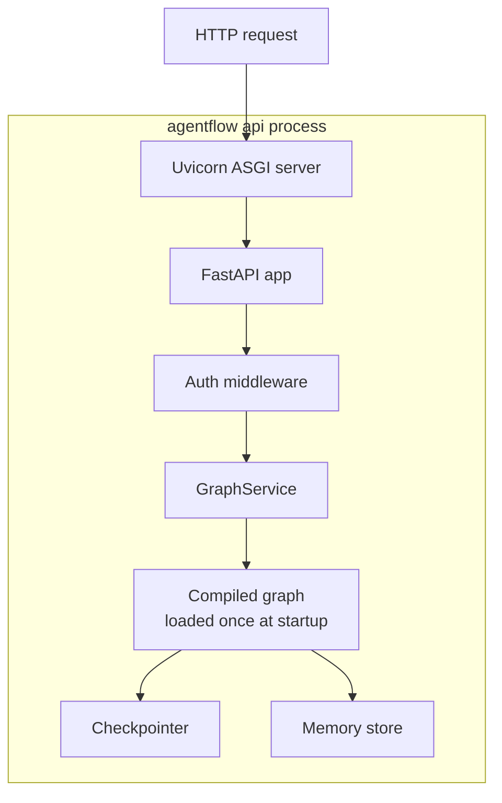
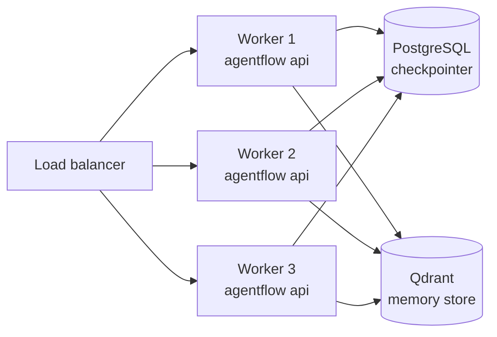

# Production runtime

Running `app.invoke` in a script is fine for experimentation. Production deployments require an HTTP server, async execution, state persistence, and the ability to handle concurrent requests.

## How the API server works



The CLI starts a Uvicorn ASGI server. The FastAPI app loads your compiled graph **once** at startup and reuses it for every request. This avoids module loading overhead per request.

## Async execution

The `GraphService` runs your graph in a thread pool so that blocking model calls do not delay the event loop. You do not need to write `async` code in your graph nodes — the runtime handles scheduling.

If your graph nodes are already `async` functions, the runtime awaits them directly.

## Publisher adapters

The `agentflow.runtime.publisher` module provides adapters for different streaming transports. Internally the API uses the SSE publisher to send `StreamChunk` events over `POST /v1/graph/stream`.

You do not interact with publisher adapters directly unless you are embedding the graph outside the standard API server.

## Multi-worker deployment

For production scale, run multiple worker processes behind a load balancer. Because state is stored in the checkpointer (and optionally in the memory store), any worker can handle any request as long as they share the same storage backend.



Use `PgCheckpointer` (backed by Postgres + Redis) so that state is shared across workers. `InMemoryCheckpointer` is process-local and breaks in a multi-worker setup.

## Environment configuration

The API server reads settings from environment variables. Key variables:

| Variable | Description | Default |
| --- | --- | --- |
| `MODE` | `development` or `production` | `development` |
| `LOG_LEVEL` | Logging verbosity | `INFO` |
| `ORIGINS` | Comma-separated allowed CORS origins | `*` |
| `JWT_SECRET_KEY` | Secret key for JWT auth | — |
| `JWT_ALGORITHM` | JWT signing algorithm | `HS256` |
| `REDIS_URL` | Redis URL for `PgCheckpointer` | — |

In production, set `MODE=production`. This enables stricter security header checks and logs warnings for unsafe defaults like `ORIGINS=*`.

## Docker deployment

Generate a Dockerfile:

```bash
agentflow build --docker-compose
```

This creates a `Dockerfile` and `docker-compose.yml` configured for the standard API server. See [Generate Docker files](../how-to/api-cli/generate-docker-files.md) for options.

## What you learned

- The API server loads the compiled graph once at startup.
- Async scheduling is handled by the runtime — your nodes can be sync or async.
- Multi-worker deployments require `PgCheckpointer` for shared state.
- Set `MODE=production` and configure `ORIGINS` for secure production deployments.

## Related concepts

- [Checkpointing and threads](./checkpointing-and-threads.md)
- [API/CLI: Configuration](../reference/api-cli/configuration.md)
- [How to: Generate Docker files](../how-to/api-cli/generate-docker-files.md)
