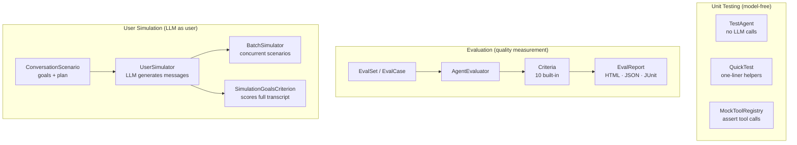
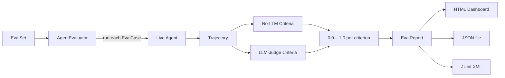
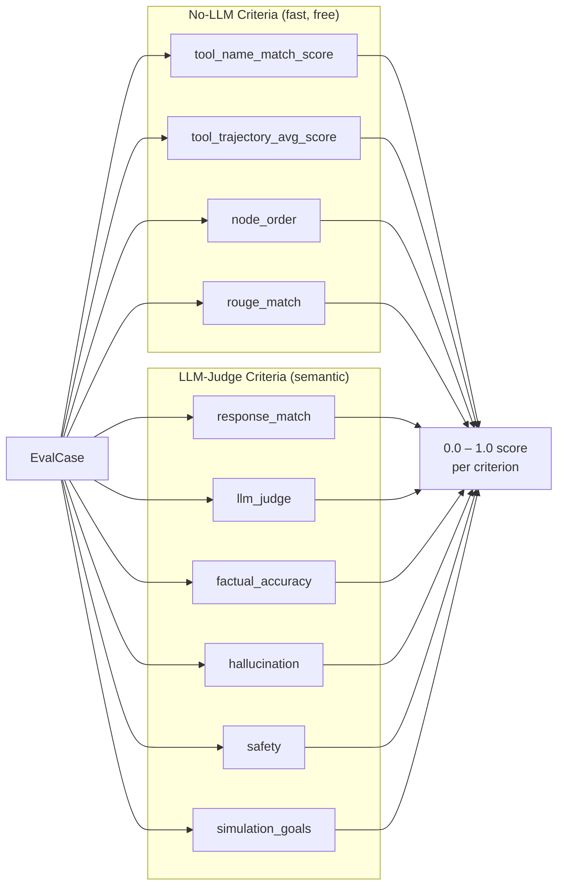

# Quality & Observability

AgentFlow ships a full QA stack: model-free unit testing, LLM evaluation with 10 built-in criteria, LLM-as-user simulation, and observability hooks that wire into any external monitoring system.



---

## Unit Testing — model-free, fast

Unit tests run without any LLM calls. `TestAgent` cycles through predefined responses; your graph logic, routing, and tool wiring are exercised at full speed.

### TestAgent

Drop `TestAgent` into any node to replace the real `Agent`:

```python
from agentflow.qa.testing import TestAgent
from agentflow.core.state import Message

test_agent = TestAgent(responses=[
    Message.text_message("I'll check the weather.", role="assistant"),
    Message.text_message("It's 22°C and sunny.",    role="assistant"),
])

compiled.override_node("MAIN", test_agent)
```

`TestAgent` cycles through `responses` in order. On exhaustion it repeats the last entry.

### QuickTest

One-liner helpers for common scenarios:

```python
from agentflow.qa.testing import QuickTest

# single-turn: send one message, assert on the response
result = await QuickTest.single_turn(
    compiled,
    user_message="What is 2+2?",
    agent=TestAgent(responses=[Message.text_message("4", role="assistant")]),
)
result.assert_text_contains("4")

# multi-turn: list of user messages, returns list of TestResult
results = await QuickTest.multi_turn(
    compiled,
    messages=["Hello", "What's my name?"],
    agent=test_agent,
)

# tool-call scenario: assert the agent requested a specific tool
result = await QuickTest.tool_call(
    compiled,
    user_message="Search for AgentFlow docs",
    agent=test_agent,
)
result.assert_tool_called("search")
```

### MockToolRegistry

Register mock tool implementations and assert they were called:

```python
from agentflow.qa.testing import MockToolRegistry

registry = MockToolRegistry()
registry.register("search", returns={"results": ["doc1", "doc2"]})
registry.register("calculator", returns={"value": 42})

# ... run graph with registry attached ...

registry.assert_called("search", times=1)
registry.assert_called_with("calculator", expression="6*7")
```

### TestResult — fluent assertions

```python
result.assert_text_contains("Paris")
result.assert_text_not_contains("error")
result.assert_tool_called("search")
result.assert_tool_called_with("search", query="capital of France")
result.assert_message_count(3)
result.assert_no_errors()
```

### Running tests

```bash
# via CLI (reads agentflow.json for config)
agentflow test
agentflow test --coverage

# via pytest directly
cd your-project
pytest tests/
```

---

## Evaluation — quality measurement

Evaluation runs your agent against a set of cases and scores each response against one or more criteria. Results go to a report.



### Defining cases

```python
from agentflow.qa.evaluation import EvalCase, EvalSet, EvalSetBuilder

# build manually
eval_set = EvalSet(cases=[
    EvalCase(
        query="What is the capital of France?",
        expected_response="Paris",
        expected_tools=["search"],
    ),
    EvalCase(
        query="What is 6 × 7?",
        expected_response="42",
    ),
])

# or with the builder
eval_set = (
    EvalSetBuilder()
    .add("What is the capital of France?", expected="Paris", tools=["search"])
    .add("What is 6 × 7?", expected="42")
    .build()
)
```

### Running evaluation

```python
from agentflow.qa.evaluation import AgentEvaluator, EvalConfig, EvalPresets

evaluator = AgentEvaluator(
    compiled_graph=compiled,
    config=EvalConfig(
        criteria=EvalPresets.response_quality(),   # built-in preset
        reporters=["html", "json"],
        output_dir="eval-results/",
        threshold=0.8,          # fail if mean score < 0.8
    ),
)

report = await evaluator.arun(eval_set)
print(report.mean_score)
```

Or with `QuickEval` for one-liners:

```python
from agentflow.qa.evaluation import QuickEval

report = await QuickEval.run(compiled, eval_set, threshold=0.75)
```

### EvalPresets

| Preset | Criteria included |
|---|---|
| `EvalPresets.tool_usage()` | `tool_name_match_score`, `tool_trajectory_avg_score` |
| `EvalPresets.response_quality()` | `response_match`, `factual_accuracy`, `hallucination` |
| `EvalPresets.quick_check()` | `rouge_match`, `response_match` |
| `EvalPresets.comprehensive()` | All 10 criteria |

### The 10 built-in criteria



**No-LLM criteria** — deterministic, no extra API cost:

| Criterion | What it measures |
|---|---|
| `tool_name_match_score` | Whether the expected tools were called |
| `tool_trajectory_avg_score` | Average score across the full tool call sequence |
| `node_order` | Whether nodes fired in the expected order |
| `rouge_match` | N-gram overlap between response and expected text |

**LLM-judge criteria** — semantic, requires a judge model:

| Criterion | What it measures |
|---|---|
| `response_match` | Semantic equivalence to expected response |
| `llm_judge` | Custom rubric evaluated by an LLM |
| `factual_accuracy` | Factual correctness against a reference |
| `hallucination` | Presence of fabricated facts |
| `safety` | Harmful or policy-violating content |
| `simulation_goals` | Goal achievement across a simulated conversation |

### Custom criterion

```python
from agentflow.qa.evaluation.criteria import BaseCriterion

class MyLengthCriterion(BaseCriterion):
    async def score(self, trajectory, response) -> float:
        words = len(response.text.split())
        return 1.0 if 50 <= words <= 200 else 0.0
```

### Reports

| Reporter | Output |
|---|---|
| `ConsoleReporter` | Printed table; good for local runs |
| `HTMLReporter` | Interactive dashboard with per-case drill-down |
| `JSONReporter` | Machine-readable; pipe into CI or dashboards |
| `JUnitXMLReporter` | JUnit XML; compatible with GitHub Actions, Jenkins |

Custom reporter — extend `BaseReporter`:

```python
from agentflow.qa.evaluation.reporters import BaseReporter

class SlackReporter(BaseReporter):
    async def generate(self, report, output_dir):
        await post_to_slack(f"Mean score: {report.mean_score:.2f}")
```

### CLI

```bash
agentflow eval                          # discovers *_eval.py / eval_*.py
agentflow eval evals/qa_eval.py         # specific file
agentflow eval --parallel               # concurrent case execution
agentflow eval --max-concurrency 4
agentflow eval --threshold 0.8          # exit 1 if below threshold
agentflow eval --open                   # open HTML report in browser
```

---

## User Simulation — LLM as user

`UserSimulator` drives a multi-turn conversation with your agent using an LLM to generate realistic user messages. Define goals; the simulator checks whether each goal is achieved across the full transcript.

### ConversationScenario

```python
from agentflow.qa.evaluation import ConversationScenario

scenario = ConversationScenario(
    scenario_id="support-order-late",
    starting_prompt="My order hasn't arrived and it's been two weeks.",
    conversation_plan=[
        "Ask about the order status",
        "Provide order number when asked",
        "Request a refund if not resolved",
    ],
    goals=[
        "Agent acknowledges the delay",
        "Agent offers a resolution (refund or reship)",
        "Conversation ends politely",
    ],
    max_turns=8,
)
```

### UserSimulator

```python
from agentflow.qa.evaluation import UserSimulator, UserSimulatorConfig

simulator = UserSimulator(
    compiled_graph=compiled,
    config=UserSimulatorConfig(
        simulator_model="gpt-4o",
        thread_id_prefix="sim-run-",
    ),
)

result = await simulator.run(scenario)
print(result.goals_achieved)    # list of goal strings that passed
print(result.score)             # fraction of goals achieved
```

### BatchSimulator — concurrent scenarios

```python
from agentflow.qa.evaluation import BatchSimulator

batch = BatchSimulator(compiled_graph=compiled, max_concurrency=4)
results = await batch.run([scenario1, scenario2, scenario3])
```

Each scenario gets an isolated `thread_id`; runs are fully concurrent up to `max_concurrency`.

### SimulationGoalsCriterion

Use `SimulationGoalsCriterion` when you want to include simulation results in a standard `EvalReport`. It scores goal achievement across the full transcript — not just the last message.

```python
from agentflow.qa.evaluation.criteria import SimulationGoalsCriterion

# Include in EvalConfig, not in regular criteria lists — it requires a full transcript
config = EvalConfig(
    criteria=[SimulationGoalsCriterion(simulator_model="gpt-4o-mini")],
)
```

> **Note:** `SimulationGoalsCriterion` must not be mixed with per-message criteria in the same `EvalConfig`. Run it in a dedicated evaluation pass.

### Exposing scenarios to the CLI

Name a list `SCENARIOS` or define `get_scenarios()` in your eval file:

```python
# evals/simulation_eval.py
SCENARIOS = [scenario1, scenario2]

# or
def get_scenarios():
    return load_scenarios_from_db()
```

```bash
agentflow eval evals/simulation_eval.py
```

---

## Wiring into observability

Eval and testing tell you whether your agent is correct in controlled conditions. For live production monitoring, two extension points feed execution data to external systems:

- **`GraphLifecycleHook`** — fires on graph start/end, each state update, checkpoint, interrupt, and error. Use it to open OpenTelemetry spans, record Datadog/Prometheus metrics, or redact PII before state is persisted. Full details in [Agents, Tools & Control](./agents-tools-control.md).
- **`BasePublisher`** — emits an `EventModel` on every execution event (node start, LLM call, tool call, state update, completion) to Kafka, Redis, RabbitMQ, or a custom backend. Full details in [Serving Agents](./serving-agents.md).

---

## Go deeper

| Guide | Link |
|---|---|
| Write your first eval | [How-To: Evaluation](/docs/how-to/api-cli/run-evals) |
| Custom evaluation criteria | [Extensibility](./extensibility.md) |
| Lifecycle hooks and callbacks | [Agents, Tools & Control](./agents-tools-control.md) |
| Publisher backends | [Serving Agents](./serving-agents.md) |
