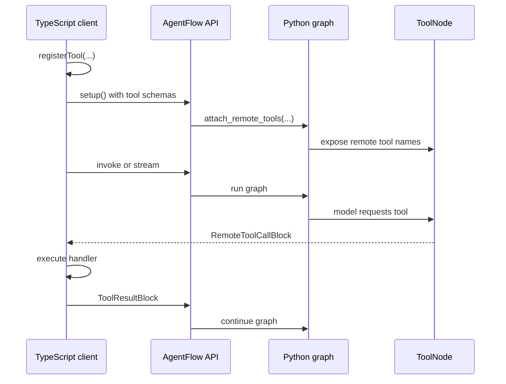

# Remote tools

Remote tools are tools whose schemas are visible to the server-side graph, but whose implementation runs in the TypeScript client or browser.

Use them for browser-only capabilities such as clipboard access, selected local files, DOM state, geolocation, UI state, or client-owned integrations. If a tool can safely run on the server, prefer a Python tool, MCP tool, or backend integration instead.

## How it works



The server does not execute the remote tool. When the model calls a remote tool, `ToolNode` returns a `RemoteToolCallBlock`. The TypeScript SDK runs the registered handler, wraps the result in a `ToolResultBlock`, and continues the graph loop.

## Register a remote tool

```ts
import { AgentFlowClient } from "@10xscale/agentflow-client";

const client = new AgentFlowClient({ baseUrl: "http://127.0.0.1:8000" });

client.registerTool({
  node: "tools",
  name: "read_clipboard",
  description: "Read the current clipboard text.",
  parameters: {
    type: "object",
    properties: {},
    required: [],
  },
  handler: async () => {
    return { text: await navigator.clipboard.readText() };
  },
});

await client.setup();
```

The `node` value must match the graph tool node that should expose the remote tool.

## Execution loop

1. The client registers handlers with `client.registerTool(...)`.
2. `client.setup()` posts schemas to `POST /v1/graph/setup`.
3. The API attaches those schemas to the matching graph tool node.
4. The model requests a tool call during invoke or stream.
5. `ToolNode` recognizes the name as remote and returns `RemoteToolCallBlock`.
6. The client executes the handler and sends a tool result message.
7. The graph continues until there are no more remote tool calls or the recursion limit is reached.

`client.invoke()` and `client.stream()` both handle this loop through the TypeScript SDK when a `ToolExecutor` is available. Streaming still yields chunks to the caller as they arrive, then the client checks the collected messages for remote tool calls before deciding whether another graph iteration is needed.

## Rules

| Rule | Why it matters |
|---|---|
| Register tools before invoke or stream | The graph must know the model-facing schemas before the model can call them. |
| Keep schemas precise | The schema is what the model uses to decide arguments. |
| Return serializable values | Results are sent back through message content blocks. |
| Use remote tools for client-owned work | Server-owned work belongs in Python tools or backend services. |
| Treat registrations as trusted input | Validate registrations if clients are not fully trusted. |

## Related docs

- [TypeScript tools reference](/docs/reference/client/tools)
- [Agents and tools](./agents-and-tools.md)
- [State and messages](./state-and-messages.md)
