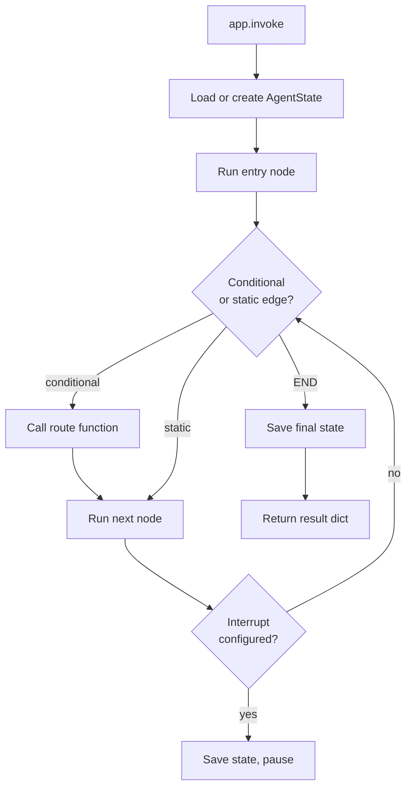

# StateGraph and nodes

`StateGraph` is the workflow engine. You describe a directed graph of nodes and edges, compile it, and invoke it. The compiled graph manages state loading, routing, checkpointing, and shutdown automatically.

---

## Creating a StateGraph

### Minimal

```python
from agentflow.core.graph import StateGraph

graph = StateGraph()   # uses AgentState by default
```

### With a custom state class

```python
from agentflow.core.graph import StateGraph
from agentflow.core.state import AgentState

class OrderState(AgentState):
    order_id: str = ""
    total: float = 0.0

graph = StateGraph(OrderState)          # pass the class
# or:
graph = StateGraph(OrderState())        # pass an instance — both work
```

### Full constructor signature

```python
StateGraph(
    state: StateT | None = None,
    context_manager: BaseContextManager | None = None,
    publisher: BasePublisher | None = None,
    id_generator: BaseIDGenerator = DefaultIDGenerator(),
    container: InjectQ | None = None,
)
```

| Parameter | Description |
|---|---|
| `state` | State class or instance. Defaults to `AgentState()` |
| `context_manager` | Optional cross-node state transformer (trim context, summarise, etc.) |
| `publisher` | Optional publisher for emitting lifecycle events |
| `id_generator` | Strategy for generating message and run IDs |
| `container` | `InjectQ` container for dependency injection. Defaults to the global singleton |

---

## Adding nodes

A node is any callable that receives `AgentState` (or your subclass) and returns a `Message`, a `ToolResult`, or a state `dict`.

### Named node

```python
graph.add_node("MAIN", my_agent_function)
graph.add_node("TOOL", tool_node_instance)
graph.add_node("VALIDATOR", Agent(...))
```

### Auto-named node — function name is used

```python
def process(state: AgentState) -> Message:
    ...

graph.add_node(process)      # node name becomes "process"
```

### Overriding a node — useful for testing

```python
graph.override_node("MAIN", mock_agent)   # replaces existing node
```

---

## Edges

### Static edge

```python
graph.add_edge("TOOL", "MAIN")  # always go from TOOL → MAIN
```

### Entry point

`set_entry_point(name)` is syntactic sugar for `add_edge(START, name)`:

```python
graph.set_entry_point("MAIN")
# equivalent to:
# graph.add_edge(START, "MAIN")
```

### Conditional edge

The routing function receives `AgentState` and returns a string key. `path_map` maps that key to a node name:

```python
from agentflow.utils.constants import END

def route(state: AgentState) -> str:
    last = state.context[-1]
    if hasattr(last, "tools_calls") and last.tools_calls:
        return "TOOL"
    return END

graph.add_conditional_edges(
    "MAIN",
    route,
    {"TOOL": "TOOL", END: END},
)
```

If `path_map` is omitted, the function must return the destination node name directly.

---

## Compiling

```python
app = graph.compile(
    checkpointer=checkpointer,
    store=store,
    media_store=media_store,
    interrupt_before=["VALIDATOR"],
    interrupt_after=["TOOL"],
    callback_manager=CallbackManager(),
    shutdown_timeout=30.0,
)
```

| Parameter | Type | Description |
|---|---|---|
| `checkpointer` | `BaseCheckpointer \| None` | State persistence. Defaults to `InMemoryCheckpointer` if not provided |
| `store` | `BaseStore \| None` | Long-term memory store |
| `media_store` | `BaseMediaStore \| None` | Media file storage for multimodal content |
| `interrupt_before` | `list[str] \| None` | Pause before these node names |
| `interrupt_after` | `list[str] \| None` | Pause after these node names |
| `callback_manager` | `CallbackManager` | Hooks for observability |
| `shutdown_timeout` | `float` | Seconds to wait for graceful shutdown (default `30.0`) |

`compile()` raises `GraphError` if no entry point is set or if `interrupt_before`/`interrupt_after` reference non-existent nodes.

---

## Invoke

```python
from agentflow.core.state import Message
from agentflow.utils import ResponseGranularity

result = app.invoke(
    {"messages": [Message.text_message("Hello!")]},
    config={"thread_id": "t1", "recursion_limit": 25},
    response_granularity=ResponseGranularity.LOW,
)
messages = result["messages"]
```

`ainvoke()` is the async equivalent.

---

## Stream

```python
from agentflow.core.state.stream_chunks import StreamEvent

for chunk in app.stream(
    {"messages": [Message.text_message("Hello!")]},
    config={"thread_id": "t2"},
):
    if chunk.event == StreamEvent.MESSAGE and chunk.message:
        print(chunk.message.text())
```

`astream()` is the async equivalent. See [Streaming](./streaming.md) for full details.

---

## Interrupts

Set `interrupt_before` or `interrupt_after` at compile time. When execution reaches an interrupt node, the graph pauses and saves state. Resume by calling `invoke` with the same `thread_id`:

```python
app = graph.compile(
    checkpointer=checkpointer,
    interrupt_before=["VALIDATOR"],
)

# First call — pauses before VALIDATOR
app.invoke({"messages": [...]}, config={"thread_id": "t3"})

# Review, then resume
app.invoke({}, config={"thread_id": "t3"})
```

---

## Execution lifecycle



---

## Configuration keys

Passed to `invoke`/`stream` in the `config` dict:

| Key | Type | Description |
|---|---|---|
| `thread_id` | `str` | Conversation thread identifier. Required for checkpointing |
| `user_id` | `str` | Optional user identifier |
| `run_id` | `str` | Optional run identifier (auto-generated if omitted) |
| `recursion_limit` | `int` | Max node executions before stopping (default `25`) |

---

## Related concepts

- [Agents and tools](./agents-and-tools.md)
- [State and messages](./state-and-messages.md)
- [Checkpointing and threads](./checkpointing-and-threads.md)
- [Dependency injection](./dependency-injection.md)
- [Streaming](./streaming.md)
