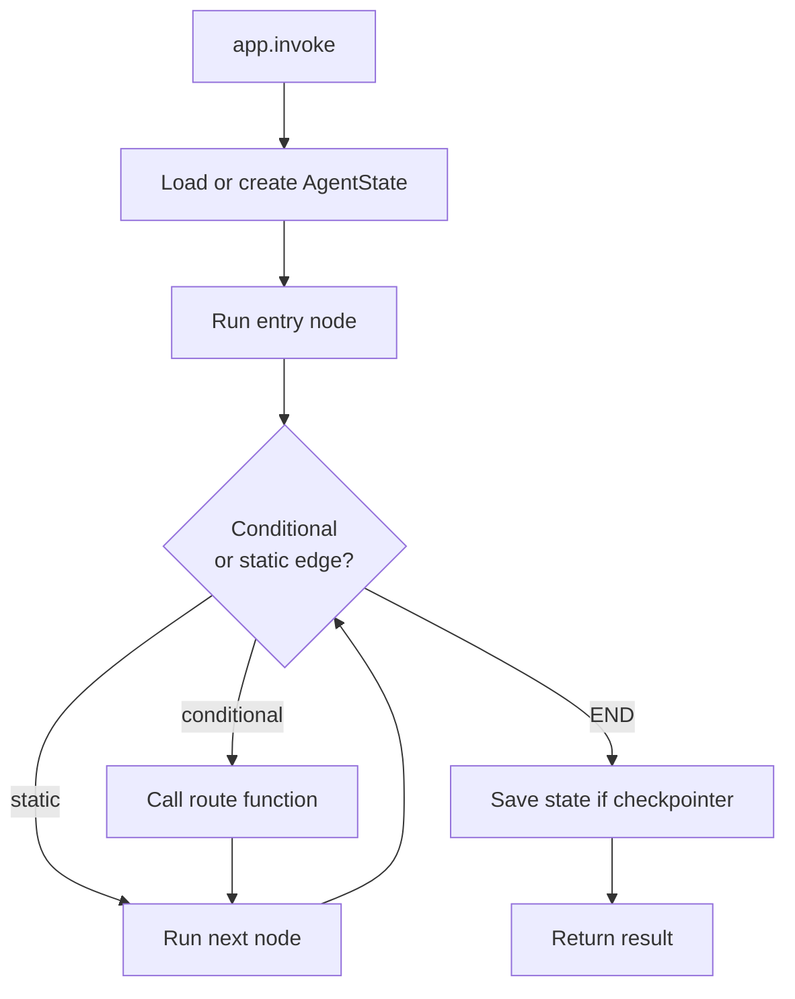

# StateGraph and nodes

`StateGraph` is the workflow engine. You describe the graph as a set of nodes and edges, compile it, and invoke it. The compiled graph manages state, routes between nodes, and knows when to stop.

## Creating a graph

```python
from agentflow.core.graph import StateGraph
from agentflow.core.state import AgentState
from agentflow.utils import END

graph = StateGraph(AgentState)
```

Passing `AgentState` tells the graph what type of state to use. You can pass a custom subclass if your workflow needs extra fields.

## Adding nodes

A node is any callable that receives `AgentState` and returns a `Message` or a `dict` of state updates:

```python
def my_node(state: AgentState) -> Message:
    ...

graph.add_node("my_node", my_node)
```

You can also pass an `Agent` or `ToolNode` instance directly:

```python
from agentflow.core.graph import Agent, ToolNode

graph.add_node("MAIN", Agent(model="google/gemini-2.5-flash", ...))
graph.add_node("TOOL", ToolNode([my_function]))
```

## Edges

Edges control the flow between nodes.

### Static edge

Always go from `source` to `target`:

```python
graph.add_edge("TOOL", "MAIN")
```

### Conditional edge

Call a routing function to decide where to go next:

```python
def route(state: AgentState) -> str:
    last = state.context[-1]
    if hasattr(last, "tools_calls") and last.tools_calls:
        return "TOOL"
    return END

graph.add_conditional_edges(
    "MAIN",
    route,
    {"TOOL": "TOOL", END: END},
)
```

The third argument maps return values to node names. `END` is a special sentinel from `agentflow.utils` that tells the graph to stop.

### Entry point

Set which node runs first:

```python
graph.set_entry_point("MAIN")
```

## Compiling

`graph.compile()` validates the structure and returns a `CompiledGraph`:

```python
app = graph.compile()
# or with a checkpointer:
app = graph.compile(checkpointer=InMemoryCheckpointer())
```

The compiled app exposes `invoke` and `stream`.

## Invoking

```python
from agentflow.core.state import Message

result = app.invoke(
    {"messages": [Message.text_message("Hello")]},
    config={"thread_id": "t1"},
)
```

The input can be a dict with a `messages` key, or a full `AgentState` dict. The `config` must include `thread_id` when a checkpointer is attached.

## Graph execution lifecycle



## Graph recursion limit

By default the graph stops after 25 node executions to prevent infinite loops. You can raise this limit at compile time if your workflow requires many steps:

```python
app = graph.compile(recursion_limit=50)
```

## What you learned

- `StateGraph` takes a state class, nodes, and edges.
- Nodes return messages or state dict updates.
- Conditional edges use a routing function to decide the next node.
- `graph.compile()` validates and returns a runnable app.
- Pass a checkpointer to `compile` to persist state across calls.

## Related concepts

- [Agents and tools](./agents-and-tools.md)
- [State and messages](./state-and-messages.md)
- [Checkpointing and threads](./checkpointing-and-threads.md)
