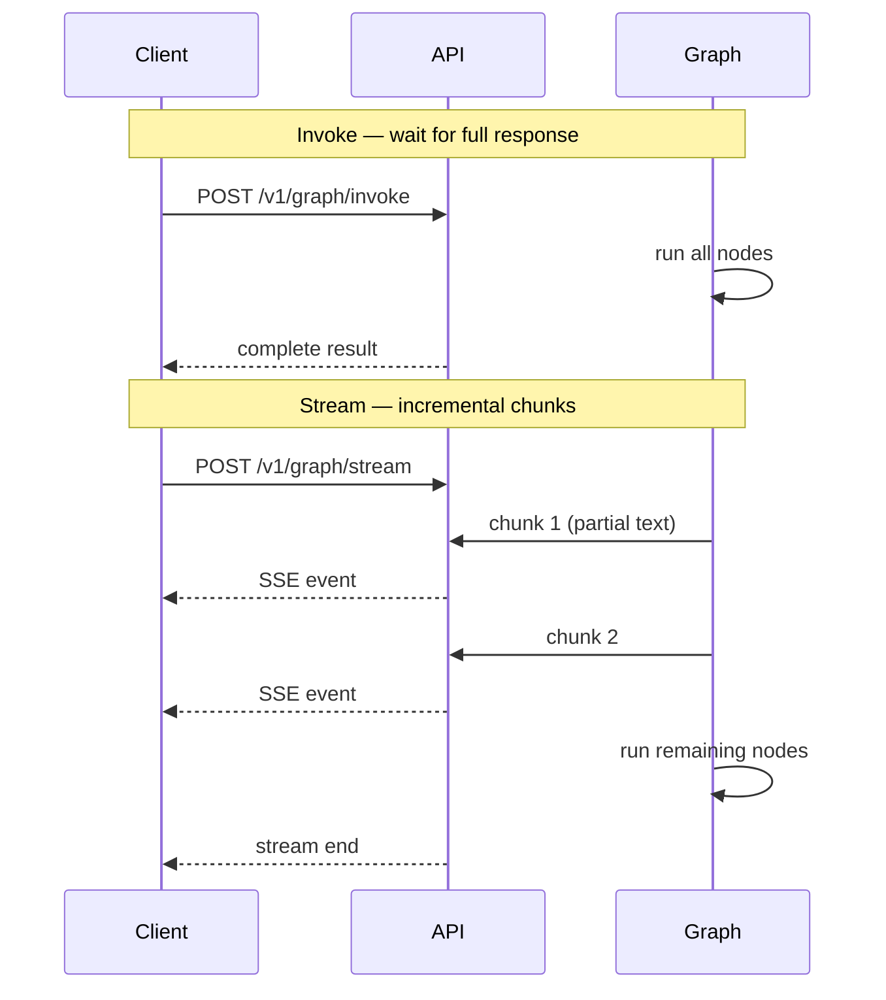

# Streaming

AgentFlow supports two execution modes: **invoke** (returns when complete) and **stream** (sends chunks as they are produced). Streaming is important for chat UIs where users expect to see responses appearing word by word.

## Invoke vs stream



Use **invoke** when you need the full result before proceeding. Use **stream** when you want the client to display partial responses as they arrive.

## Streaming in Python

Call `app.stream` instead of `app.invoke`. It returns a generator of `StreamChunk` objects:

```python
from agentflow.core.state import Message

for chunk in app.stream(
    {"messages": [Message.text_message("Tell me a short story.")]},
    config={"thread_id": "stream-demo"},
):
    if chunk.type == "message_chunk":
        print(chunk.content, end="", flush=True)

print()  # newline after stream ends
```

### StreamChunk types

| `chunk.type` | Description |
| --- | --- |
| `message_chunk` | Partial text from the model response |
| `message_start` | New message beginning |
| `message_end` | Current message complete |
| `tool_call` | The model requested a tool call |
| `tool_result` | A tool returned a result |
| `done` | Graph execution complete |

## Streaming via the REST API

`POST /v1/graph/stream` returns a server-sent events (SSE) response. Each event is a JSON-encoded `StreamChunk`:

```bash
curl -X POST http://127.0.0.1:8000/v1/graph/stream \
  -H "Content-Type: application/json" \
  -d '{
    "messages": [{"role": "user", "content": "Tell me a story."}],
    "config": {"thread_id": "stream-rest-demo"}
  }'
```

Response:

```
data: {"type": "message_chunk", "content": "Once"}
data: {"type": "message_chunk", "content": " upon"}
data: {"type": "message_chunk", "content": " a time"}
data: {"type": "done"}
```

## Streaming in TypeScript

`AgentFlowClient.stream` returns an async iterator:

```typescript
import { AgentFlowClient, Message } from "@10xscale/agentflow-client";

const client = new AgentFlowClient({ baseUrl: "http://127.0.0.1:8000" });

const stream = client.stream(
  [Message.text_message("Tell me a short story.")],
  { config: { thread_id: "ts-stream-demo" } },
);

for await (const chunk of stream) {
  if (chunk.type === "message_chunk") {
    process.stdout.write(chunk.content ?? "");
  }
}
console.log();
```

## Stopping a stream

To cancel an in-progress request, send a stop request:

```bash
POST /v1/graph/stop
{ "thread_id": "your-thread-id" }
```

This signals the running graph to stop after the current node finishes.

## What you learned

- `app.stream` returns a generator of `StreamChunk` objects.
- `POST /v1/graph/stream` returns an SSE response.
- `AgentFlowClient.stream` provides an async iterator in TypeScript.
- Use `POST /v1/graph/stop` to cancel a running stream.

## Related concepts

- [StateGraph and nodes](./state-graph.md)
- [Production runtime](./production-runtime.md)
