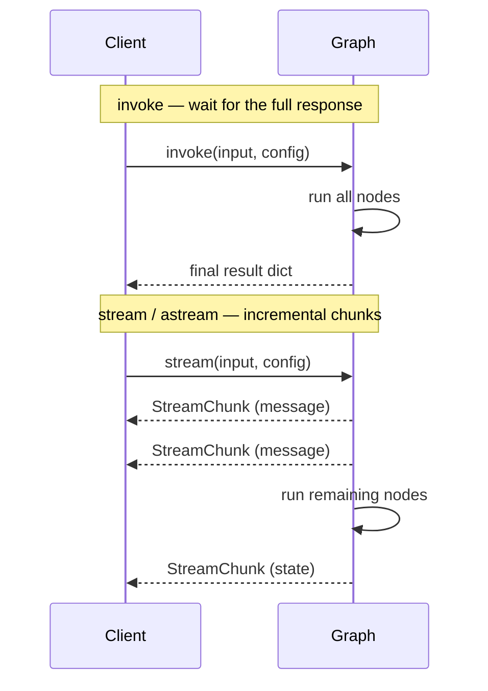

# Streaming

AgentFlow gives you three execution modes — **invoke** (sync, wait for finish), **stream** (sync generator), and **astream** (async generator). Streaming is essential for chat UIs where users expect to see words appear as the model produces them.

---

## How it works



Use **invoke** when you need the full result before proceeding. Use **stream** / **astream** when the client should see partial responses immediately.

---

## StreamChunk

Every streaming event is a `StreamChunk` Pydantic model:

```python
from agentflow.core.state.stream_chunks import StreamChunk, StreamEvent

class StreamChunk(BaseModel):
    event: StreamEvent          # "message" | "state" | "error" | "updates"
    message: Message | None     # populated for StreamEvent.MESSAGE
    state: AgentState | None    # populated for StreamEvent.STATE
    data: dict | None           # populated for StreamEvent.ERROR / UPDATES
    thread_id: str | None
    run_id: str | None
    metadata: dict | None
    timestamp: float            # UNIX timestamp
```

### StreamEvent values

| `StreamEvent` | Value | When sent | Populated field |
|---|---|---|---|
| `StreamEvent.MESSAGE` | `"message"` | Each model output message | `chunk.message` |
| `StreamEvent.STATE` | `"state"` | After each node completes | `chunk.state` |
| `StreamEvent.ERROR` | `"error"` | Execution error | `chunk.data` |
| `StreamEvent.UPDATES` | `"updates"` | Custom node-level updates | `chunk.data` |

---

## ResponseGranularity

Both `stream()` and `astream()` accept a `response_granularity` parameter to control what is included in each `StreamChunk`:

```python
from agentflow.utils import ResponseGranularity
```

| Value | Description |
|---|---|
| `ResponseGranularity.LOW` | Only the latest messages (default) |
| `ResponseGranularity.PARTIAL` | Context, context_summary, and latest messages |
| `ResponseGranularity.FULL` | Complete state and messages |

---

## Synchronous streaming

`app.stream()` is a synchronous generator. Use it from non-async code:

```python
import asyncio
from agentflow.core.state import Message
from agentflow.utils import ResponseGranularity
from agentflow.core.state.stream_chunks import StreamEvent

for chunk in app.stream(
    {"messages": [Message.text_message("Tell me a short story.")]},
    config={"thread_id": "stream-1", "recursion_limit": 10},
    response_granularity=ResponseGranularity.LOW,
):
    if chunk.event == StreamEvent.MESSAGE and chunk.message is not None:
        print(chunk.message.text(), end="", flush=True)

print()  # trailing newline
```

---

## Asynchronous streaming

`app.astream()` is an async generator. Use it inside async code (e.g., FastAPI, async tests):

```python
import asyncio
from agentflow.core.state import Message
from agentflow.utils import ResponseGranularity
from agentflow.core.state.stream_chunks import StreamEvent

async def main():
    inp = {"messages": [Message.text_message("Call get_weather for Tokyo.")]}
    config = {"thread_id": "astream-1", "recursion_limit": 10}

    async for chunk in app.astream(inp, config, ResponseGranularity.LOW):
        if chunk.event == StreamEvent.MESSAGE and chunk.message is not None:
            print(chunk.message.text(), end="", flush=True)
        elif chunk.event == StreamEvent.STATE and chunk.state is not None:
            print(f"\n[state received, step={chunk.state.execution_meta.step}]")

asyncio.run(main())
```

### Inspecting all chunk types

```python
async for chunk in app.astream(inp, config):
    match chunk.event:
        case StreamEvent.MESSAGE:
            # new message from the model or a tool
            print("message:", chunk.message.text())
        case StreamEvent.STATE:
            # node completed — full or partial state
            print("state step:", chunk.state.execution_meta.step)
        case StreamEvent.ERROR:
            print("error:", chunk.data)
        case StreamEvent.UPDATES:
            print("updates:", chunk.data)
```

---

## invoke and ainvoke

For non-streaming use, `app.invoke()` and `app.ainvoke()` return a plain dict:

```python
# Sync
result = app.invoke(
    {"messages": [Message.text_message("Hello!")]},
    config={"thread_id": "t1"},
    response_granularity=ResponseGranularity.LOW,
)
messages = result["messages"]   # list of Message

# Async
result = await app.ainvoke(
    {"messages": [Message.text_message("Hello!")]},
    config={"thread_id": "t1"},
)
```

The returned dict keys depend on `response_granularity`:

| Granularity | Keys present |
|---|---|
| `LOW` | `messages` |
| `PARTIAL` | `messages`, `context`, `context_summary` |
| `FULL` | `messages`, `state` |

---

## Stopping a running stream

Call `app.stop()` / `app.astop()` to request cancellation. The graph checks a stop flag after each node and exits cleanly:

```python
# stop from another coroutine / thread
await app.astop({"thread_id": "stream-1"})
```

Via the REST API:

```bash
POST /v1/graph/stop
Content-Type: application/json

{"thread_id": "stream-1"}
```

---

## Streaming via the REST API

`POST /v1/graph/stream` returns a server-sent events (SSE) response. Each event is a JSON-encoded `StreamChunk`:

```bash
curl -N -X POST http://127.0.0.1:8000/v1/graph/stream \
  -H "Content-Type: application/json" \
  -d '{
    "messages": [{"role": "user", "content": "Tell me a short story."}],
    "config": {"thread_id": "rest-stream-1"}
  }'
```

Response:

```
data: {"event": "message", "message": {"role": "assistant", "content": [{"type": "text", "text": "Once"}]}, ...}
data: {"event": "message", "message": {"role": "assistant", "content": [{"type": "text", "text": " upon a time"}]}, ...}
data: {"event": "state", "state": {...}, ...}
```

---

## Streaming in TypeScript

`AgentFlowClient.stream` returns an async iterator of `StreamChunk`:

```typescript
import { AgentFlowClient, Message, StreamEvent } from "@10xscale/agentflow-client";

const client = new AgentFlowClient({ baseUrl: "http://127.0.0.1:8000" });

for await (const chunk of client.stream(
  [Message.textMessage("Tell me a short story.")],
  { config: { threadId: "ts-stream-1" } },
)) {
  if (chunk.event === StreamEvent.MESSAGE && chunk.message) {
    process.stdout.write(chunk.message.text ?? "");
  }
}
console.log();
```

---

## Related concepts

- [StateGraph and nodes](./state-graph.md)
- [State and messages](./state-and-messages.md)
- [Production runtime](./production-runtime.md)
