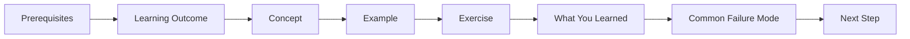
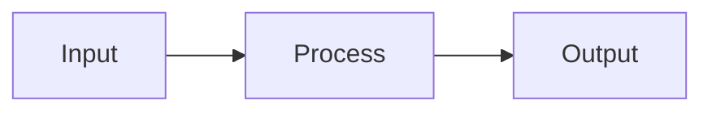
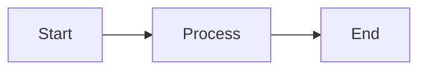
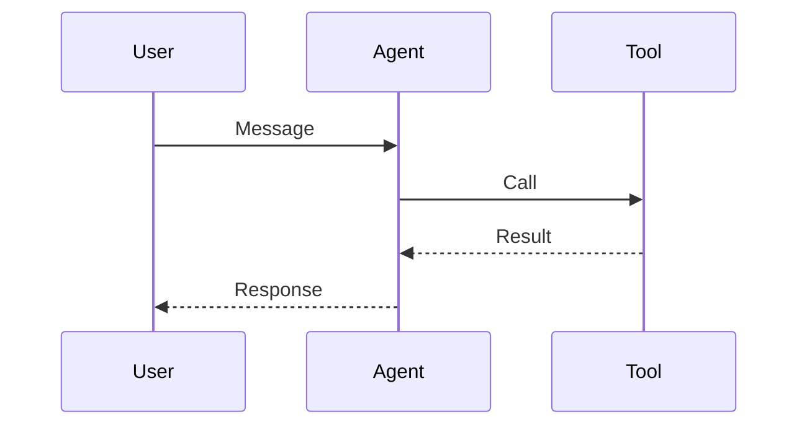
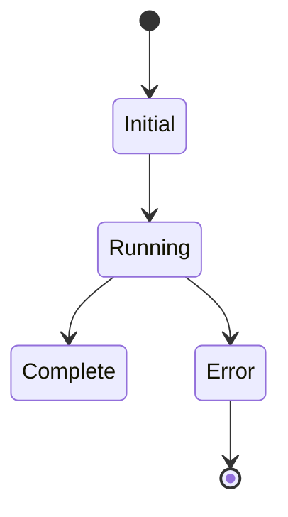

# Course Style Guide

This guide defines the standards for writing lessons in the GenAI Beginner and Advanced courses.

## Page Structure

Every lesson must follow this structure:



### Required Sections

| Section | Required? | Description |
|---------|-----------|-------------|
| **Prerequisites** | Yes | Links to shared pages or previous lessons |
| **Learning Outcome** | Yes | 3-4 bullet points of what learners will achieve |
| **Concept** | Yes | Brief explanation with diagrams |
| **Example** | Yes | Runnable code or detailed walkthrough |
| **Exercise** | Yes | Practice task for learners |
| **What You Learned** | Yes | Key takeaways (3-5 bullets) |
| **Common Failure Mode** | Yes | Common mistake and how to avoid |
| **Next Step** | Yes | Links to next lesson and related content |

## Writing Standards

### Tone and Voice

- **Active voice** — "You will build" not "will be built"
- **Second person** — Address learners as "you"
- **Confident but not condescending** — "You can" not "You should be able to"
- **Practical** — Code examples over theory

### Code Examples

```python
# ✅ Good: Complete, runnable example
from agentflow.core.graph import StateGraph

builder = StateGraph(AgentState)

@builder.node
def chat(state: AgentState) -> AgentState:
    messages = state.messages
    response = llm.generate(messages)
    messages.append(response)
    return {"messages": messages}

# ❌ Bad: Incomplete or theoretical
class Agent:
    def process(self):
        # TODO: implement
        pass
```

### Diagrams

Use Mermaid for all diagrams:



### File Paths

Use absolute paths from repository root:
- ✅ `docs/courses/genai-beginner/index.md`
- ❌ `./index.md`

## Lesson Template

```markdown
---
title: "Lesson N: [Topic Name]"
description: [Brief description of what learners will accomplish]
---

# Lesson N: [Topic Name]

## Learning Outcome

By the end of this lesson, you will be able to:
- [Outcome 1]
- [Outcome 2]
- [Outcome 3]

## Prerequisites

- [Previous lesson or shared page]
- [Any required concepts]

---

## Concept: [Concept Name]

[Explanation with diagrams]

### Sub-concept (if needed)

[More detail]

---

## Example: [Example Name]

### Step 1: [Step description]

[Code or walkthrough]

### Step 2: [Step description]

[More code]

### Expected Output

```
[Sample output]
```

---

## Exercise: [Exercise Name]

### Your Task

[Task description]

### Template

```python
[Template code]
```

### Test Cases

| Input | Expected Output |
|-------|----------------|
| Case 1 | Result 1 |
| Case 2 | Result 2 |

---

## What You Learned

1. [Takeaway 1]
2. [Takeaway 2]
3. [Takeaway 3]

---

## Common Failure Mode

**[Failure name]**

[Description of the failure]

```python
# ❌ Don't do this
bad_code()

# ✅ Do this instead
good_code()
```

---

## Next Step

Continue to the next lesson to learn about [next topic].

### Or Explore

- [Related concepts](/docs/courses/shared/glossary.md)
- [Beginner course](/docs/courses/genai-beginner/index.md)
```

## Formatting Conventions

### Headings

- H1: Page title (one per page)
- H2: Major sections (Concept, Example, Exercise)
- H3: Sub-sections within major sections

### Code Blocks

Always specify language:

````markdown
```python
# Python code
```
````

### Tables

Use tables for comparisons and structured information:

```markdown
| Column 1 | Column 2 |
|----------|----------|
| Value 1 | Value 2 |
```

### Admonitions

Use sparingly for important callouts:

```markdown
:::note
This is a note.
:::

:::tip
This is a tip.
:::

:::warning
This is a warning.
:::
```

## Linking

### Internal Links

```markdown
- [Lesson 1](./lesson-1.md)
- [Shared: Tokenization](/docs/courses/shared/tokenization-and-context-windows.md)
- [AgentFlow Architecture](/docs/concepts/architecture.md)
```

### External Links

Only link to authoritative sources:
- OpenAI documentation
- Anthropic documentation
- AgentFlow documentation

## Mermaid Diagrams

### Flowchart



### Sequence Diagram



### State Diagram



## Review Checklist

Before publishing a lesson, verify:

- [ ] Learning outcome is clear and achievable
- [ ] Prerequisites are linked correctly
- [ ] All code examples are complete and runnable
- [ ] Diagrams render correctly
- [ ] Exercise has clear requirements and test cases
- [ ] "What you learned" summarizes key points
- [ ] "Common failure mode" is actually common
- [ ] "Next step" links to correct lesson
- [ ] Internal links use correct paths
- [ ] No broken links

## Style Violations to Avoid

| Violation | Example | Correction |
|-----------|---------|------------|
| Passive voice | "will be built" | "you will build" |
| First person | "I think" | "This course teaches" |
| Jargon without explanation | "Use the checkpointer" | "Use the checkpointer to persist state" |
| Incomplete examples | Code with `pass` | Complete working code |
| Missing prerequisites | Links to non-existent pages | Verify all links exist |
