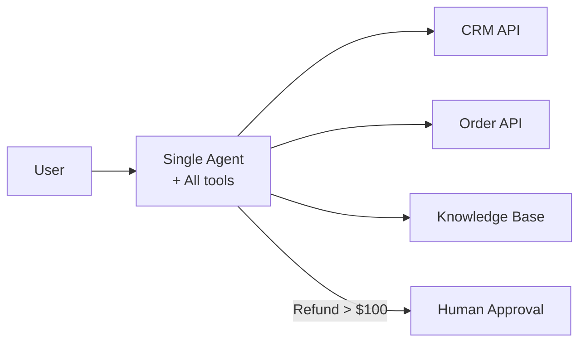
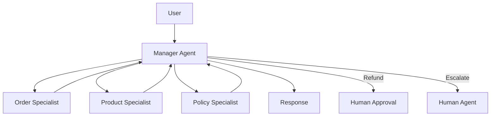
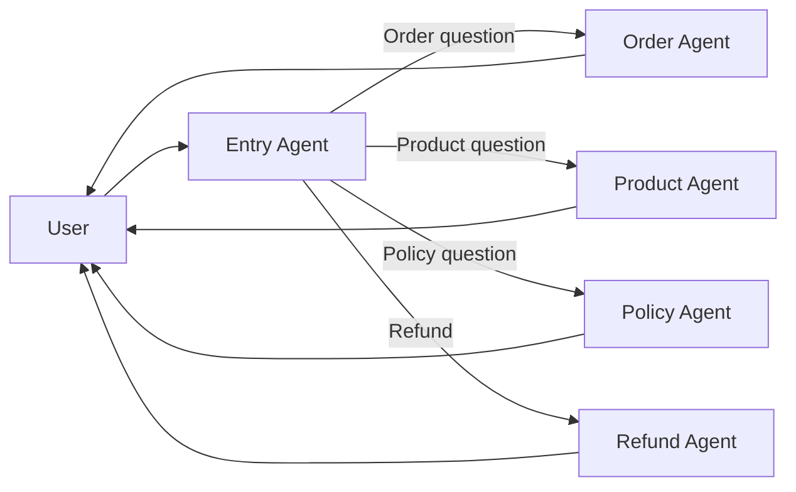

# Architecture Review Exercise

Compare three architectures for the same product requirement and justify your choice.

## Scenario

**Product**: Customer support system that:
- Answers questions about orders, products, and policies
- Can process refunds (requires approval)
- Can escalate to human agents
- Handles 10,000 conversations/day
- Needs to integrate with existing CRM and order systems

---

## Architecture Options

### Option A: Single Agent with Tools



### Option B: Manager + Specialists



### Option C: Decentralized Handoff



---

## Comparison Template

### 1. Architectural Fit

| Criterion | Option A | Option B | Option C |
|-----------|----------|----------|----------|
| **Complexity** | Low | Medium | High |
| **Latency** | Lowest | Medium | Varies |
| **Context isolation** | None | Medium | High |
| **Failure isolation** | Poor | Good | Best |
| **Tool management** | Simple | Moderate | Complex |

### 2. Cost Analysis

| Cost Factor | Option A | Option B | Option C |
|-------------|----------|----------|----------|
| **LLM calls/conversation** | 1-3 | 2-5 | 2-4 |
| **Avg tokens/conversation** | 2000 | 3000 | 2500 |
| **Estimated daily cost** | Calculate | Calculate | Calculate |
| **Infrastructure cost** | Low | Medium | High |

### 3. Failure Analysis

| Failure Mode | Option A | Option B | Option C |
|--------------|----------|----------|----------|
| **Agent loops forever** | Risk: High | Risk: Low | Risk: Medium |
| **Wrong tool selection** | Risk: High | Risk: Low | Risk: Medium |
| **Context overflow** | Risk: High | Risk: Low | Risk: Medium |
| **Tool timeout** | Affects all | Isolated | Isolated |

### 4. Evaluation Requirements

| Metric | Option A | Option B | Option C |
|--------|----------|----------|----------|
| **Eval complexity** | Low | Medium | High |
| **Test coverage needed** | Basic | Comprehensive | Per-agent |
| **Monitoring complexity** | Low | Medium | High |

### 5. Human-in-the-Loop Requirements

| Action | Implementation |
|--------|---------------|
| **Refund approval** | How to implement? |
| **Escalation** | How to implement? |
| **Interrupt and resume** | How to implement? |

---

## Your Analysis

### Chosen Architecture

**Option: [A / B / C]**

### Justification

```markdown
1. Why this architecture over others?


2. What control boundaries exist?


3. What failure modes do you expect?


4. How would you evaluate before production?


5. Where is human approval or rollback required?


```

---

## Implementation Sketch

Sketch key implementation components for your chosen architecture:

### Agent Definition

```python
# Your implementation here
class CustomerSupportAgent:
    def __init__(self):
        # Define agents, tools, and routing
        pass
    
    async def process(self, message: str, thread_id: str) -> str:
        # Implementation
        pass
```

### Approval Flow

```python
# Your implementation here
async def handle_refund(request: RefundRequest) -> str:
    # Implementation
    pass
```

### Checkpoint Strategy

```python
# Your implementation here
def checkpoint_strategy() -> dict:
    # What to checkpoint and when
    pass
```

---

## Evaluation Criteria

Your analysis will be evaluated on:

1. **Justification quality** — Clear reasoning for architecture choice
2. **Tradeoff awareness** — Honest acknowledgment of costs and risks
3. **Failure thinking** — Realistic failure mode analysis
4. **Human oversight** — Appropriate approval and rollback points
5. **Production readiness** — Practical evaluation and monitoring plan

---

## Next Steps

After completing this exercise:

1. Review your analysis against real production requirements
2. Prototype the chosen architecture
3. Run evaluations before committing
4. Build monitoring and observability

---

## Related Lessons

- [Lesson 1: Agentic product fit](./lesson-1-agentic-product-fit-and-system-bounded-autonomy.md)
- [Lesson 2: Bounded autonomy](./lesson-2-single-agent-runtime-and-bounded-autonomy.md)
- [Lesson 5: Multi-agent patterns](./lesson-5-router-manager-and-specialist-patterns.md)
- [Lesson 6: Human-in-the-loop](./lesson-6-handoffs-human-review-and-control-surfaces.md)
