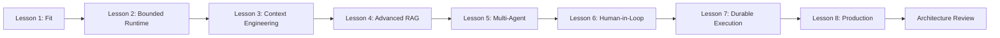
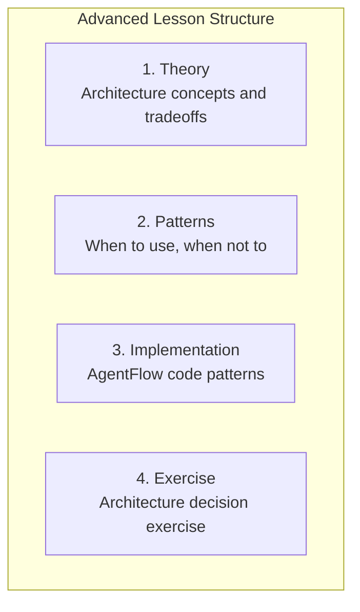

# GenAI Advanced Course

Design reliable architecture choices for agent systems in production. This course is for engineers who understand the basics and need to make architectural decisions.

## What You'll Learn

| Lesson | Topic | Key Decision |
|--------|-------|-------------|
| 1 | [Agentic product fit and system boundaries](./lesson-1-agentic-product-fit-and-system-bounded-autonomy.md) | When to use agents vs. workflows |
| 2 | [Single-agent runtime and bounded autonomy](./lesson-2-single-agent-runtime-and-bounded-autonomy.md) | Limits and recovery patterns |
| 3 | [Context engineering, long context, and caching](./lesson-3-context-engineering-long-context-and-caching.md) | Optimize context for quality and cost |
| 4 | [Knowledge systems and advanced RAG](./lesson-4-knowledge-systems-and-advanced-rag.md) | Choose retrieval architectures |
| 5 | [Router, manager, and specialist patterns](./lesson-5-router-manager-and-specialist-patterns.md) | Multi-agent orchestration |
| 6 | [Handoffs, human review, and control surfaces](./lesson-6-handoffs-human-review-and-control-surfaces.md) | Human-in-the-loop design |
| 7 | [Memory, checkpoints, artifacts, and durable execution](./lesson-7-memory-checkpoints-artifacts-and-durable-execution.md) | Runtime durability |
| 8 | [Observability, testing, security, and deployment](./lesson-8-observability-testing-security-and-deployment.md) | Production readiness |

## Course Structure

## Prerequisites

- Completed the [GenAI Beginner Course](../genai-beginner/index.md) (or equivalent)
- Comfortable with AgentFlow core concepts
- Building or maintaining GenAI applications

## Time Commitment

| Component | Time |
|-----------|------|
| 8 lessons | 45-75 min each |
| Architecture exercise | 1-2 hours |
| **Total** | ~8-10 hours |

## How Each Lesson Is Structured

Each advanced lesson follows this structure:

1. **Theory** — Architectural concepts with tradeoffs
2. **Patterns** — When to use, when NOT to use
3. **Implementation** — AgentFlow code patterns
4. **Exercise** — Apply concepts to a real scenario

## Key Differences from Beginner

| Aspect | Beginner | Advanced |
|--------|----------|----------|
| **Focus** | Building one feature | Choosing between patterns |
| **Questions** | "How do I...?" | "Should I...?" and "Which is better?" |
| **Failure modes** | Implementation bugs | Architectural mistakes |
| **Tradeoffs** | Basic (speed vs. quality) | Complex (context, cost, latency, safety) |

## Your Learning Path

### Start With Shared Foundations

If you need a refresher:

- [LLM basics](/docs/courses/shared/llm-basics-for-engineers.md)
- [Tokenization](/docs/courses/shared/tokenization-and-context-windows.md)
- [Embeddings](/docs/courses/shared/embeddings-vectorization-and-similarity.md)
- [Design checklists](/docs/courses/shared/design-checklists.md)

### Then Continue With Lessons

Start with [Lesson 1: Agentic product fit and system boundaries](./lesson-1-agentic-product-fit-and-system-bounded-autonomy.md)

## After This Course

After completing this course, you will be able to:

- **Choose architectures** — Workflow vs. agent vs. multi-agent
- **Design bounded systems** — Limits, recovery, and failure containment
- **Optimize context** — Context engineering, caching, and compaction
- **Build multi-agent systems** — Routing, delegation, and handoffs
- **Implement human-in-the-loop** — Approval flows and interrupts
- **Ship production-ready** — Testing, observability, and security

:::note Coming from the Beginner Course?
If you've completed the beginner course, this advanced course goes deeper into the architectural decisions behind what you built.
:::

---

**Ready to start?** Begin with [Lesson 1: Agentic product fit and system boundaries](./lesson-1-agentic-product-fit-and-system-bounded-autonomy.md).
