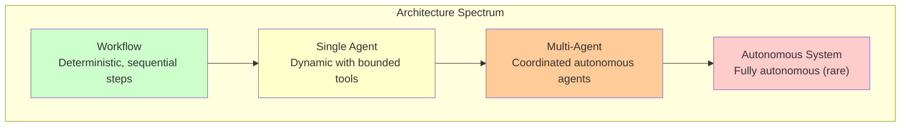
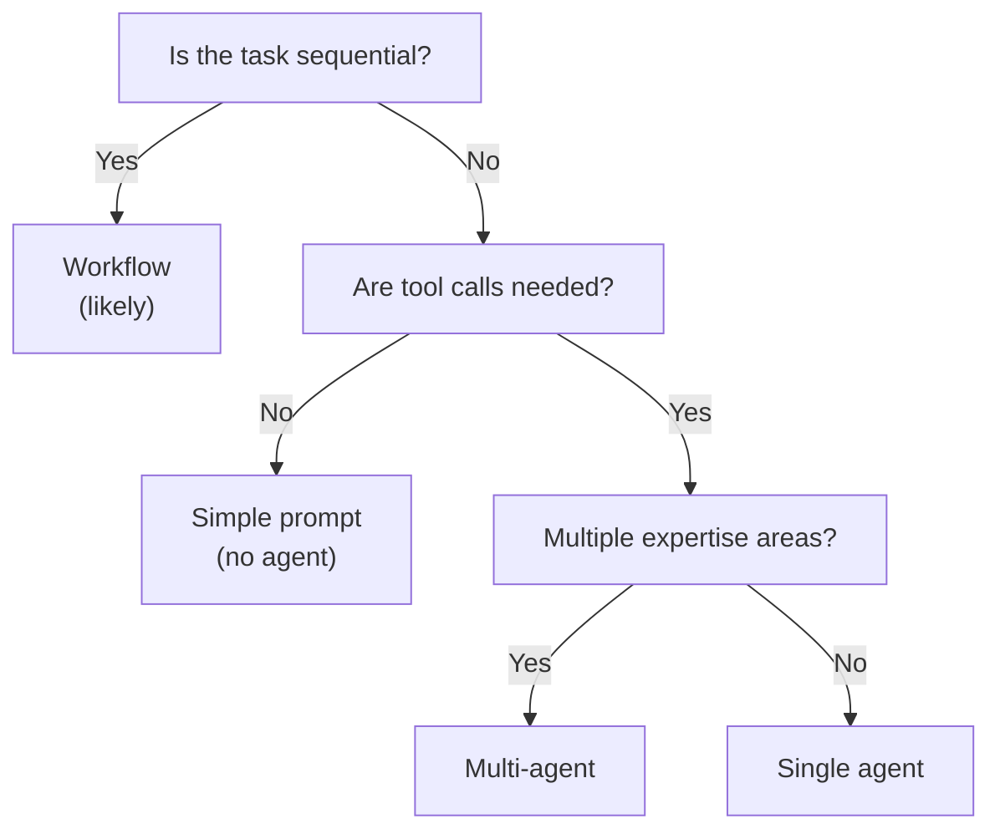
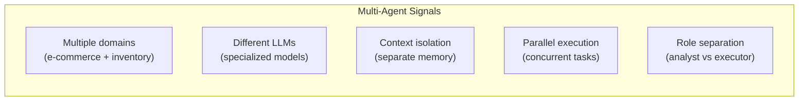
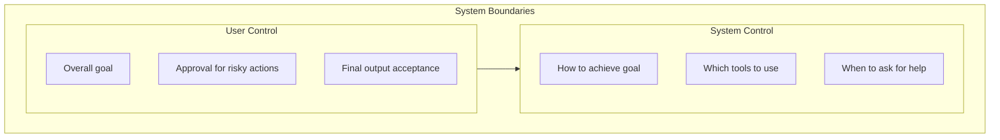
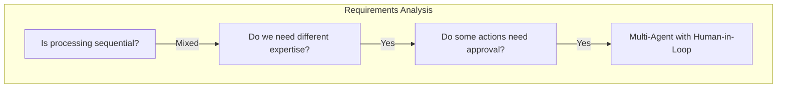

# Lesson 1: Agentic Product Fit and System Boundaries

## Learning Outcome

By the end of this lesson, you will be able to:
- Distinguish between workflows, single agents, and multi-agent systems
- Identify signals that justify each architecture choice
- Define system boundaries and user goals clearly

## Prerequisites

- Completed Beginner Course or equivalent
- [Design checklists](/docs/courses/shared/design-checklists.md)

---

## Concept: The Architecture Spectrum

GenAI systems exist on a spectrum from fully deterministic to fully autonomous:



### When to Use Each

| Architecture | Best For | Signs You Need It |
|--------------|----------|-------------------|
| **Workflow** | Sequential tasks, known steps | Steps are predictable |
| **Single Agent** | Dynamic paths, tool use | Steps depend on input |
| **Multi-Agent** | Multiple expertise areas | Different skills needed |
| **Autonomous** | Research, exploration | Human oversight possible |

---

## Concept: Workflow vs. Agent Decision

### Key Questions

Before reaching for an agent, ask:



### Decision Matrix

| Task Characteristic | Workflow | Single Agent | Multi-Agent |
|--------------------|----------|--------------|-------------|
| **Steps known in advance** | ✅ | ⚠️ | ⚠️ |
| **Dynamic tool selection** | ❌ | ✅ | ✅ |
| **Branching logic** | ⚠️ | ✅ | ✅ |
| **Different expertise needed** | ❌ | ❌ | ✅ |
| **Parallel processing** | ❌ | ❌ | ✅ |
| **Human review needed** | ✅ | ✅ | ✅ |

---

## Concept: Signals That Justify Multi-Agent

### When Single Agent Isn't Enough



### Real-World Triggers

| Trigger | Example | Solution |
|---------|---------|----------|
| **Tool conflict** | Same tool used differently | Separate agents with own tools |
| **Context bloat** | Too many tools for one prompt | Specialists with focused tools |
| **Latency requirements** | Slow because of all tools | Parallel specialists |
| **Domain separation** | Legal docs vs. code | Domain-specific agents |

---

## Concept: Defining System Boundaries

### What the System Decides vs. What the User Decides



### Defining Approval Boundaries

| Action Type | Approval Required? | Why |
|-------------|-------------------|-----|
| Read data | No | Low risk |
| Generate text | No | Can be reviewed |
| Send email | ✅ Yes | Irreversible |
| Delete data | ✅ Yes | Irreversible |
| Spend money | ✅ Yes | Financial risk |

---

## Example: Architecture Decision for a Customer Support System

### Scenario

Build a customer support system that:
- Answers questions about orders
- Processes refunds
- Escalates complex issues
- Sends email confirmations

### Decision Process



### Architecture: Manager + Specialists

```python
from agentflow.core.graph import StateGraph, END
from agentflow.prebuilt.agent import RouterAgent

# Manager routes to specialists
manager = RouterAgent(
    routes={
        "order_status": "order_agent",
        "refund": "refund_agent",  # Requires approval
        "escalation": "escalation_agent",
        "general": "general_agent"
    }
)

# Specialist agents
order_agent = ReactAgent(tools=[check_order_status, track_shipment])
refund_agent = ReactAgent(
    tools=[process_refund],
    require_approval=True  # Human approval required
)
escalation_agent = ReactAgent(tools=[create_ticket, send_alert])
general_agent = ReactAgent(tools=[search_kb, general_help])
```

---

## Exercise: Architecture Brief

### Your Task

For this product idea, write a one-page architecture brief:

**Product**: Automated code review assistant that:
- Reviews pull requests
- Suggests improvements
- Flags security issues
- Can request changes to code

### Brief Template

```markdown
## Architecture Brief: [Product Name]

### Problem Fit
- Workflow / Single Agent / Multi-Agent: [Choose one]
- Justification: [Why this choice over others]

### System Boundaries
- System decides: [What the system controls]
- User decides: [What users must approve]

### Agent Design
- Number of agents: [How many and why]
- Specialization: [What each agent does]

### Approval Points
- [ ] Action A: [Approval required?]
- [ ] Action B: [Approval required?]

### Why This Is NOT Just a Workflow
[1-2 sentences explaining why agent architecture is necessary]
```

### Discussion Questions

1. Would a simple workflow work for code review?
2. Do you need different agents for security vs. style?
3. When should the system request human approval?

---

## What You Learned

1. **Architecture is a spectrum** — From deterministic workflows to autonomous agents
2. **Match architecture to requirements** — Don't over-engineer
3. **Multi-agent has costs** — Only use when single agent is insufficient
4. **Define boundaries clearly** — What the system does vs. what users approve

---

## Common Failure Mode

**Jumping to multi-agent too early**

```python
# ❌ Over-engineered
manager = ManagerAgent(agents=[
    CoderAgent(), BugFixerAgent(), TesterAgent(), 
    DocumenterAgent(), DeployerAgent(), MonitorAgent()
])

# ✅ Appropriate complexity
review_agent = ReactAgent(
    tools=[check_syntax, check_style, check_security]
)
```

Start simple. Add agents only when you have clear justification.

---

## Next Step

Continue to [Lesson 2: Single-agent runtime and bounded autonomy](./lesson-2-single-agent-runtime-and-bounded-autonomy.md) to learn how to design safe, bounded agent behavior.

### Or Explore

- [StateGraph concepts](/docs/concepts/state-graph.md) — Graph-based agent design
- [Architecture concepts](/docs/concepts/architecture.md) — System architecture patterns
