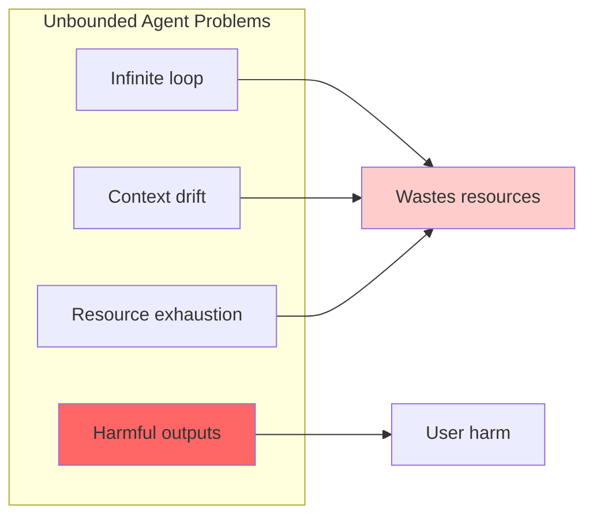
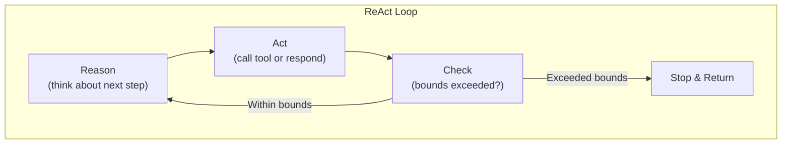
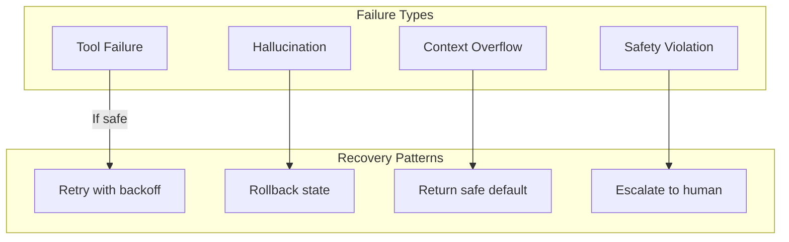

# Lesson 2: Single-Agent Runtime and Bounded Autonomy

## Learning Outcome

By the end of this lesson, you will be able to:
- Implement bounded retry and step limits
- Design recovery paths for agent failures
- Contain failures before scaling to multi-agent

## Prerequisites

- Lesson 1: Architecture decisions
- [StateGraph concepts](/docs/concepts/state-graph.md)

---

## Concept: Why Bounded Autonomy Matters

Agents can wander, loop, or fail in unexpected ways. Without bounds, a broken agent can:



### Bounded Autonomy Principles

| Principle | Description | Example |
|-----------|-------------|---------|
| **Step limits** | Max tool calls per request | 10 calls max |
| **Budget limits** | Max tokens per response | 4000 output tokens |
| **Time limits** | Max execution time | 30 seconds |
| **Retry limits** | Max retries on failure | 3 retries |
| **Approval gates** | Human check for risky actions | Approve before DELETE |

---

## Concept: ReAct-Style Loop Control

ReAct (Reasoning + Acting) loops are common but need bounds:



### Bounded ReAct Implementation

```python
class BoundedReactAgent:
    def __init__(
        self,
        max_steps: int = 10,
        max_tokens: int = 4000,
        timeout_seconds: float = 30.0
    ):
        self.max_steps = max_steps
        self.max_tokens = max_tokens
        self.timeout = timeout_seconds
    
    async def run(self, input_message: str) -> str:
        state = {"messages": [], "step_count": 0}
        
        while state["step_count"] < self.max_steps:
            # Check bounds before each step
            if self._exceeded_token_limit(state):
                return self._format_final_response(state, "token_limit")
            
            # Reason
            thought = await self.reason(state)
            
            # Act
            action = await self.decide_action(thought)
            
            if action.type == "respond":
                return action.content  # Done!
            
            # Execute tool
            result = await self.execute_tool(action.tool, action.args)
            state["messages"].append(result)
            state["step_count"] += 1
        
        # Exceeded step limit
        return self._format_final_response(state, "step_limit")
```

---

## Concept: Failure Containment

### Failure Types and Recovery



### Recovery Patterns

| Failure Type | Detection | Recovery |
|--------------|-----------|----------|
| **Tool timeout** | Check result | Retry, then skip |
| **Invalid tool call** | Schema validation | Return error to user |
| **Hallucination** | Confidence scoring | Add grounding |
| **Context overflow** | Token counting | Truncate or summarize |

---

## Example: Bounded Agent Implementation

### Step 1: Define Bounds

```python
from dataclasses import dataclass
from enum import Enum

class StopReason(Enum):
    COMPLETED = "completed"
    STEP_LIMIT = "step_limit_reached"
    TOKEN_LIMIT = "token_limit_reached"
    TIMEOUT = "timeout"
    ERROR = "error"

@dataclass
class AgentBounds:
    max_steps: int = 10
    max_output_tokens: int = 4000
    max_execution_seconds: float = 30.0
    max_tool_retries: int = 2
    
    # Risk-based limits
    max_delete_operations: int = 0
    require_approval_for: list[str] = None
```

### Step 2: Implement Bounds Checking

```python
class BoundedAgent:
    def __init__(self, bounds: AgentBounds):
        self.bounds = bounds
        self.llm = OpenAIModel("gpt-4o")
        self.tools = []
    
    def _check_step_limit(self, step_count: int) -> bool:
        if step_count >= self.bounds.max_steps:
            return False  # Stop
        return True
    
    def _check_token_limit(self, state: AgentState) -> bool:
        total_tokens = self._estimate_tokens(state)
        return total_tokens < self.bounds.max_output_tokens
    
    def _check_risk_level(self, action: ToolCall) -> bool:
        risky_actions = ["delete", "drop", "destroy"]
        if any(r in action.name.lower() for r in risky_actions):
            return False  # Block unless approved
        return True
    
    def _format_response(self, state: AgentState, reason: StopReason) -> str:
        if reason == StopReason.COMPLETED:
            return state.messages[-1].content
        
        return f"""
I wasn't able to complete this request fully.

What I did:
{self._summarize_steps(state)}

Reason: {reason.value}

Try: Breaking this into smaller steps or providing more context.
"""
```

### Step 3: Implement Retry Logic

```python
async def execute_with_retry(
    self,
    tool: str,
    args: dict,
    max_retries: int = None
) -> ToolResult:
    max_retries = max_retries or self.bounds.max_tool_retries
    
    for attempt in range(max_retries + 1):
        try:
            result = await self.call_tool(tool, args)
            
            if result.success:
                return result
            
            # Retry on transient failures
            if result.is_transient_error():
                wait_time = 2 ** attempt  # Exponential backoff
                await asyncio.sleep(wait_time)
                continue
            
            # Non-transient failure
            return result
            
        except Exception as e:
            if attempt == max_retries:
                return ToolResult(error=f"Failed after {max_retries} retries: {e}")
            
            await asyncio.sleep(2 ** attempt)
    
    return ToolResult(error="Max retries exceeded")
```

---

## Exercise: Fix a Fragile Agent

### Scenario

You have a fragile agent that sometimes loops indefinitely:

```python
class FragileAgent:
    """This agent has problems - fix them!"""
    
    async def run(self, user_message: str) -> str:
        messages = [Message(role="user", content=user_message)]
        
        while True:  # No bounds!
            response = await self.llm.generate(messages)
            messages.append(Message(role="assistant", content=response))
            
            if response.tool_calls:
                for call in response.tool_calls:
                    result = await self.call_tool(call.name, call.args)
                    messages.append(result)
            else:
                return response  # Assumes completion
        
        return messages[-1].content  # Never reached
```

### Your Task

Rewrite this agent with:

1. **Step limit** — Stop after N steps
2. **Token limit** — Stop if output exceeds limit
3. **Timeout** — Stop if execution takes too long
4. **Retry logic** — Handle transient tool failures
5. **Safe default** — Return meaningful response on bounds exceeded

### Expected Output

```python
class FixedAgent:
    """Fixed agent with bounded autonomy"""
    
    def __init__(self):
        # Your implementation here
        pass
    
    async def run(self, user_message: str) -> str:
        # Your bounded implementation here
        pass
```

---

## What You Learned

1. **Bounds prevent runaway agents** — Step, token, time, and risk limits
2. **Recovery is essential** — Retry logic and safe defaults
3. **Start with single-agent bounds** — Before multi-agent expansion
4. **Failure containment** — Catch and handle failures gracefully

---

## Common Failure Mode

**No bounds = no reliability**

```python
# ❌ Unbounded
while True:
    response = llm.generate(messages)
    # Never stops!

# ✅ Bounded
for step in range(max_steps):
    response = llm.generate(messages)
    if is_final_response(response):
        return response
    messages.append(response)
```

---

## Next Step

Continue to [Lesson 3: Context engineering, long context, and caching](./lesson-3-context-engineering-long-context-and-caching.md) to optimize context management.

### Or Explore

- [React Agent Tutorial](/docs/tutorials/from-examples/react-agent.md) — ReAct implementation
- [Testing Reference](/docs/reference/python/testing.md) — Testing bounded agents
