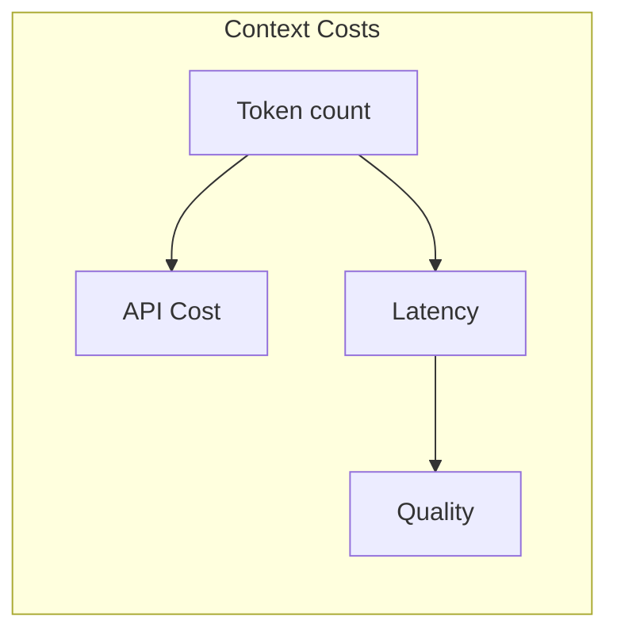
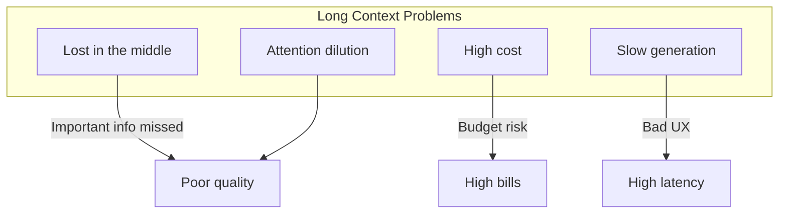
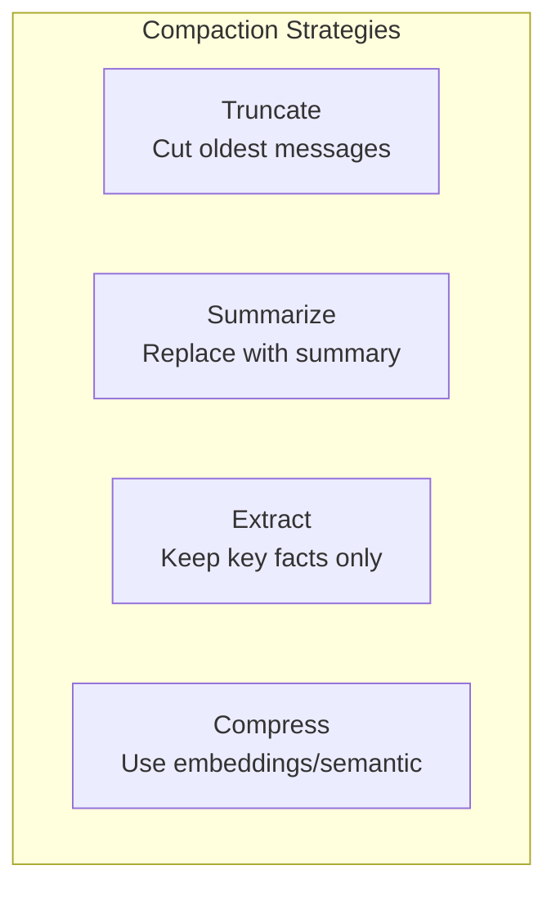
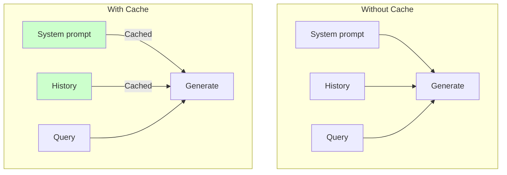

# Lesson 3: Context Engineering, Long Context, and Caching

## Learning Outcome

By the end of this lesson, you will be able to:
- Design stable prompt structures for large systems
- Use context compaction and summarization
- Implement prompt caching effectively
- Make context decisions based on quality vs. cost tradeoffs

## Prerequisites

- [Tokenization and context windows](/docs/courses/shared/tokenization-and-context-windows.md)
- Lesson 2: Bounded autonomy

---

## Concept: Context Is a Resource

Context is not free—it has real costs:



### The Context Budget

Every request has a budget:

| Context Component | Typical Size | Notes |
|-------------------|-------------|-------|
| System prompt | 500-2000 tokens | Stable, can cache |
| Conversation history | Variable | Grows with turns |
| Retrieved context | Variable | Depends on retrieval |
| Current input | Variable | User's message |
| Output buffer | Variable | Expected response |

### Context Engineering vs. Prompt Engineering

| Aspect | Prompt Engineering | Context Engineering |
|--------|-------------------|---------------------|
| Focus | What you tell the model | What you give the model |
| Scope | Instructions, format | All input including history |
| Impact | Response quality | Quality + cost + latency |

---

## Concept: Long Context Patterns

### When Long Context Makes Sense

| Use Case | Long Context OK? | Alternative |
|----------|-----------------|-------------|
| Few-shot examples | ✅ Yes | Keep it |
| Code diff review | ✅ Yes | Small diffs only |
| Full document Q&A | ⚠️ Maybe | Retrieve relevant sections |
| Chat history | ❌ No | Summarize old messages |
| RAG over large corpus | ❌ No | Retrieve only relevant |

### Long Context Failure Modes



### Best Practices

1. **Put important info at the edges** — Beginning and end get more attention
2. **Use retrieval instead of long context** — Pull only what's needed
3. **Summarize old context** — Replace history with compact summary

---

## Concept: Context Compaction

### Strategies



| Strategy | When to Use | Tradeoff |
|----------|-------------|----------|
| **Truncate** | History less relevant | May lose context |
| **Summarize** | Dense conversation | Summary quality varies |
| **Extract** | Structured info needed | Need extraction schema |
| **Compress** | Large document | May lose nuance |

### Implementation

```python
async def compact_context(
    messages: list[Message],
    max_tokens: int,
    strategy: str = "summarize"
) -> list[Message]:
    """Compact messages to fit within token budget."""
    
    current_tokens = count_tokens(messages)
    
    if current_tokens <= max_tokens:
        return messages
    
    match strategy:
        case "truncate":
            # Keep most recent
            return truncate_to_token_limit(messages, max_tokens)
        
        case "summarize":
            # Summarize old, keep recent
            return await summarize_old_messages(messages, max_tokens)
        
        case "extract":
            # Extract key facts
            return await extract_key_facts(messages, max_tokens)
        
        case _:
            return truncate_to_token_limit(messages, max_tokens)
```

---

## Concept: Prompt Caching

### How Caching Works



### Cacheable vs. Non-Cacheable

| Component | Cacheable? | Reason |
|-----------|-----------|--------|
| System instructions | ✅ Yes | Same for all requests |
| Task instructions | ✅ Usually | Stable within session |
| Conversation history | ⚠️ Partial | Recent turns change |
| Retrieved context | ⚠️ Sometimes | Depends on query |
| User message | ❌ No | Unique per request |

### Implementation with AgentFlow

```python
# Identify cacheable prefix
STABLE_PREFIX = """
You are a helpful assistant for Acme Corp.
Company policies:
- Refunds within 30 days
- Support hours: 9am-5pm EST
- Escalation: support@acme.com

Guidelines:
- Be professional and helpful
- Always cite sources
"""

@app.post("/chat")
async def chat(request: ChatRequest):
    response = await llm.generate(
        messages=[
            {"role": "system", "content": STABLE_PREFIX},  # Cached
            {"role": "user", "content": request.message}
        ],
        cache=True  # Enable caching
    )
    return {"response": response}
```

---

## Example: Context Management for a Long Conversation

### Scenario

Build a customer support agent that handles long conversations.

### Implementation

```python
from enum import Enum

class CompactionStrategy(Enum):
    NEVER = "never"
    WHEN_EXCEEDED = "when_exceeded"
    PERIODICALLY = "periodically"

class ContextManager:
    def __init__(
        self,
        max_context_tokens: int = 8000,
        compaction_strategy: CompactionStrategy = CompactionStrategy.WHEN_EXCEEDED,
        keep_recent_messages: int = 5
    ):
        self.max_tokens = max_context_tokens
        self.strategy = compaction_strategy
        self.keep_recent = keep_recent_messages
    
    async def build_context(
        self,
        thread_id: str,
        new_message: str
    ) -> list[dict]:
        """Build optimized context for LLM."""
        
        # Load conversation history
        history = await self.load_history(thread_id)
        
        # Add new message
        messages = history + [{"role": "user", "content": new_message}]
        
        # Check if compaction needed
        tokens = count_tokens(messages)
        
        if tokens > self.max_tokens:
            messages = await self.compact(messages)
        
        return messages
    
    async def compact(self, messages: list[dict]) -> list[dict]:
        """Compact messages to fit budget."""
        
        # Keep recent messages
        recent = messages[-self.keep_recent:]
        
        # Summarize old messages
        old_messages = messages[:-self.keep_recent]
        
        if old_messages:
            summary = await self.summarize(old_messages)
            return [
                {"role": "system", "content": f"Earlier conversation: {summary}"}
            ] + recent
        
        return recent
    
    async def summarize(self, messages: list[dict]) -> str:
        """Summarize old conversation."""
        prompt = f"""
Summarize this conversation concisely, keeping key facts and user preferences:

{' '.join([m['content'] for m in messages])}
"""
        
        response = await llm.generate(prompt)
        return response[:500]  # Limit summary size
```

---

## Exercise: Re-layout a Long Prompt

### Your Task

Take this verbose prompt and optimize it:

```python
verbose_prompt = """
You are a helpful assistant. You help customers with their questions.
You should be friendly and professional. Try to be as helpful as possible.
If you don't know something, say you don't know. Don't make up information.
You can help with questions about:
- Orders and shipping
- Returns and refunds
- Product information
- Account issues
- Technical support

When answering questions:
- Be concise but complete
- Use bullet points when appropriate
- Cite sources when available
- If the user asks about something you don't have information about,
  politely explain that you don't have that information and suggest
  alternatives like checking the FAQ or contacting support.

Remember to always:
- Be polite
- Be professional
- Be helpful
- Be accurate

Now answer this question: {user_question}
"""
```

### Optimization Checklist

1. [ ] Remove redundant instructions
2. [ ] Use clear hierarchy
3. [ ] Put important instructions at start and end
4. [ ] Identify cacheable vs. dynamic parts
5. [ ] Estimate token savings

### Expected Output

Create an optimized version that:
- Is 30-50% shorter
- Retains all essential instructions
- Separates stable vs. dynamic content

---

## What You Learned

1. **Context is a budget** — Optimize for quality within token limits
2. **Long context has tradeoffs** — Higher cost, lower quality, more latency
3. **Compaction strategies help** — Summarize, truncate, or extract
4. **Caching reduces costs** — Identify stable context that can be cached

---

## Common Failure Mode

**Sticking everything in context**

```python
# ❌ Everything in context
prompt = f"""
All company policies:
{full_policy_document}

All product information:
{full_product_catalog}

All user history:
{full_user_history}

Question: {question}
"""

# ✅ Selective retrieval
prompt = f"""
Relevant policies:
{retrieved_policies}

Relevant products:
{retrieved_products}

User context:
{relevant_user_facts}

Question: {question}
"""
```

---

## Next Step

Continue to [Lesson 4: Knowledge systems and advanced RAG](./lesson-4-knowledge-systems-and-advanced-rag.md) to choose retrieval architectures.

### Or Explore

- [State and Messages concepts](/docs/concepts/state-and-messages.md) — State management
- [Streaming concepts](/docs/concepts/streaming.md) — Streaming for latency
