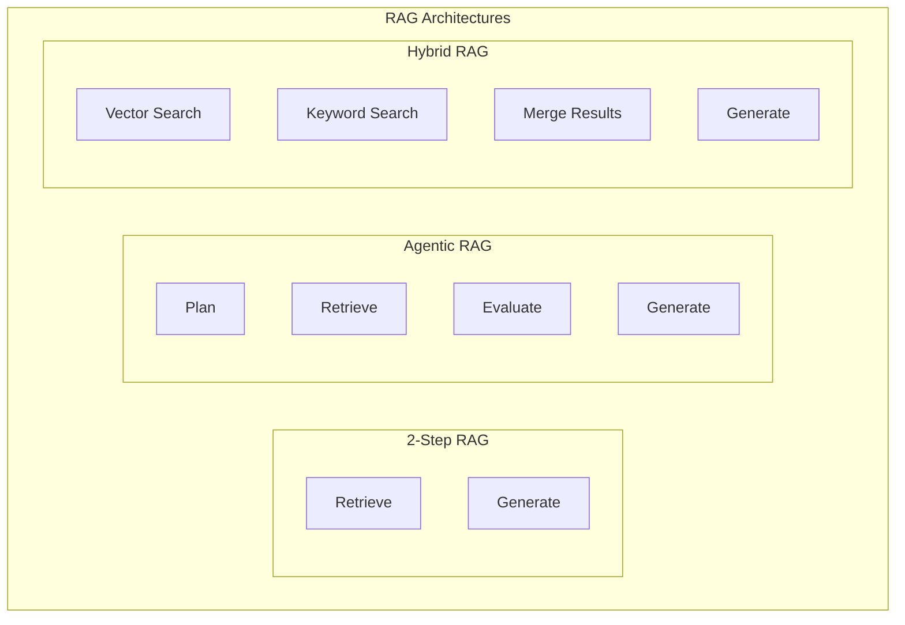
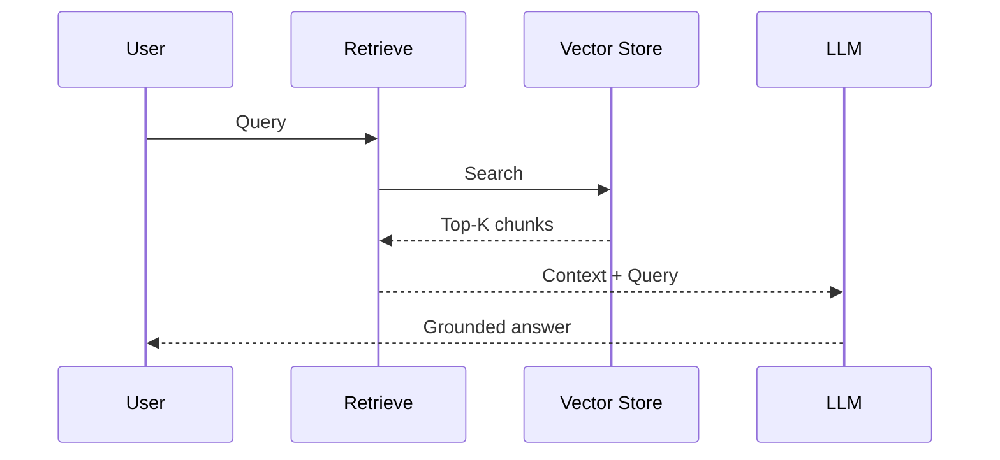
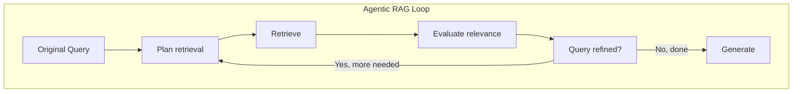
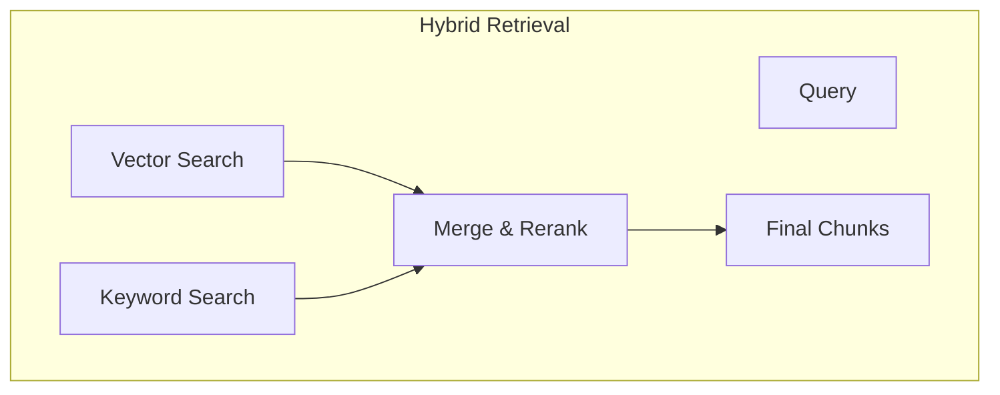

# Lesson 4: Knowledge Systems and Advanced RAG

## Learning Outcome

By the end of this lesson, you will be able to:
- Distinguish between 2-step RAG, agentic RAG, and hybrid RAG
- Implement query rewriting and retrieval grading
- Design citation strategies and source trust
- Choose the right retrieval architecture for your use case

## Prerequisites

- [Chunking and retrieval primitives](/docs/courses/shared/chunking-and-retrieval-primitives.md)
- Lesson 3: Context engineering

---

## Concept: RAG as a Family of Architectures

"RAG" is not one thing—it encompasses several patterns:



### When to Use Each

| Pattern | Best For | Complexity |
|---------|----------|------------|
| **2-Step RAG** | Simple Q&A, document Q&A | Low |
| **Agentic RAG** | Multi-hop questions, dynamic retrieval | High |
| **Hybrid RAG** | High recall requirements | Medium |

---

## Concept: 2-Step RAG

The classic pattern: retrieve then generate.



### Implementation

```python
async def two_step_rag(query: str, top_k: int = 5) -> str:
    # 1. Retrieve
    query_embedding = embedding_model.embed(query)
    chunks = vector_store.search(query_embedding, top_k=top_k)
    
    # 2. Generate
    prompt = f"""
Answer based on the provided context.

Context:
{format_chunks(chunks)}

Question: {query}
"""
    
    return await llm.generate(prompt)
```

### Limitations

| Limitation | Impact | Mitigation |
|-----------|--------|------------|
| **Single retrieval pass** | May miss relevant docs | Lower threshold, more chunks |
| **No query refinement** | Query may not match docs | Query rewriting |
| **No evaluation** | May include irrelevant chunks | Retrieval grading |

---

## Concept: Agentic RAG

RAG with agent-style loops for better results.



### Key Capabilities

| Capability | What It Does |
|-----------|-------------|
| **Query planning** | Decompose complex questions |
| **Query rewriting** | Improve retrieval with better queries |
| **Retrieval grading** | Filter irrelevant results |
| **Multi-hop reasoning** | Combine multiple sources |

### Implementation

```python
class AgenticRAG:
    def __init__(self):
        self.llm = OpenAIModel("gpt-4o")
        self.retriever = VectorRetriever()
    
    async def query(self, question: str) -> str:
        context = []
        iterations = 0
        max_iterations = 3
        
        while iterations < max_iterations:
            # Plan what to retrieve
            plan = await self.plan_retrieval(question, context)
            
            if not plan.need_more_retrieval:
                break
            
            # Retrieve with refined query
            chunks = await self.retriever.search(
                plan.search_query,
                top_k=plan.num_chunks
            )
            
            # Grade results
            relevant = await self.grade_results(question, chunks)
            context.extend(relevant)
            
            iterations += 1
        
        # Generate with gathered context
        return await self.generate(question, context)
    
    async def plan_retrieval(
        self,
        question: str,
        current_context: list
    ) -> RetrievalPlan:
        """Plan next retrieval step."""
        prompt = f"""
Question: {question}
Already retrieved: {summarize_context(current_context)}

What should I retrieve next?
Return JSON: {{"search_query": "...", "num_chunks": 5, "need_more_retrieval": true/false}}
"""
        return await self.llm.generate(prompt, response_format=RetrievalPlan)
    
    async def grade_results(
        self,
        question: str,
        chunks: list
    ) -> list:
        """Filter to relevant chunks only."""
        graded = []
        
        for chunk in chunks:
            score = await self.relevance_score(question, chunk)
            if score > 0.7:  # Threshold
                graded.append(chunk)
        
        return graded
```

---

## Concept: Hybrid RAG

Combining multiple retrieval methods.



### Why Hybrid?

| Method | Strength | Weakness |
|--------|----------|----------|
| **Vector** | Semantic similarity | May miss exact terms |
| **Keyword** | Exact matches | No semantic understanding |

### Implementation

```python
from rank_bm25 import BM25Okapi

class HybridRetriever:
    def __init__(self, vector_store, documents: list[str]):
        self.vector_store = vector_store
        self.bm25 = BM25Okapi(documents)
    
    async def search(
        self,
        query: str,
        top_k: int = 10,
        vector_weight: float = 0.7
    ) -> list:
        # Vector search
        query_vec = embedding_model.embed(query)
        vector_results = self.vector_store.search(query_vec, top_k * 2)
        
        # Keyword search
        tokenized_query = query.lower().split()
        bm25_scores = self.bm25.get_scores(tokenized_query)
        top_indices = sorted(range(len(bm25_scores)), 
                           key=lambda i: bm25_scores[i],
                           reverse=True)[:top_k * 2]
        keyword_results = [documents[i] for i in top_indices]
        
        # Merge with weights
        merged = self.merge_results(
            vector_results,
            keyword_results,
            vector_weight=vector_weight
        )
        
        return merged[:top_k]
    
    def merge_results(
        self,
        vector_results: list,
        keyword_results: list,
        vector_weight: float
    ) -> list:
        scores = {}
        
        for i, result in enumerate(vector_results):
            doc_id = result["id"]
            scores[doc_id] = scores.get(doc_id, 0) + vector_weight * (1 - i/len(vector_results))
        
        for i, result in enumerate(keyword_results):
            doc_id = result["id"]
            scores[doc_id] = scores.get(doc_id, 0) + (1 - vector_weight) * (1 - i/len(keyword_results))
        
        sorted_ids = sorted(scores.keys(), key=lambda x: scores[x], reverse=True)
        return [r for r in vector_results + keyword_results if r["id"] in sorted_ids]
```

---

## Concept: Retrieval Quality Metrics

### Key Metrics

| Metric | What It Measures | Target |
|--------|-----------------|--------|
| **Recall** | % of relevant docs retrieved | > 0.9 |
| **Precision** | % of retrieved docs relevant | > 0.7 |
| **MRR** | Mean reciprocal rank | > 0.8 |
| **NDCG** | Normalized discounted cumulative gain | > 0.7 |

### Measuring Retrieval Quality

```python
async def evaluate_retrieval(
    queries: list[str],
    relevant_docs: dict[str, list[str]],
    retriever: HybridRetriever
) -> dict:
    results = {
        "recall": [],
        "precision": [],
        "mrr": []
    }
    
    for query in queries:
        retrieved = await retriever.search(query, top_k=10)
        relevant = relevant_docs.get(query, [])
        
        retrieved_ids = {r["id"] for r in retrieved}
        relevant_ids = set(relevant)
        
        # Recall
        recall = len(retrieved_ids & relevant_ids) / len(relevant_ids) if relevant_ids else 0
        results["recall"].append(recall)
        
        # Precision
        precision = len(retrieved_ids & relevant_ids) / len(retrieved_ids) if retrieved_ids else 0
        results["precision"].append(precision)
        
        # MRR
        for i, r in enumerate(retrieved):
            if r["id"] in relevant_ids:
                results["mrr"].append(1 / (i + 1))
                break
    
    return {k: sum(v) / len(v) if v else 0 for k, v in results.items()}
```

---

## Exercise: Compare Retrieval Architectures

### Scenario

Build a legal document Q&A system that:
- Answers questions about contracts
- Cites specific clauses
- Handles multi-part questions

### Your Task

Compare three retrieval architectures:

1. **2-Step RAG** — Simple retrieve and generate
2. **Agentic RAG** — With query planning
3. **Hybrid RAG** — Vector + keyword

### Comparison Template

```markdown
## Architecture Comparison: Legal Q&A System

### 2-Step RAG
| Aspect | Analysis |
|--------|----------|
| Pros | |
| Cons | |
| Estimated latency | |
| Estimated cost | |
| Quality (1-5) | |

### Agentic RAG
| Aspect | Analysis |
|--------|----------|
| Pros | |
| Cons | |
| Estimated latency | |
| Estimated cost | |
| Quality (1-5) | |

### Hybrid RAG
| Aspect | Analysis |
|--------|----------|
| Pros | |
| Cons | |
| Estimated latency | |
| Estimated cost | |
| Quality (1-5) | |

### Recommendation
[Which architecture would you choose and why?]
```

---

## What You Learned

1. **RAG is a family** — 2-step, agentic, and hybrid have different tradeoffs
2. **Agentic RAG handles complexity** — Better for multi-hop and dynamic queries
3. **Hybrid improves recall** — Vector + keyword covers more cases
4. **Quality metrics matter** — Measure recall, precision, and MRR

---

## Common Failure Mode

**Treating RAG as solved**

```python
# ❌ "We have RAG, we're done"
chunks = vector_search(query)
response = llm.generate(f"Context: {chunks}\nQuestion: {query}")

# ✅ Continuous improvement
chunks = vector_search(query)
graded = retrieval_grader.grade(query, chunks)
if low_confidence:
    chunks = await agentic_retrieve(query)  # Try again
response = llm.generate(f"Context: {chunks}\nQuestion: {query}")
```

---

## Next Step

Continue to [Lesson 5: Router, manager, and specialist patterns](./lesson-5-router-manager-and-specialist-patterns.md) to learn multi-agent orchestration.

### Or Explore

- [Memory and Store concepts](/docs/concepts/memory-and-store.md) — Storage architecture
- [Multi-agent Tutorial](/docs/tutorials/from-examples/multiagent.md) — Implementation patterns
